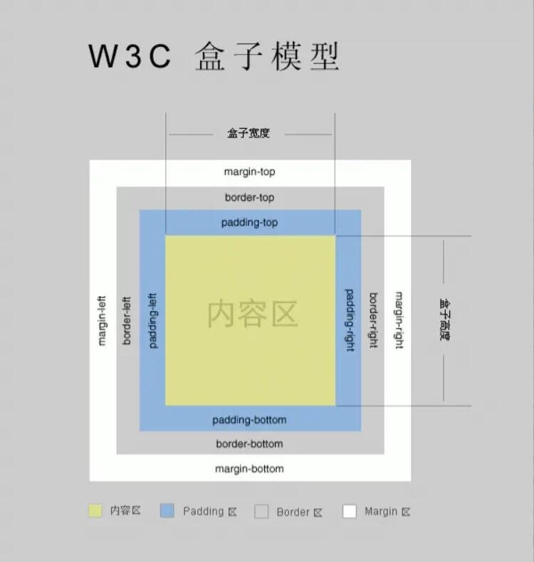
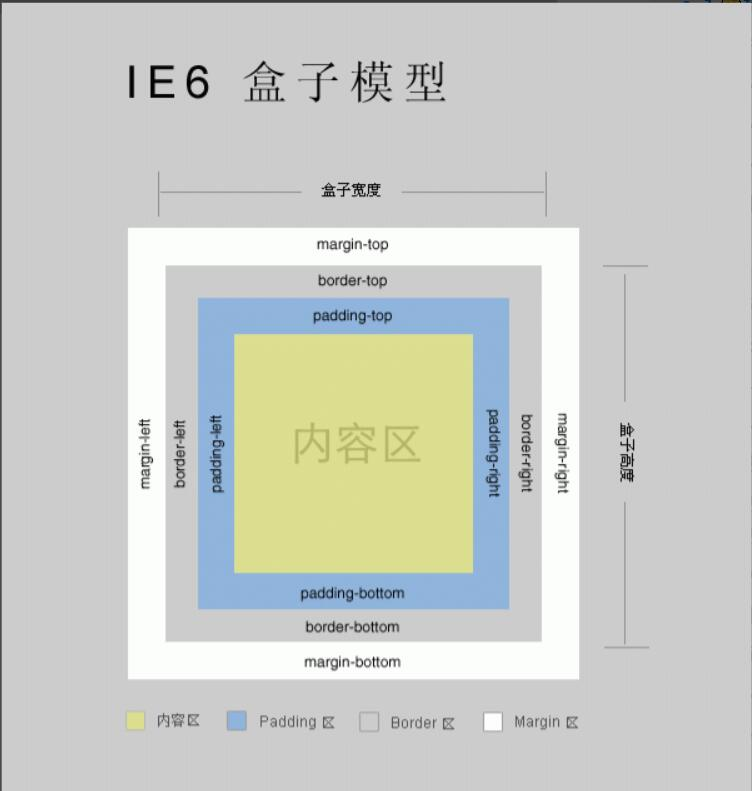
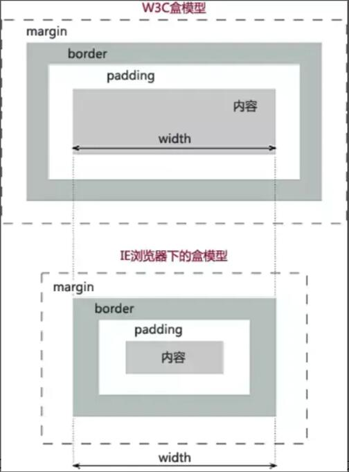

# 标准的 CSS 盒子模型及和其低版本的 IE 盒子模型的区别？
* 盒子模型：
    1. margin（外边距）———— 清除边框外的取余，外边距是透明的
    2. Border（边框）———— 围绕在内边距和内容外的边框
    3. Padding（内边距）———— 清除内容周围的区域，内边距是透明的
    4. Content（内容）———— 盒子的内容，显示文本和图片
    5. 外边距不会影响盒子可见框的大小，但是会影响盒子的位置和实际占用空间
    6. width 和 height 指的是内容区 和 内边距 和 边框 的总大小
* 标准（W3C）盒子模型：width = 内容宽度（content）+ border + padding + margin

* 低版本 IE 盒子模型：width = 内容宽度（content + border + padding） + margin

* 区别：
    * 标准盒子模型盒子的 height 和 width 是 content （内容）的宽高，而 IE 盒子模型盒子的宽高则包括 content + padding + border
    
* box-sizing 属性，该属性有三个可取的值，具体语法：
    * box-sizing: content-box | border-box | inherit
    * box-sizing: border-box 高度和宽度用来社会整个盒子可见框的大小
    * box-sizing: content-box 默认值，高度和宽度用来设置内容区的大小

# CSS 选择器有那些以及权重？哪些属性可以继承？
* 权重：
    行内样式（+1000）；
    id选择器（+100）；
    属性、class、伪类选择器（+10）；
    元素、伪元素（+1）；
    通配符（+0）
* 优先级：
    1. 权重相同，写在后面的覆盖前面的
    2. 使用 !important 达到最大优先级，都使用 !important 时，权重大的优先级高

* 常用选择器：
    1. id 选择器（#content）
    2. 类选择器（.content）
    3. 标签选择器（div、p、span 等）
* 复合选择器：
    1. 交集选择器
        * 作用：选中同时复合多个条件的元素
        * 语法：选择器1选择器2选择器3选择器n{}
        * eg：.a.b.c
    2. 选择器分组（并集选择器）
        * 作用：同时选择多个选择器对应的元素
        * 语法：选择器1,选择器2,选择器3,选择器n{}
        * eg：.p1,h1,span,div{}
* 关系选择器：
    1. 子元素选择器：
        * 作用：选中指定父元素的指定子元素
        * 语法：父元素 > 子元素
        * eg：ul > li
    2. 后代选择器
        * 作用：选中指定元素内的指定后代元素
        * 语法：祖先 后代
        * eg：li a
    3. 相邻选择器（选择下一个兄弟）
        * 语法：前一个 + 后一个
        * eg：h1 + p
    4. 选择下面所有兄弟
        * 语法：兄 ~ 弟
* 通配符选择器：（*）
* 属性选择器：
    [ 属性名 ] 选择含有指定属性的元素  p[ title ]
    [ 属性名=属性值 ] 选择含有指定属性和属性值的元素  p[ title=abc ]
    [ 属性名^=属性值 ] 选择属性值以指定值开头的元素  p[ title^=abc ]
    [ 属性名$=属性值 ] 选择属性值以指定值结尾的元素  p[ title$=abc ]
    [ 属性名*=属性值 ] 选择属性值中含有某值的元素的元素  p[ title*=e ]
* 伪类选择器：
    * 伪类（不存在的类，特殊的类）
    * 伪类用来描述一个元素的特殊状态
        * 比如：第一个子元素、被点击的元素、鼠标移入的元素...
    * 伪类一般情况下都是 : 开头
        * :first-child 第一个子元素
        * :last-child 最后一个子元素
        * :nth-child 选中第 n 个子元素
            * 特殊值：
                1. n 或 第 n 个 （n的范围 0 到正无穷）
                2. 2n 或 even 表示选中偶数位的元素
                3. 2n+1 或 odd 表示选中奇数位的元素
        * :first-of-type
        * :last-of-type
        * :nth-of-type()
            * 这几个伪类的功能和上述的类似，不通点是他们是在同类型元素中进行排序
        * :not() 否定伪类
            * 将符合条件的元素从选择器中去除        
* 可以继承的样式属性：font-size、font-family、color、ul、li、dl、dd、dt
* 不可继承的样式属性：border、padding、margin、width、height

# CSS 优先级算法如何计算？
* 考虑到就近原则，同权重情况下样式定义以最近者为准
* 载入的样式按照最后的定位为准
* 优先级排序：
    * 同权重情况下：内联样式表（标签内部）> 嵌入样式表（当前文件中） > 外部样式表（外部文件中）
* 权重：
    行内样式（+1000）；
    id选择器（+100）；
    属性、class、伪类选择器（+10）；
    元素、伪元素、通配符（+0）
* 优先级：
    1. 权重相同，写在后面的覆盖前面的
    2. 使用 !important 达到最大优先级，都使用 !important 时，权重大的优先级高

# CSS3 新增伪类有那些？
1. :root 选择文档的根元素，等同于 html 元素
2. :empty 选择没有子元素的元素
3. :target 选取当前活动的目标元素
4. :not(selector) 选择除 selector 元素之外的元素
5. :enabled 选择可用的表单元素
6. :disabled 选择禁用的表单元素
7. :checked 选择被选中的表单元素
8. :nth-child 匹配父元素下指定子元素，在所有子元素中排序第 n 
9. :nth-last-child(n) 匹配父元素下指定子元素，在所有子元素中排序第 n
10. :nth-child(odd)
11. :nth-child(even)
12. :nth-child(3n+1)
13. :first-child
14. :last-child
15. :only-child
16. :nth-of-type(n) 匹配父元素下指定子元素，在同类子元素中排序第 n
17. :nth-last-of-type(n) 匹配父元素下指定子元素，在同类子元素中排序第 n，从后向前数
18. :nth-of-type(odd)
19. :nth-of-type(even)
20. :nth-of-type(3n+1)
21. :first-of-type
22. :last-of-type
23. :only-of-type
24. ::selection 选择被用户选取的元素部分（伪元素）
25. :first-line 选择元素中的第一行（伪元素）
26. :first-letter 选择元素中的第一个字符（伪元素）
27. :after 在该元素之后添加内容（伪元素）
28. :before 在该元素之前添加内容（伪元素）

# a 标签（超链接）
* 可以直接将超链接的 href 属性设置为 #，这样点击超链接之后页面不会发生跳转，而是转到当前页面的顶部位置
* 可以跳转到页面的指定位置，只需将 href 属性设置 #目标元素的 id 属性值
* id 属性（唯一不重复）
    * 每一个标签都可以添加一个 id 属性
    * id 属性就是元素的唯一标识，同一个页面中不能出现重复的 id 属性

## target 属性
1. _blank 在新窗口中打开被链接文档
2. _self 默认值，在相同的框架中打开被链接文档
3. _parent 在父框架集中打开被链接文档
4. _top 在整个文档中打开被链接文档
5. framename 在指定的框架中打开被链接文档

# 图片标签
* 图片标签用于向当前页面中引入一个外部图片，使用 img 标签来引入外部图片，img 标签是一个自结束标签，img 这种元素属于替换元素
* 属性：
    1. src：指定外部图片的路径（路径规则和超链接是一样的）
    2. alt：图片的描述，这个描述默认情况下不会显示，有些浏览器会图片无法加载时显示。（搜索引擎会根据 alt 中的内容来识别图片，如果不写 alt 属性则图片不会被搜索引擎所搜录）
    3. width：图片的高度（单位是像素）
    4. height：图片的高度
    * 高度和宽度如果只改变了一个，则另一个会同比例的缩放
    * 一般情况下在 pc 端，不建议修改图片的大小，需要多大的图片就裁多大的，但是在移动端，经常需要对图片进行缩放（大图缩小）
* 图片的格式：
    1. jpeg（jpg）
        * 支持的颜色比较丰富，不支持透明效果，不支持动图
        * 一般用来显示照片
    2. gif
        * 支持的颜色较少，支持简单透明，不支持动图
        * 颜色单一的图片，动图
    3. png
        * 支持的颜色非负，支持复杂透明，不支持动图
        * 颜色丰富，复杂透明图片（专为网页而生）
    4. webp
        * 这种格式是谷歌推出的专门用来表示网页中的图片的一种格式
        * 具备其他图片格式的所有优点，并且文件还特别小
        * 缺点：兼容性不好
    5. base64
        * 将图片使用 base64 编码，这样可以将图片转换为字符，通过字符的形式来引入图片
        * 一般都是一些需要和网页一起加载的图片才会使用 base64

# 音视频
* audio （video）标签用来向页面中引入一个外部的音频文件
* 音频文件引入时，默认情况下不允许用户自己控制播放停止
* 属性：
    1. controls 是否允许用户控制播放
    2. autoplay 音频文件是否自动播放
        * 如果设置了 autoplay 则音乐在打开页面时会自动播放，但是目前来看大部分浏览器都不会对音乐进行播放
    3. loop 音乐是否循环播放

# 单位
1. 像素 px
    1. 屏幕（显示器）实际上是由一个个的小点构成的
    2. 不同的屏幕的像素大小是不同的，像素越小的屏幕显示的效果越清晰
    3. 同样的 200px 在不同的设备下显示效果不一样
2. 百分比
    1. 将属性值设置为相对于其父元素属性的百分比
    2. 设置百分比可以使子元素随着父元素的改变而改变

3. rem是相对于根元素（html）的字体大小，而em是相对于其父元素的字体大小。
    1. em 是相对长度单位。相对于当前对象内文本的字体尺寸。如当前对行内文本的字体尺寸未被人为设置，则相对于浏览器的默认字体尺寸
        * em 的值并不是固定的；
        * em 会继承父级元素的字体大小；
        * 任意浏览器的默认字体高都是16px。所有未经调整的浏览器都符合: 1em=16px。body选择器中声明Font-size=62.5%<==>1em=10px。
    2. rem 是CSS3的一个相对单位（root em，根em）
        * 使用rem为元素设定字体大小时，仍然是相对大小，但相对的只是HTML根元素
        * 只要html的font-size大小不变，1rem所代表的font-size大小就不会变，rem只取决于html的font-size
        * 如在 iPhone6 上，屏幕宽度为 375px，共有 750 个物理像素，则 750 rpx = 375 px = 750 物理像素，1rpx = 0.5px = 1 物理像素
4. rpx：可以根据屏幕宽度进行自适应。规定屏幕宽为 750rpx
    * 开发微信小程序可以用 iPhone6 作为视觉稿的标准
5. vw 和 vh
    * vw,视窗宽度，1vw=视窗宽度的1%
    * vh,视窗高度，1vh=视窗高度的1%
    * 如果浏览器的高是900px,1vh求得的值为9px。同理，如果显示窗口宽度为750px,1vw求得的值为7.5px。
6. vmin 和 vmax
    * vmin和vmax是相对于视口的高度和宽度两者之间的最小值或最大值。
    * 浏览器的高为1100px、宽为700px，那么1vmin就是7px，1vmax就是11px
    * 浏览器的高为800px，宽为1080px，那么1vmin也是8px，1vmax也是10.8px
    * vmin取宽度高度两者更小者/100
    * vmax取宽度高度两者更大者/100

# 颜色单位
1. 在CSS中可以直接使用颜色名来设置各种颜色
    * 比如：red、orange、yellow、blue、green ... ...
    * 但是在css中直接使用颜色名是非常的不方便
2. RGB值：
    * RGB通过三种颜色的不同浓度来调配出不同的颜色
    * R red，G green ，B blue
    * 每一种颜色的范围在 0 - 255 (0% - 100%) 之间
    * 语法：RGB(红色,绿色,蓝色)
3. RGBA:
    * 就是在rgb的基础上增加了一个a表示不透明度
    * 需要四个值，前三个和rgb一样，第四个表示不透明度
        * 1表示完全不透明   0表示完全透明  .5半透明
* rgba 和 opacity
    1. opacity 取值在 0 到 1 之间，0 表示完全透明，1 表示完全不透明
    2. 区别：
        1. opacity 作用于元素，以及元素内的所有内容的透明度
        2. rgba 作用于元素的颜色或其背景色（设置 rgba 透明的元素的子元素不会继承透明效果）
4. 十六进制的RGB值：
    * 语法：#红色绿色蓝色
    * 颜色浓度通过 00-ff
    * 如果颜色两位两位重复可以进行简写  
        * #aabbcc --> #abc
5. HSL值 HSLA值
    * H 色相(0 - 360)
    * S 饱和度，颜色的浓度 0% - 100%
    * L 亮度，颜色的亮度 0% - 100%


# 块元素和行内元素
* 块元素
    1. 块元素会在页面中独占一行（自上而下垂直排列）
    2. 默认宽度是父元素的全部（会把父元素撑满）
    3. 默认高度时被内容撑开（子元素）
* 行内元素
    1. 行内元素不会独占页面的一行，只占自身的大小
    2. 行内元素在页面中从左向右水平排列
    3. 如果一行之中不能容纳下所有的行内元素，则元素会换到第二行继续自左向右排列
    4. 行内元素的默认宽度和高度都是被内容撑开的
    5. 不支持设置宽度和高度
    6. 可以设置 padding、border、margin，但是垂直方向都不会影响页面的布局 
*   常用的块状元素有：
      div 、 p 、 h1 ... h6 、 ol 、 ul 、 dl 、 table 、 address 、 blockquote  、 form 
*   常用的行内元素有：
      a 、 span 、 br 、 i 、 em 、 strong 、 label 、 q 、 var 、 cite 、 code 
*   常用的内联块状元素有：
      img 、 input 
*   知名的空元素：
      br/ 、 hr/ 、 img/ 、 input/ 、 link/ 、 meta/  
*   鲜为人知的是：
      area 、 base 、 col 、 command 、 embed 、 keygen 、 param 、 source 、 track 、 wbr 

# 使用 overflow 属性来设置父元素如何处理溢出的子元素
* 可选值：
    * visible，默认值 子元素会从父元素中溢出，在父元素外部的位置显示
    * hidden 溢出内容将会被裁剪不会显示
    * scroll 生成两个滚动条，通过滚动条来查看完整的内容
    * auto 根据需要生成滚动条

# display 和 visibility
* display 用来设置元素显示的类型
    * 可选值：
        1. none 此元素不会在页面中显示 
        2. inline 将元素设置为行内元素
        3. block 将元素设置为块元素
        4. inline-block 将元素设置为行内块元素（行内块既可以设置宽度和高度又不会独占一行）
        5. table 将元素设置为一个块级表格
        6. inline-table 此元素会作为内联表格来显示
        7. list-item 此元素会作为列表显示
        8. inherit 规定应该从父元素继承 display 属性的值
* visibility 用来设置元素的显示状态
    * 可选值：
        1. visible 默认值，元素在页面中正常显示
        2. hidden 元素在页面中隐藏不显示，但是依然占据页面的位置

## display:none 和 visibility:hidden 的区别
* display:none
    1. 隐藏后的元素不占据任何空间
    2. 父级设置 none，子元素就显示不出来了
    3. 会引起渲染和回流，影响性能
* visibility:hidden
    1. 隐藏的元素空间依旧存在
    2. 父级设置 hidden，子元素也会继承这个属性
    3. 使用 visibility:visible 显示子元素，不会引起回流

# 边框和圆角
* box-shadow 用来设置元素的阴影效果，阴影不会影响页面布局
    box-shadow: 0px 0px 50px rgba(0, 0, 0, .3)
    1. 第一个值：水平偏移量，设置阴影的水平位置，正值向右移动，负值向左移动
    2. 第二个值：水平偏移量，设置阴影的水平位置，正值向下移动，负值向上移动
    3. 第三个值：阴影的模糊半径
    4. 第四个值：阴影的颜色 
* outline 用来设置元素的轮廓线，用法和border一模一样
    outline: 10px red solid;
    * 轮廓和边框不同的点，就是轮廓不会影响到可见框的大小
* border-radius: 用来设置圆角 圆角设置的圆的半径大小
    * border-radius 可以分别指定四个角的圆角
        1. 四个值 左上 右上 右下 左下
        2. 三个值 左上 右上/左下 右下 
        3. 两个值 左上/右下 右上/左下  
    * eg：将元素设置为一个圆形
        * border-radius: 50%;

# 浮动
* 通过浮动可以使一个元素向其父元素的左侧或右侧移动
    * 使用 float 属性来设置元素的浮动
        * 可选值：
            1. none 默认值，元素不浮动
            2. left 元素向左浮动
            3. right 元素向右浮动
    * 注意：
        1. 元素设置浮动以后，水平布局的等式便便需要强制成立
        2. 元素设置浮动后，会完全从文档流中脱离，不再占用文档流的位置
        3. 所以元素下边的还在文档流中的元素会自动向上移动
    * 特点：
        1. 浮动元素会完全脱离文档流，不再占据文档流中的位置
        2. 设置浮动以后元素会向父元素的左侧或右侧移动
        3. 浮动元素默认不会从父元素中移出
        4. 浮动元素向左或向右移动时，不会超过它前变的其它浮动元素
        5. 如果浮动元素的上边是一个没有浮动的块元素，则浮动元素无法上移
        6. 浮动元素不会超过它上边的浮动的兄弟元素，最多就是和它一样高
        * 浮动元素不会盖住文字，文字会自动环绕在浮动元素的周围
* 总结：
    * 浮动的主要作用就是让页面中的元素可以水平排列
    * 通过浮动可以制作一些水平方向的布局
* 清除浮动（clear）
    * 作用清除浮动元素对当前元素所产生的影响
    * 可选值：
        1. left：清除左侧浮动元素对当前元素的影响
        2. right：清除右侧浮动元素对当前元素的影响
        3. both：清除两侧中最大影响的那侧
    * 原理：设置清除浮动后，浏览器会自动为元素添加一个上外边距，以使其位置不受其他元素的影响

## 脱离文档流
* 脱离文档流的特点：
    * 块元素：
        1. 块元素不再独占页面的一行
        2. 脱离文档流以后，块元素的宽度和高度默认都被内容撑开
    * 行内元素：
        1. 行内元素脱离文档流以后会变成块元素，特点和块元素一样
    * 脱离文档流以后，不需要再区分块和行内

# BFC（块级格式化上下文）
* BFC 是一个 CSS 中的一个隐含的属性，可以为一个元素开启 BFC 
    * 开启 BFC 后，该元素会变成一个独立的布局区域
    * 元素开启 BFC 后的特点
        1. 不会被浮动元素覆盖
        2. 子元素和父元素外边距不会重叠
        3. 可以包含浮动的子元素
    * 可以通过一些特殊的方式来开启元素的 BFC
        1. 设置元素的浮动（不推荐）
        2. 将元素设置为行内块元素（不推荐）
        3. 将元素的 overflow 设置为一个非 visible 的值
            * 常用方式 为元素设置 overflow: hidden 开启其 BFC，以使其可以包含浮动元素

# 高度坍塌
* 在浮动布局中，父元素的高度默认是被子元素撑开的
    1. 当子元素浮动后，其会完全脱离文档流，子元素从文档流中脱离
    2. 将会无法撑起父元素的高度，导致父元素的高度丢失
* 父元素高度丢失以后，其下的元素会自动上移，导致页面的布局混乱
* clearfix 这个样式可以同时解决高度坍塌和外边距重叠的问题

# CSS 中定位的方式有那些？ position 属性的值有哪些以及之间的区别？
* 标准文档流：在不使用其他与排列和定位相关的特殊 CSS 规则时，元素的默认排列规则
* HTML 文档中元素可以分为两大类：行内元素和块级元素
    1. 行内元素：是 DOM 树中的一个节点，不单独占据空间，依赖于块级元素，行内元素没有自己的区域
    2. 块级元素：是 DOM 树中的一个节点，总是以块的形式表现出来，并且跟统计的兄弟块依次竖直排列，左右自动伸展，知道包含它的元素的边界，在水平方向上不能并排
* 遵循标准文档流
    1. static 定位：
        1. HTML 元素的默认值，即没有定位，遵循正常的文档流对象
        2. 静态定位的元素不会受到 top、bottom、left、right 影响
    2. relative 定位（相对定位）：
        1. 处于标准文档流中的位置，依据 left、top 进行定位（当然还可以使用 right、bottom）
        2. margin 和 padding 会改变相对定位的对象在标准文档流中的占位空间
        3. 相对定位元素的定位是相对其正常位置，会提升元素的层级
        4. 移动相对定位元素，但它原本所占的空间不会改变，不会改变元素的性质，块还是块，行内还是行内
        5. 相对定位元素经常被用来作为绝对定位元素的容器块
* 脱离标准文档流
    1. fixed 定位（固定定位）：
        1. 元素的位置相对于浏览器窗口是固定位置
        2. 即使窗口是滚动的，它也不会移动
        * 注意：
            1. fixed 定位使元素的位置与文档流无关，因此不占据空间
            2. fixed 定位的元素和其他元素重叠
    2. absolute 定位（绝对定位）：
        1. 相对于 static 定位以外的第一个父元素，使用 left、top（或者right、bottom）进行绝对定位（相对于最近的非 static 定位的祖先元素进行定位）
        2. 绝对定位的元素的位置相对于最近的已定位父元素，如果元素没有已定位的父元素，那么它的位置相对于 html 
        3. 会改变元素的性质，行内变成块，块的宽高被内容撑开
        4. 会使元素提升一个层级

        * 注意：
            1. absolute 定位使元素的位置与文档流无关，因此不占据空间
            2. absolute 定位的元素和其他元素重叠
* 其他定位
    1. sticky 定位（沾性定位）：
        1. 基于用户滚动的位置
        2. 未脱离文档流
    2. initial ：设置该属性为浏览器默认值
    3. inherit ：规定应该从父元素继承 position 属性的值
* 偏移量（offset）
    * 当元素开启了定位以后，可以通过偏移量来设置元素的位置
        1. top：定位元素和定位位置上边的距离
        2. bottom：定位元素和定位位置下边的距离
        3. left：定位元素和定位位置的左侧距离
        4. right：定位元素和定位位置的右侧距离
    * 定位元素垂直方向的位置由 top 和 bottom 两个属性来控制
        * top 越大，元素越向下移动
        * bottom 越大，元素越向上移动
    * 定位元素水平方向的位置由 right 和 left 两个属性控制
        * left 越大，元素越靠右
        * right 越大，元素越靠左
* 对于开启了定位的元素，可以通过 z-index 属性来指定元素的层级
    * z-index 需要一个整数作为参数，值越大元素的层级越高
        * 元素的层级越高越优先显示
        * 如果元素的层级一样，则优先显示靠下的元素
        * 祖先元素的层级再高也不会盖住后代元素（除非重叠的时候，层级越高，就会盖住后代元素）

# 字体和文本
* font-face 可以将服务器中的字体直接提供给用户去使用
    * 问题：
        1. 加载速度
        2. 版权
        3. 字体格式
    * eg：
        ```css
            @font-face {
                /* 指定字体的名字 */
            font-family:'myfont' ;
            /* 服务器中字体的路径 */
            src: url('./font/ZCOOLKuaiLe-Regular.ttf') format("truetype");
        }
        ```
* 字体相关的样式
    1. color 设置字体颜色
    2. font-size 字体的大小
        * 和 font-size 相关的单位
            1. em 相当于当前元素的一个 font-size
            2. rem 相对于根元素的一个 font-size
    3. font-family 字体族（字体的格式）
        * 可选值
            1. serif 衬线字体
            2. sans-serif 非衬线字体
            3. monospace 等宽字体
        * font-family 可以通知指定多个字体，多个字体间使用,间隔
            * 字体生效时优先使用第一个，第一个无法使用则使用第二个 以此类推
* text-align 文本的水平对齐
    * 可选值
        1. left 左侧对齐
        2. right 右侧对齐
        3. center 居中对齐
        4. justify 两端对齐
* vertical-align 文本垂直对齐
    * 可选值
        1. baseline 默认值 基线对齐
        2. top 顶部对齐
        3. bottom 底部对齐
        4. middle 居中对齐
* text-decoration 设置文本修饰
    * 可选值
        1. none 
        2. underline 下划线
        3. line-through 删除线
        4. overline 上划线
* white-space 设置网页如何处理空白
    * 可选值
        1. normal 正常
        2. nowrap 不换行
        3. pre 保留空白

# 背景
* background-color 设置背景颜色
* background-image 设置背景图片
    1. 同时设置背景图片和背景颜色，这样背景颜色将会成为图片的背景色
    2. 如果背景的图片小于元素，则背景图片会自动在元素中平铺将元素铺满
    3. 如果背景的图片大于元素，将会有一个部分背景无法完全显示
    4. 如果背景图片的元素一样大，则会直接正常显示
* background-repeat 用来设置背景的重复方式
    * 可选值
        1. repeat 默认值，背景会沿着 X 轴 Y轴双方向重复
        2. repeat-x 沿着 X 轴方向重复
        3. repeat-y 沿着 Y 轴方向重复
        4. no-repeat 背景图片不重复
* background-position 设置背景图片的位置
    * 设置方式
        * 通过 top left right bottom center 几个表示方位的词来设置背景图片的位置
            * 设置方位词时必须要同时指定两个值，如果只写一个则第二个默认就是 center
        * 通过偏移量来指定背景图片的位置
            * 水平方向的偏移量 垂直方向变量
* background-clip 设置背景的范围
    * 可选值
        1. border-box 默认值，背景会出现在边框的下边
        2. padding-box 背景不会出现在边框，只出现在内容区和内边距
        3. content-box 背景只会出现在内容区
* background-origin 背景图片的偏移量计算的原点
    * 可选值
        1. padding-box 默认值，background-position 从内边距开始计算
        2. content-box 背景图片的偏移量从内容区处计算
        3. border-box 背景图片的变量从边框处开始计算
* background-size 设置背景图片的大小
    * 第一个值表示宽度，第二个值表示高度
    * 如果只写一个，则第二个值默认是 auto
        1. cover 图片的比例不变，将元素铺满
        2. contain 图片比例不变，将图片在元素中完整显示
* background-attachment 背景图片是否跟随元素移动
    * 可选值：
        1. scroll 默认值 背景图片会跟随元素移动
        2. fixed 背景会固定在页面中，不会随元素移动

# 渐变
* 线性渐变，颜色沿着一条直线发生变化 linear-gradient() 
    * eg：linear-gradient(red, yellow) 红色在开头，黄色在结尾，中间是过渡区域
    * 线性渐变的开头，可以指定一个渐变方向
        1. to left/right
        2. to bottom/top
        3. deg deg 表示度数
        4. turn 表示圈
    * 渐变可以同时指定多个颜色，多个颜色默认情况下平均分布
* 径向渐变 (放射性的效果) radial-gradient() 
    * radial-gradient(大小 at 位置, 颜色 位置 ,颜色 位置 ,颜色 位置)
        * 大小：
            circle 圆形
            ellipse 椭圆
            closest-side 近边	
            closest-corner 近角
            farthest-side 远边
            farthest-corner 远角
        * 位置：
            top right left center bottom


# 

# CSS 属性
## 01. CSS 中定位的方式有那些？ position 属性的值有哪些以及之间的区别？
* 标准文档流：在不使用其他与排列和定位相关的特殊 CSS 规则时，元素的默认排列规则
* HTML 文档中元素可以分为两大类：行内元素和块级元素
    1. 行内元素：是 DOM 树中的一个节点，不单独占据空间，依赖于块级元素，行内元素没有自己的区域
    2. 块级元素：是 DOM 树中的一个节点，总是以块的形式表现出来，并且跟统计的兄弟块依次竖直排列，左右自动伸展，知道包含它的元素的边界，在水平方向上不能并排
* 遵循标准文档流
    1. static 定位：
        1. HTML 元素的默认值，即没有定位，遵循正常的文档流对象
        2. 静态定位的元素不会受到 top、bottom、left、right 影响
    2. relative 定位（相对定位）：
        1. 处于标准文档流中的位置，依据 left、top 进行定位（当然还可以使用 right、bottom）
        2. margin 和 padding 会改变相对定位的对象在标准文档流中的占位空间
        3. 相对定位元素的定位是相对其正常位置
        4. 移动相对定位元素，但它原本所占的空间不会改变
        5. 相对定位元素经常被用来作为绝对定位元素的容器块
* 脱离标准文档流
    1. fixed 定位（绝对定位）：
        1. 元素的位置相对于浏览器窗口是固定位置
        2. 即使窗口是滚动的，它也不会移动
        * 注意：
            1. fixed 定位使元素的位置与文档流无关，因此不占据空间
            2. fixed 定位的元素和其他元素重叠
    2. absolute 定位（绝对定位）：
        1. 相对于 static 定位以外的第一个父元素，使用 left、top（或者right、bottom）进行绝对定位（相对于最近的非 static 定位的祖先元素进行定位）
        2. 绝对定位的元素的位置相对于最近的已定位父元素，如果元素没有已定位的父元素，那么它的位置相对于 html 
        * 注意：
            1. absolute 定位使元素的位置与文档流无关，因此不占据空间
            2. absolute 定位的元素和其他元素重叠
* 其他定位
    1. sticky 定位（沾性定位）：
        1. 基于用户滚动的位置
        2. 未脱离文档流
    2. initial ：设置该属性为浏览器默认值
    3. inherit ：规定应该从父元素继承 position 属性的值

## 02. 设置元素浮动后，该元素的 display 值是多少
    自动变成 display:block
    absolute 和 float 都会隐式改变 display

## 03. 浮动
* 浮动（float）是 CSS 定位属性。浮动元素从网页的正常流动中移出，但是保持了部分的流动性，会影响其他元素的定位（比如文字会围绕着浮动元素）
* 浮动元素引起的问题：
    1. 父元素的高度无法被撑开，影响与父元素同级的元素
    2. 与浮动元素同级的非浮动元素会跟随其后
    3. 若非第一个元素浮动，则该元素之前的元素也需要浮动，否则会影响页面显示的结构
* CSS 的 clear 属性通过使用 left、right、both，让该元素向下移动（清除浮动）到浮动元素的下面
* 如果父元素只包含浮动元素，那么该元素的高度将坍塌为0。我们可以通过清除（clear）从浮动元素后到父元素关闭前之间的浮动来修复这个问题

## 04. 清除浮动的方法
1. 父级 div 定义 height
    给父元素添加高度 height，防止父元素无法获取高度的问题（防止父元素高度变为0），只建议高度固定的布局
2. 结尾处加空 div 标签 clear:both
3. 父级 div 定义伪类 :after 和 zoom
4. 父级 div 定义 overflow:hidden 或 auto
5. 父级 div 也浮动，需要定义宽度
6. 父级 div 定义 display:table
* 常用1、2、3、4，了解 5、6

## 05. display 有那些值
1. none（隐藏） ：此元素不会被显示，隐藏后的元素不占据任何空间，该元素以及它的所有后代元素都会隐藏
2. block（块显示） ：此元素将显示为块级元素，此元素前后会带有换行符
3. inline（内嵌） ： 默认。此元素会被显示为内联元素，元素前后没有换行符
4. table（表格显示） ：此元素会作为块级表格来显示（类似 table 标签），表格前后带有换行符
5. inline-block : 元素既具有 block 元素可以设置宽高的特性，同时又具有 inline 元素默认不换行的特性
6. list-item ：像块元素一样显示，并添加样式列表标记
7. inherit ：规定应该从父元素继承 display 的值

## 07. CSS3 新特性
1. 新增各种 CSS 选择器（:not(.input)：所有不是“input”的节点）
2. 圆角（border-radius: 8px）
3. 多列布局（multi-column layout）
4. 阴影和反射（Shadow\Reflect）
5. 文字特效（text-shadow）
6. 文字渲染（Text-decoration）
7. 线性渐变（gradient）
8. 旋转（transform）
9. 增加了旋转、缩放、定位、倾斜、动画、多背景
10. transform:scale(0.85,0.90) translate(0px,-30px) skew(-9deg,0deg) Animation // 旋转,缩放,定位,倾斜

## 08. before 和 after 中双冒号和单冒号有什么区别？解释一下这2个伪元素的作用
* 单冒号（:）用于 CSS3 伪类；双冒号（::）用于 CSS3 伪元素
* 两者都是描述不在文本流中的东西
* 伪类用于向某些选择器添加特殊的效果
* 伪元素用于将特殊效果添加到某些选择器
* 伪类的效果可以通过添加一个实际的类来达到，而伪元素的效果则需要通过添加一个实际的元素才能达到

## 09. CSS 旋转属性，transform 的用法
* transform 属性向元素应用 2D 或 3D 转换。该属性允许我们对元素进行旋转、缩放、移动或倾斜
### 1. 旋转rotate
* 用法：transform:rotate(45deg)
    一个参数“角度”，单位 deg 为度，正数为顺时针旋转，负数为逆时针旋转
1. 水平翻转
    ```css
    transform:scale(-1, 1)
    filter:FlipH
    ```
2. 垂直翻转
    ```css
    transform:scale(1, -1)
    filter:FlipV
    ```
3. 顺时针旋转90度
    1. ```css
       -moz-transform:rotate(90deg); 
       -webkit-transform:rotate(90deg); 
       -o-transform:rotate(90deg); 
       transform:rotate(90deg); 
       ```
    2. ```css
       filter:progid:DXImageTransform.Microsoft.BasicImage(rotation=1)
       ```

### 2. 缩放 scale
* 用法：transform:scale(0.5) 或者 transform:scale(0.5, 2)
* 参数表示缩放倍数
    1. 一个参数时：表示水平和垂直同时缩放该倍率
    2. 两个参数时：第一个参数指定水平方向的缩放倍率，第二个参数指定垂直方向的缩放倍率
### 3. 移动 translate
* 用法：transform:translate(45px)或者transform:skew(45px, 150px)
* 参数表示移动距离，单位px
    1. 一个参数时：表示水平方向的移动距离
    2. 两个参数时：表示第一个参数表示水平方向的移动距离，第二个参数表示垂直方向的移动距离
### 4. 倾斜 skew
* 用法：transform: skew(30deg)  或者 transform: skew(30deg, 30deg);
* 参数表示倾斜角度，单位deg
    1. 一个参数时：表示水平方向的倾斜角度；
    2. 两个参数时：第一个参数表示水平方向的倾斜角度，第二个参数表示垂直方向的倾斜角度。
    * skew 的默认原点 transform-origin 是这个物件的中心点
### 5. 基准点 transform-origin
* 在使用 transform 方法进行文字或图像的变形时，是以元素的中心点为基准点。
* 使用 transform-origin 属性，可以改变变形的基准点
* 用法：transform-origin:10px 10px
* 共两个参数，表示相对于左上角原点的距离，单位px
    1. 第一个参数表示相对于左上角原点的水平方向的距离
    2. 第二个参数表示相对于左上角原点的垂直方向的距离
* 两个参数除了可以设置为具体的像素值，其中第一个参数可以指定为 left、center、right，第二个参数可以指定为 top、center、bottom
### 6. 组合变形
```css
transform: rotate(45deg) scale(0.5) skew(30deg, 30deg) translate(100px, 100px);
```

## 10. CSS 的权重和优先级
* 权重：
    行内样式（+1000）；
    id选择器（+100）；
    属性、class、伪类选择器（+10）；
    元素、伪元素、通配符（+0）
* 优先级：
    1. 权重相同，写在后面的覆盖前面的
    2. 使用 !important 达到最大优先级，都使用 !important 时，权重大的优先级高

# CSS 布局

## 01. CSS 那些属性脱离文档流
### 1. 什么是文档流
* 将窗体自上而下分为一行一行，并在每行中按从左到右依次排放元素，称为文档流，也称普通流
### 2. 什么是脱离文档流
* 脱离文档流，那么文档原本占据文档流的位置会被它后面的元素填不
### 3. CSS 哪些属性脱离文档流   
* 脱离文档流有两种方式：浮动和定位
1. 定位
    1. position:absolute
    2. position:fixed
2. 浮动
    1. float:left
    2. float:right

## 02. BFC 定义
* BFC（Block formatting context）直译“块级格式化上下文”。它是独立的渲染区域，只有 Block-level box 参与，它规定了内部的 Block-level Box 如何布局，并且与这个区域外部毫不相干
* Box：css 布局的基本单位。直观点来说，就是一个页面由很多个 Box 组成。元素的类型和 display 属性，决定了这个 Box 的类型，不同类型的 Box，会参与不同的 Formatting Context
* 作用：使 BFC 内部浮动元素不会到处乱跑和浮动元素产生边界，可以用来清除浮动和解决 margin 重叠等问题
* 一般根元素、浮动元素、绝对定位元素、行内块元素、表格类元素、还有 overflow 不为 visible 的元素都会创建 BFC
### 特征
1. BFC 的块不会和浮动块重叠
2. 计算 BFC 元素的高度时，会包括浮动元素
3. 在一个 BFC 下的块 margin 会发生重叠，不再同一个则不会
4. BFC 元素是一个独立的容器，使得里面的元素和外部元素隔离开，互不影响
### 触发 BFC
1. float 的值不为 none
2. overflow 的值为 auto、hidden、scroll，不是 visibel
3. display 的值为 table-cell、table-caption、inline-block、flex或inline-flex
4. position 设置为 absolute 和fixed
* 除此之外，html元素本身默认就是一个BFC元素
### 应用场景
1. 清除浮动
2. 自适应布局
3. 防止 margin 合并

## 02. div+css的布局较table布局有什么优点？
1. 改版的时候更⽅便 只要改 css ⽂件。
2. ⻚⾯加载速度更快、结构化清晰、⻚⾯显示简洁。
3. 表现与结构相分离。
4. 易于优化（ seo ）搜索引擎更友好，排名更容易靠前。

## 03. 如何居中div？如何居中一个浮动元素？如何让绝对定位的div居中？
1. 宽高固定：css 指定样式
    1. top:50%; left:50%
    2. margin-top 和 margin-left 指定为负数，绝对值为自身宽高的一半
2. 有宽度
    使用margin:0 auto;可以实现居中（需要有宽度）
3. 居中一个浮动元素
    父元素和子元素同时左浮动，然后父元素相对左移动50%，再然后子元素相对右移动50%，或者子元素相对左移动-50%也就可以了。
4. 让绝对定位的div居中
    1. 先把外层的相对定位的大div用margin:0px auto;居中，
    2. 然后这个绝对定位的用left，top来定位。
    3. top属性值:（父元素的高度-子元素高度）/2；
    4. left属性值:（父元素宽度值-子元素宽度值）/2。

## 03. 三栏布局，中间自适应
* 左中右三栏布局，左右两栏宽度固定（要想不固定将宽度值改为百分值即可），中间栏宽度自适应
1. 绝对定位法
    左右两栏采用绝对定位，分别固定于页面的左右两侧，中间的主体栏用左右margin值撑开距离。于是实现了三栏自适应布局。
2. 自身浮动法
    应用了标签浮动跟随的特性。左栏左浮动，右栏右浮动，主体直接放后面，就实现了自适应。
3. margin负值法
    外层div宽度100%显示，并且浮动（本例左浮动，下面所述依次为基础），内层div为真正的主体内容，含有左右210像素的margin值。
    左栏与右栏都是采用margin负值定位的，左栏左浮动，margin-left为-100%，由于前面的div宽度100%与浏览器，所以这里的-100%margin值正好使左栏div定位到了页面的左侧； 右侧栏也是左浮动，其margin-left也是负值，大小为其本身的宽度即200像素。

## 04. 如果需要⼿动写动画，你认为最⼩时间间隔是多久，为什么？
    多数显示器默认频率是 60Hz ，即 1 秒刷新 60 次，所以理论上最⼩间隔为
    1⁄60*1000ms ＝ 16.7ms

## 05. 全屏滚动的原理是什么？用到了CSS的那些属性？
* 主要呈现方式有两种，
    1. 一种是整体的元素一直排列下去，假设有五个需要展示的全屏页面，那么高度是500%，只是展示100%，剩下的可以通过transform进行Y轴定位，也可以通过margin-top实现，
    2. 第二种就是所有的子元素和页面一样，都显示在当前页面。

## 06. 用纯CSS创建一个三角形的原理是什么？
* 均分原理
    1. 在矩形的直角，两条边的样式要均分
    2. 比如左上角 border-top 和 border-left 的样式要均分
    3. 如果border-left 无色透明， border-top有色， 就会出来一个45度的锐角
* 三角形
   1. 基础三角形
   ```css
    div {
        width: 0;
        height: 0;
        border-width: 20px;
        border-style: solid;
        border-color: transparent transparent red transparent
    }
    ```
    或者
    ```css
    div {
        width: 0;
        border: 100px solid transparent;
        border-bottom-color: #343434
    }
    ```
    2. 等边三角形
    ```css
        div {
            width: 0;
            border: 100px solid transparent;
            border-bottom: 173px solid #343434
        }
    ```
    3. 直角三角形
    ```css
        div {
            width: 0;
            border: 0 solid transparent;
            border-left: 100px solid transparent;
            border-bottom: 100px solid #343434
        } 
    ```

## 07. Flex 布局，Flex是什么属性的缩写
* 弹性盒布局，CSS3 的新属性， 是一种替代浮动布局的方案，用于方便布局，比如垂直居中
* flex 属性是 flex-grow、flex-shrink 和 flex-basis 的缩写

* 在 flex 布局中有两大概念：容器和轴：
    1. 轴分为主轴和与主轴垂直的交叉轴，可通过 flex-direction 来切换
    2. 然后就是容器，采用弹性盒的区域就是容器，将容器的 display 设为 flex，内部的元素就成为一个个项目，整体形成 flex 布局，容器可通过 justify-content 控制项目在主轴的排列方式，通过 align-items 控制项目在交叉轴的排列方式，还有 flex-wrap 控制项目的换行方式。针对项目，可以通过 flex-grow 来控制自身放大比例， flex-shrink 控制缩小比例，order 控制项目排列顺序

## 08. 水平垂直居中
1. 确定容器宽高：
    相对或绝对定位，设置外边距 margin
    ```css
    div {
        position: relative / fixed;
        width: 500px;
        height: 300px;
        top: 50%;
        left: 50%;
        margin: -150x 0 0 -250px;
        background-color: pink;
    }
    ```
2. 不确定容器宽高
    绝对定位，利用 transform 属性
    ```css
    div {
        position: absolute / fixed;
        top: 50%;
        left: 50%;
        transform: translate(-50%, -50%)
    }
    ```
3. flex布局
    高度可以确定，也可以不确定
    ```css
    .container {
        display: flex;
        align-items: center; 		/* 垂直居中 */
        justify-content: center;	/* 水平居中 */
    }
    .container div {
        width: 100px; /* 可省 */
        height: 100px; /* 可省 */
        background-color: pink;	/* 方便看效果 */
    }  
    ```
4. inline-block
    高度可以确定，也可以不确定
    水平居中：text-align
    垂直居中: 父元素 line-height 与 height 同值，子元素 vertical-align
    ```css
    .container {
        height: 200px; /* 垂直居中 */
        line-height: 200px; /* 垂直居中 */
        text-align: center; /* 水平居中 */
    }
    .container div {
        display: inline-block; /* 核心：宽度自适应，高度可居中 */
        line-height: 20px; /* 会自动继承，必须设置不同的值来覆盖 */
        vertical-align: middle; /* 垂直居中 */
    }  
    ```

## 09. 单列布局
* 常见的单列布局有两种：
    * header，content 和 footer 等宽的单列布局
    * header 与 footer 等宽，content 略窄的单列布局

## 10. 两列自适应布局
* 两列自适应布局是指一列由内容撑开，另一列撑满剩余宽度的布局方式
### 1. float + overflow:hidden
* 如果是普通的两列布局，浮动 + 普通元素的 margin 便可以实现，但如果是自适应的两列布局，利用 float + overflow:hidden 便可以实现，这种办法主要通过 overflow 触发 BFC，而 BFC 不会重叠浮动元素。由于设置 overflow:hidden 并不会触发 IE6-浏览器的 haslayout 属性，所以需要设置 zoom:1 来兼容 IE6-浏览器
* 
    ```html
        <div class="parent" style="background-color: lightgrey;">
            <div class="left" style="background-color: lightblue;">
                <p>left</p>
            </div>
            <div class="right"  style="background-color: lightgreen;">
                <p>right</p>
                <p>right</p>
            </div>        
        </div>
    ```
* 
    ```css
        .parent {
            overflow: hidden;
            zoom: 1;
        }
        .left {
            float: left;
            margin-right: 20px;
        }
        .right {
            overflow: hidden;
            zoom: 1;
        }
    ```
* 注意点:如果侧边栏在右边时，注意渲染顺序。即在HTML中，先写侧边栏后写主内容
### 2. Flex 布局
* Flex 布局，也叫弹性盒子布局
*    
    ```css
        .parent {
            display: flex;
        }
        .right {
            margin-left: 20px;
            flex: 1
        }
    ```
* flex 是 flex-grow、flex-shrink、flex-basis的缩写
    1. flex-grow
        CSS flex-grow 属性定义弹性盒子项（flex item）的拉伸因子
        ```css
            flex-grow: 1;
            flex-grow: inherit;
        ```
    2. flex-shrink
        CSS flex-shrink 属性指定了 flex 元素的收缩规则。flex 元素仅在默认宽度之和大于容器的时候才会发生收缩，其收缩的大小是依据 flex-shrink 的值
    3. flex-basis
        CSS 属性 flex-basis 指定了 flex 元素在主轴方向上的初始大小。如果不使用 box-sizing 改变盒模型的话，那么这个属性就决定了 flex 元素的内容盒（content-box）的尺寸。
        <‘width’>
        width 值可以是 ; 该值也可以是一个相对于其父弹性盒容器主轴尺寸的百分数 。负值是不被允许的。默认为 auto
        content
        基于 flex 的元素的内容自动调整大小

### 3. grid 布局
* Grid 布局，是一个基于网格的二维布局系统，目的是用来优化用户界面设计
    ```css
        .parent {
            display: grid;
            grid-template-columns: auto 1fr;
            grid-gap: 20px
        }
    ```

## 11. 三栏布局
* 特征：中间列自适应宽度，旁边两侧固定宽度
### 1. 圣杯布局
* 特点：特殊的三栏布局，同样是两边固定宽度，中间自适应，唯一区别是 dom 结构必须是先写中间列部分，这样实现中间列可以优先加载
    ```html
        <article class="container">
            <div class="center">
                <h2>圣杯布局</h2>
            </div>
            <div class="left"></div>
            <div class="right"></div>
        </article>
    ```
    ```css
        .container {
            /* 为左右两栏腾出空间 */
            padding-left: 220px;
            padding-right: 220px;
        }
        .left {
            float: left;
            width: 200px;
            height: 400px;
            background: red;
            margin-left: -100%;
            position: relative;
            left: -220px;
        }
        .center {
            float: left;
            width: 100%;
            height: 500px;
            background: green;
        }
        .right {
            float: left;
            width: 200px;
            height: 400px;
            background: blue;
            margin-left: -200px;
            position: relative;
            right: -220px;
        }
    ```
### 2. 双飞翼布局
* 特点：同样是三栏布局，在圣杯布局基础上进一步优化，解决了圣杯布局错乱问题，实现了内部与布局的分离。而且任何一栏都可以是最高栏，不会出问题
    ```html
        <article class="container">
            <div class="center">
                <div class="inner">双飞翼布局</div>
            </div>
            <div class="left"></div>
            <div class="right"></div>
        </article>
    ```
    ```css
        .container {
            /* 确保中间内容可以显示出来，两倍 left宽 + right宽 */
            min-width: 600px;
        }
        .left {
            float: left;
            width: 200px;
            height: 400px;
            background: red;
            margin-left: -100%;
        }
        .center {
            float: left;
            width: 100%;
            height: 500px;
            background: green;
        }
        .center .inner {
            margin: 0 200px;
        }
        .right {
            float: left;
            width: 200px;
            height: 400px;
            background: blue;
            margin-left:-200px;
        }
    ```

## 12. 等高布局
* 等高布局是指子元素在父元素中高度相等的布局方式
### 1. 利用正 padding + 负 margin
* 利用等布局可解决圣杯布局的第二缺点，因为背景是在 padding 区域显示的，设置一个大数值的 padding-bottom，再设置相同数值的负的 margin-bottom，并在所有列外面加上一个容器，并设置 overflow: hidden 把溢出背景切掉。
* 这种可能实现多列等高布局，并且也能实现列与列之间分割线效果，结构简单，兼容所有浏览器。
* 新增代码：
    ```css
        .center,
        .left,
        .right {
            padding-bottom: 10000px;
            margin-bottom: 10000px;
        }
        .container {
            padding-left: 220px;
            padding-right: 220px;
            /* 把溢出背景切掉 */
            overflow: hidden;
        }
    ```

### 2. 利用背景图片
* 这种方法是实现等高列最早使用的一种方法，就是使用背景图片。在列的父元素上使用这个背景图片进行 Y 轴的铺放，从而实现一种等高列的假象。实现方法简单，兼容性强，不需要太多的 css 样式就可以轻容实现，但此方法不适合流体布局等高列的布局
    ```html
        <div class=”container clearfix”>
            <div class=”left”></div>
            <div  class=”content”></div>
            <div class=”right”></div>
        </div>
    ```
    ```css
        .container {
            background: url("test.png") repeat-y;
            width: 960px;
            margin: 0 auto
        }
        .left {
            float: left;
            width: 220px;
        }
        .content {
            float: left;
            width: 480px;
        }
        .right {
            float: left;
            width: 220px;
        }
    ```
### 3. 模仿表格布局
* 简单、易于实现。兼容性差，在 ie6-7 无法正常运行
    ```html
        <div class="container table">
        <div class="containerInner tableRow">
            <div class="column tableCell cell1">
            <div class="left aside">
                ....
            </div>
            </div>
            <div class="column tableCell cell2">
            <div class="content section">
                ...
            </div>
            </div>
            <div class="column tableCell cell3">
            <div class="right aside">
                ...
            </div>
            </div>
        </div>
        </div>
    ```
    ```css
        .table {
            width: auto;
            min-width: 1000px;
            margin: 0 auto;
            padding: 0;
            display: table;
        }
        .tableRow {
            display: table-row;
        }
        .tableCell {
            display: table-cell;
            width: 33%;
        }
        .cell1 {
            background: #f00;
            height: 800px;
        }
        .cell2 {
            background: #0f0;
        }
        .cell3 {
            background: #00f;
        }
    ```
### 4. 使用边框和定位
* 使用边框和绝对定位来实现一个假的高度相等列的效果。结构简单，兼容各浏览器。
* 实现一个两列等高布局，侧栏高度要与主内容高度相等
    ```html
        <div id="wrapper">
            <div id="mainContent">...</div>
            <div id="sidebar">...</div>
        </div>
    ```
    ```css
        #wrapper {
            width: 960px;
            margin: 0 auto;
        }
        #mainContent {
            border-right: 220px solid #dfdfdf;
            position: absolute;
            width: 740px;
            height: 800px;  
            background: green;
        }
        #sidebar {
            background: #dfdfdf;
            margin-left: 740px;
            position: absolute;
            height: 800px;
            width: 220px;
        }
    ```

## 13. 粘连布局
* 特点：
    1. 有一块内容 < main >，当 < main > 的高度足够长的时候，紧跟在 < main > 后面的元素 < footer > 会跟在 < mian > 元素的后面
    2. 当 < mian > 元素比较短的时候（比如小于屏幕的高度），期望这个 < footer > 元素能够“粘连”在屏幕的底部
    ```html
        <div id="wrap">
            <div class="main">
                main <br />
                main <br />
                main <br />
            </div>
        </div>
        <div id="footer">footer</div>
    ```
    ```css
        * {
            margin: 0;
            padding: 0;
        }
        html,
        body {
            height: 100%;//高度一层层继承下来
        }
        #wrap {
            min-height: 100%;
            background: pink;
            text-align: center;
            overflow: hidden;
        }
        #wrap .main {
            padding-bottom: 50px;
        }
        #footer {
            height: 50px;
            line-height: 50px;
            background: deeppink;
            text-align: center;
            margin-top: -50px;
        }
    ```
    1. footer 必须是独立的结构，与 wrap 没有任何嵌套关系
    2. wrap 区域的高度通过设置 min-height，变为视口高度
    3. footer 要使用 margin 为负来确定自己的位置
    4. 在 mian 区域需要设置 padding-bottom。这也是为了防止负 margin 导致 footer 覆盖任何实际内容


# rgba() 和 opacity 的透明效果有什么不同？
opacity 作用于元素以及元素内的所有内容（包括文字）的透明度；
rgba() 只作用于元素自身的颜色或其背景色，子元素不会继承透明效果；

# png、jpg、 jpeg、 bmp、gif 这些图片格式解释一下，分别什么时候用。有没有了解过webp？
（1）、png-便携式网络图片（Portable Network Graphics）,是一种无损数据压缩位图文件格式。优点是：压缩比高，色彩好。 大多数地方都可以用。
（2）、jpg是一种针对相片使用的一种失真压缩方法，是一种破坏性的压缩，在色调及颜色平滑变化做的不错。在www上，被用来储存和传输照片的格式。
（3）、gif是一种位图文件格式，以8位色重现真色彩的图像。可以实现动画效果。
（4）、bmp的优点： 高质量图片；缺点： 体积太大； 适用场景： windows桌面壁纸；
（4）、webp格式是谷歌在2010年推出的图片格式，压缩率只有jpg的2/3，大小比png小了45%。缺点是压缩的时间更久了，兼容性不好，目前谷歌和opera支持。

# 尺寸单位
1. px
2. em 是相对长度单位。相对于当前对象内文本的字体尺寸。如当前对行内文本的字体尺寸未被人为设置，则相对于浏览器的默认字体尺寸
    * em 的值并不是固定的；
    * em 会继承父级元素的字体大小；
    * 任意浏览器的默认字体高都是16px。所有未经调整的浏览器都符合: 1em=16px。body选择器中声明Font-size=62.5%<==>1em=10px。
3. rem 是CSS3的一个相对单位（root em，根em）
    * 使用rem为元素设定字体大小时，仍然是相对大小，但相对的只是HTML根元素
    * 只要html的font-size大小不变，1rem所代表的font-size大小就不会变，rem只取决于html的font-size
    * 如在 iPhone6 上，屏幕宽度为 375px，共有 750 个物理像素，则 750 rpx = 375 px = 750 物理像素，1rpx = 0.5px = 1 物理像素
4. rpx：可以根据屏幕宽度进行自适应。规定屏幕宽为 750rpx
    * 开发微信小程序可以用 iPhone6 作为视觉稿的标准

* rem是相对于根元素（html）的字体大小，而em是相对于其父元素的字体大小。

5. vw 和 vh
    * vw,视窗宽度，1vw=视窗宽度的1%
    * vh,视窗高度，1vh=视窗高度的1%
    * 如果浏览器的高是900px,1vh求得的值为9px。同理，如果显示窗口宽度为750px,1vw求得的值为7.5px。

6. vmin 和 vmax
    * vmin和vmax是相对于视口的高度和宽度两者之间的最小值或最大值。
    * 浏览器的高为1100px、宽为700px，那么1vmin就是7px，1vmax就是11px
    * 浏览器的高为800px，宽为1080px，那么1vmin也是8px，1vmax也是10.8px
    * vmin取宽度高度两者更小者/100
    * vmax取宽度高度两者更大者/100

# 性能优化
## 01. 雪碧图
*   雪碧图是把多张图片整合到一张上的图片。它被运用在众多使用了很多小图标的网站上（Gmail在使用）
*   实现方法：
    1. 使用生成器将多张图片打包成一张雪碧图，并为其生成合适的CSS
    2. 每张图片都有对应的CSS类，该类定义了background-image、background-position和background-size属性
    3. 使用图片时，将相应的类添加到元素中
*   好处：
    1. 减少加载多张图片的HTTP请求数（一张雪碧图只需要一个请求），但是对于HTTP2来说，加载多张图片不再是问题
    2. 提前加载资源，防止在需要时才在开始下载引发的问题，比如只出现在:hover伪类中的图片，不会出现闪烁