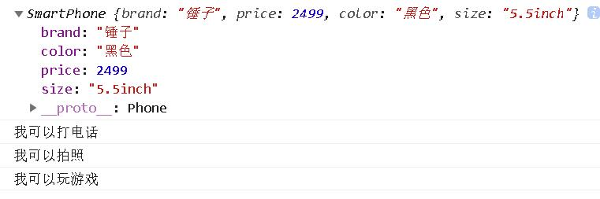
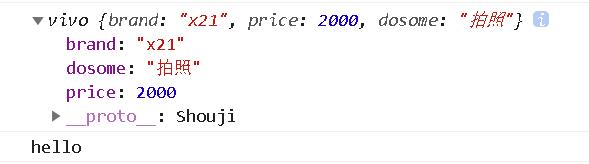
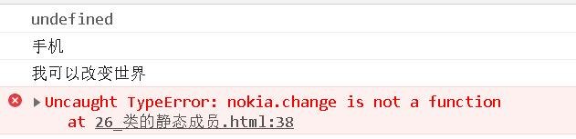
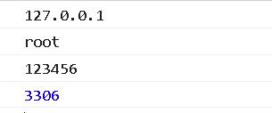
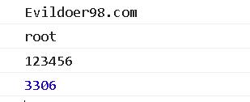

# ES6 新特性
* 类
* 模块化
* 函数参数默认值
* 模板字符串
* 解构赋值
* 延展操作符
* 对象属性缩写
* Promise
* let 和 const

## 1. 类
* ES6 引入了 class（类），让 JavaScript 的面向对象变得更加简单和易于理解
1. 不使用 class（类）
```javascript

    function Phone(brand, price) {
        this.brand = brand
        this.price = price
    }
    // 在原型上添加方法
    Phone.prototype.call = function () {
        console.log('我可以打电话')
    }
    // 实例化对象
    let Huawei = new Phone('华为', 5000)
    Huawei.call()
    console.log(Huawei)
```


2. 不使用 class（类）继承
```javascript
    //手机
        function Phone(brand, price){
            this.brand = brand;
            this.price = price;
        }

        Phone.prototype.call = function(){
            console.log("我可以打电话");
        }

        //智能手机
        function SmartPhone(brand, price, color, size){
            Phone.call(this, brand, price);
            this.color = color;
            this.size = size;
        }

        //设置子级构造函数的原型
        SmartPhone.prototype = new Phone;
        SmartPhone.prototype.constructor = SmartPhone;

        //声明子类的方法
        SmartPhone.prototype.photo = function(){
            console.log("我可以拍照")
        }

        SmartPhone.prototype.playGame = function(){
            console.log("我可以玩游戏");
        }

        const chuizi = new SmartPhone('锤子',2499,'黑色','5.5inch');

        console.log(chuizi);
        chuizi.call()
        chuizi.photo()
        chuizi.playGame()

```


3. 使用class（类）
    * 构造函数在实例化的时候将会被调用，如果不指定，那么就会有一个不带参数的默认构造函数
```javascript
    Class Shouji {
        //构造方法 名字不能修改
        constuctor (brand, price) {
            this.brand = brand
            this.price
        }
        call () {
            console.log('我可以打电话')
        }
    }
    let onePlus = new Shouji("1+", 1999);
    console.log(onePlus);
    console.log(onePlus.call());
```


4. 使用类继承
    * 子类必须要在 constructor 中指定 super 函数，否则在新建实例的时候会报错
    * 如果没有置顶 constructor，默认带 super 函数的 constructor 将会被添加
```javascript
    class vivo extends Shouji{
        constructor(brand, price, dosome) {
            super(brand, price)
            this.dosome = dosome
        }
        toString () {
            console.log('hello');
        }
    }

    let vivox = new vivo('x21',2000,'拍照')
    console.log(vivox);
    console.log(vivox.toString());
```


5. class 的 get 和 set 
```javascript
    class Phone {
        get price () {
            console.log('价格属性被读取了')
            return '价格是....'
        }
        set price(newValue) {
            console.log('价格属性被修改了')
        }
    }
    let oppo = new Phone()
    console.log(oppo.price)
    oppo.price = 'free'
```


6. class 的静态成员
```javascript
    class Phone{
        //静态属性
        static name = '手机';
        static change(){
            console.log("我可以改变世界");
        }
    }

    let nokia = new Phone();
    console.log(nokia.name);
    console.log(Phone.name);
```


## 2. 模块化
* ES5 不支持原生的模块化，在 ES6 中模块作为重要的组成部分被添加进来。模块的功能主要由 export 和 import 组成。每一个模块都有自己单独的作用域，模块之间的相互调用关系是通过 export 来规定模块对外暴露的接口，通过 import 来引用其他模块提供的接口。同时还为模块创造了命名空间，防止函数的命名冲突
1. 导出（export）
    * ES6 允许在一个模块中使用 export 来导出多个变量或函数
2. 导出变量
```javascript
    // test.js
    export var name = 'test'
```
ES6 将一个文件视为一个模块，上面的模块通过 export 向外输出了一个变量。一个模块也可以同时向外输出多个变量
```javascript
    var name = 'test'
    var age = 18
    export {name, age}
```
3. 导出函数
```javascript
    // myModule.js
    export function myModule (someArg) {
        return someArg
    }
```
4. 导入（import）
定义好模板的输出以后就可以在另外一个模块通过 import 引用
```javascript
    import {myModule} form 'myModule' // main.js
    import {name, age} form 'test' // test.js
```

## 3. 箭头(Arrow)函数
* => 不只是关键字 function 的缩写，它还带来了其他好处。箭头函数与包围它的代码共享同一个 this，能很好的解决 this 的指向问题。比如 var self = this 或 var that = this 这种引入外围 this 的模式，但是使用 => ，就不需要这么麻烦了
### 箭头函数的结构
* 箭头函数的箭头 => 之前是一个括号、单个的参数名、或用括号括起来的多个参数名，而箭头之后可以是一个表达式（作为函数的返回值），或者是用花括号括起的函数体（需要自行通过 return 来返回值，否则返回的是 undefined）
```javascript
    () => 1
    v => v + 1
    (a, b) => a + b
    () => {
        alert('test')
    }
    e => {
        if (e == 0) {
            return 0
        }
        return 100
    }
```

* 注意：不论是箭头函数还是 bind，每次被执行都返回的是一个新的函数引用，因此如果需要函数的引用去做一些别的事情（比如卸载监听器），那么就需要保存这个引用

### 特性
1. this 是静态的，this 始终指向函数声明时所在作用域下的 this 的值，箭头函数的 this 只取决于定义时的环境
2. 不能作为构造实例化对象
3. 不能使用 arguments 变量
4. 箭头函数的缩写
    1. 省略小括号，当形参有且只有一个的时候
    2. 省略花括号，当代码体只有一条语句的时候，此时 return 必须省略，而且语句的执行结果就是函数的返回值
5. 因为箭头函数没有 this，所以一切改变箭头函数 this 指向都是无效的
*  比如 fn 箭头函数在 window 环境下定义的，无论如何调用，this 都指向 window  

## 4. 函数参数默认值
* ES6 允许给函数参数赋值初始值
    1. 形参初始值，具有默认值的参数，一般位置都要靠后（潜规则）
        ```javascript
            function foo (height = 50, width = 100, color = 'red') {
                ...
            }
        ```
        * 不使用默认值
        ```javascript
            function foo (hight, color) {
                var height = height || 50
                var color = color || 'red'
                return height + '+' + color
            }
        ```
        * 当参数的布尔值为 false 时，就会出现问题
        * 比如：foo(0, "")  // 50 + red
            * 因为 0 的布尔值为 false，这样 height 的取值将是 50，同理 color 的取值为 'red' 

    2. 与解构赋值结合
        ```javascript
            function connect({host="127.0.0.1", username,password, port}){
            console.log(host)
            console.log(username)
            console.log(password)
            console.log(port)
            }
            connect({
                // host: 'Evildoer98.com',
                username: 'root',
                password: '123456',
                port: 3306
            })
        ```
        
    
## 5. 模板字符串
* ES6 引入新的声明字符串的方式
1. 声明
```javascript
    let str = `我是一个字符串`
    console.log(str, typeof str) // 我是一个字符串 string
```
2. 内容中可以直接出现换行符
```javascript
    let str = `<ul>
                <li>沈腾</li>
                <li>玛丽</li>
                <li>魏翔</li>
                <li>艾伦</li>
                </ul>`;
```
3. 变量拼接
```javascript 
    let star = '小星星'
    let out = `${star} 是个人`
    console.log(out) // 小星星是个人
```
* 在 ES6 中通过 ${} 就可以完成字串符的拼接，只需要将变量放在大括号中即可

## 6. 解构赋值
* ES6 允许按照一定模式从数组和对象中提取值，对变量进行赋值
1. 数组的解构：
    * 从数组中获取值并赋值到变量中，变量的顺序与数组中对象顺序对应
    ```javascript
        const F4 = ['小沈阳','刘能','赵四','宋小宝']
        let [xiao, liu, zhao, song] = F4
        console.log(xiao) // 小沈阳
        console.log(liu) // 刘能
        console.log(zhao) // 赵四
        console.log(song) // 宋小宝

        var foo = ['one', 'two', 'three', 'four']
        var [one, two, three] = foo
        console.log(one) // one
        console.log(two) // two
        console.log(three) // three

        // 如果要忽略某些值，可以按照下面的写法获取需要的值
        var [first, , ,last] = foo
        console.log(first) // one
        console.log(last) // four

        var a, b
        [a, b] = [1, 2]
        console.log(a) // 1
        console.log(b) // 2
    ```
    * 如果没有从数组中获取到值，你可以为变量设置一个默认值
    ```javascript
        var a, b
        [a = 5, b = 7] = [1]
        console.log(a) // 5
        console.log(b) // 7
    ```
    * 通过解构赋值可以方便交换两个变量的值
    ```javascript
        var a = 1
        var b = 5
        [a, b] = [b, a]
        console.log(a) // 1
        console.log(b) // 5
    ```

2. 对象的解构
```javascript
    const zhao = {
        name: '赵本山',
        age: '不详',
        xiaopin: function () {
            console.log('我可以演小品')
        }
    }
    let {name, age, xiaopin} = zhao
    console.log(name) // 赵本山
    console.log(age) // 不详
    console.log(xiaopin) // f () { console.log('我可以演小品') }
    console.log(xiaopin()) // 我可以演小品
```

## 7. 拓展运算符
* 拓展运算符 ... 可以在函数调用/数组构造时，将数组表达式或者 string 在语法层面展开，还可以构造对象时，将对象表达式按 key-value 的方式展开
* 语法：
    * 函数调用：myfunction(...iterableObj)
    * 数组构造或字符串：[...iterableObj, '4', ...'hello', 6]
    * 构造对象时，进行克隆或者属性拷贝：let objClone = {...obj}
* 应用场景
    * 在函数调用时使用拓展运算符
    ```javascript
        function sum (x, y, z) {
            return x + y + z
        }
        const numbers = [1, 2, 3]
        // 不使用拓展运算符
        console.log(sum.apply(null, numbers)) // 6
        // 使用拓展运算符
        console.log(sum(...numbers)) // 6
    ```

    * 构造数组
        * 没有展开语法的时候，只能组合使用 push、splice、concat 等方法，来将已有数组元素变成新数组的一部分。有了展开语法，构造新数组会变得更简单、更优雅
        * 和参数列表的展开类似，...在构造数组时，可以在任意位置多次使用
    ```javascript
        const students = ['john', 'tom']
        const persons = ['alice', ...students, 'bob', 'baby']
        console.log(presons) // 'alice', 'john', 'tom', 'bob', 'baby'
    ```

    * 数组拷贝
        * 展开语法和 Object.assign() 行为一致，执行的都是浅拷贝（只遍历一层）
    ```javascript 
        var arr = [1, 2, 3]
        var arr2 = [...arr] // 等同于 arr.slice()
        arr2.push(4)
        console.log(arr2) // [1, 2, 3, 4]
    ```

    * 连接多个数组
    ```javascript
        var arr1 = [0, 1, 2]
        var arr2 = [3, 4, 5]
        var arr3 = [...arr1, ...arr2] // 将 arr 中所有元素附加到 arr1 后面并返回
        // 等同于
        var arr4 = arr1.concat(arr2)
    ```

    * 对象
    ```javascript
        var obj1 = {foo: 'hello', x: 18}
        var obj2 = {foo: 'world', x: 20}

        var cloneObj = {...obj1} // 克隆后对象：{foo: 'hello', x: 18}
        var mergeObj = {...obj1, ...obj2} // 合并后的对象：{foo: 'world', x: 18, y: 20}
    ```

## 8. 对象属性简写
* 在 ES6 中允许我们在设置一个对象的属性的时候不指定属性名
* 不使用 ES6
    ```javascript
        const name = 'ming',
              age = 18,
              city = '成都'

        const student = {
            name: name, 
            age: age,
            city: city
        }
        console.log(student) // {name: 'ming', age: 18, city: '成都'}
    ```
* 使用 ES6
    ```javascript
        const name = 'ming',
              age = 18,
              city = '成都'

        const student = {
            name,
            age,
            city
        }
        console.log(student) // {name: 'name', age: 18, city: '成都'}

    ```

## 9. Promise
* Promise 是异步编程的一种解决方案，比传统的解决方案 callback 更加的优雅。它最早由社区提出和实现的，ES6 将其写进了语言标准，统一了用法，原生提供了 Promise 对象
* 不使用 ES6
    * 嵌套两个 settimeout 回调函数
    ```javascript
        setTimeout(function (){
            console.log('Hello') // 1 秒后输出 'hello'
            setTimeout(function () {
                console.log('world') // 2 秒后输出 'world'
            }, 1000)
        }, 1000)
    ```
* 使用 ES6
    * 两个 then 来进行一步编程串行化，避免了回调地狱
    ```javascript
        var waitSecond = new Promise (function (resolve, reject) {
            setTimeout(resolve, 1000)
        })
        waitSecond.then(function () {
            console.log('hello') // 1 秒后输出 'hello'
            return waitSecond
        })
        .then(function () {
            console.log('world') // 2 秒后输出 'world'
        })

    ```

## 10. 支持 let 与 const
* 在之前 JS 是没有块级作用域，const 与 let 都是块级作用域
* 使用 var 定义的变量为函数级作用域
    ```javascript
        {
            var a = 10
        }
        console.log(a) // 10
    ```
* 使用 let 与 const 定义的变量为块级作用域
    ```javascript
        {
            let a = 10
        }
        console.log(a) // Uncaught ReferenceError: a is not defined
    ```