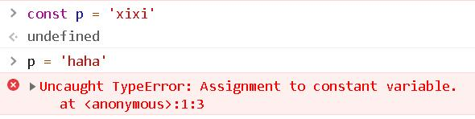
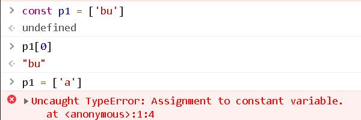
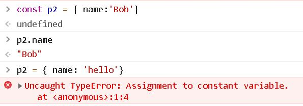
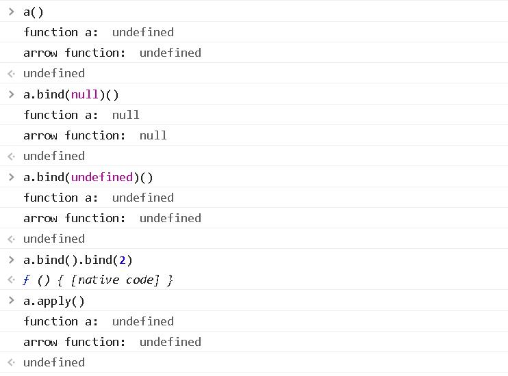
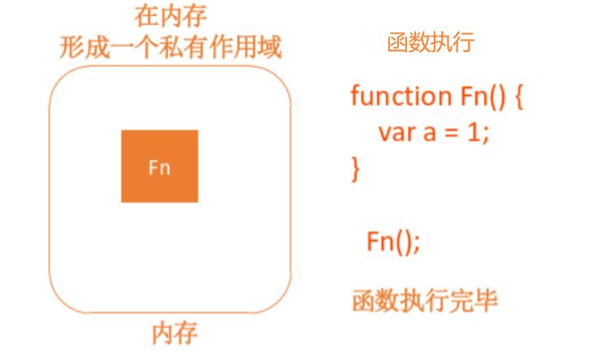
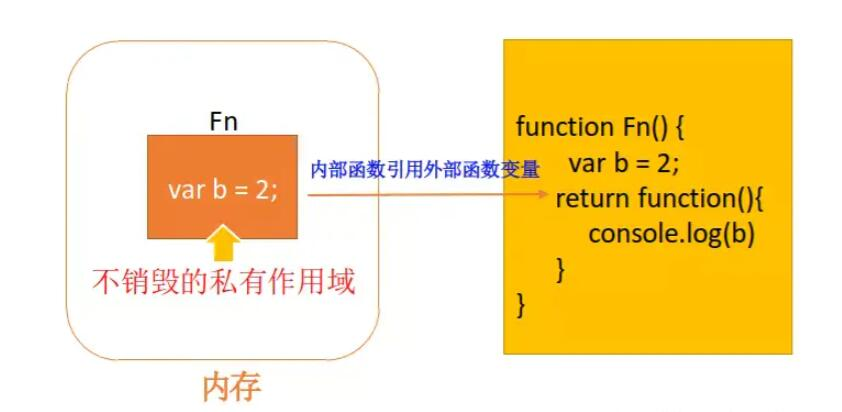
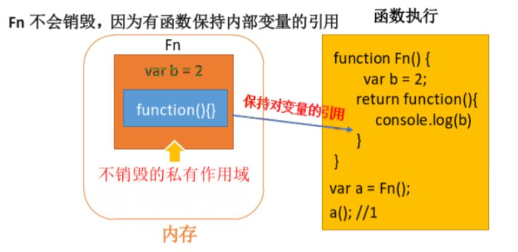
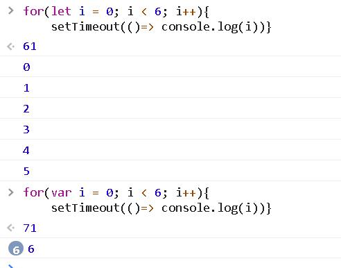

# 数据类型
* JavaScript 是一种弱类型/动态语言。这意味着不用提前声明变量的类型，在程序运行过程中，类型会被自动确定。这意味着可以使用同一个变量保存不同类型的数据
## 01. JS数据类型分为两大类，九个数据类型：
1. 原始类型
    * 分为七种类型，分为：boolean、number、null、undefined、string、symbol、bigint（大于2^53-1）
        * undefined：typeof instance === "undefined"
        * Boolean：typeof instance === "boolean"
        * Number：typeof instance === "number"
        * String：typeof instance === "string"
        * BigInt：typeof instance === "bigint"
        * Symbol：typeof instance === "symbol"
        * Null：typeof instance === "object" (至于为什么是 object ，原因在后续中)
    *   BigInt数据类型的目的是比Number数据类型支持的范围更大的整数值。在对大整数执行数学运算时，以任意精度表示整数的能力尤为重要。使用BigInt，整数溢出将不再是问题。
2. 对象类型
    * 分为两种，分为:   
        * Object（Array、RegExp、Math、Map、Set）
        * Function
3.  |数据类型	 |基本数据类型	 |引用数据类型|
    |----       |----          |----       |
    |储存的元素  | 	值	        |地址 (指针) |
    |储存的地点	 |  栈	        |    堆     |

## 02. == 和 === 的区别
* 全等运算符（ === 和 !== ）：当等号两边的值为相同类型的时候，直接比较等号两边的值，值相同则返回true，若等号两边的值类型不同时直接返回false
    1. 如果操作数的类型不同，则返回 false
    2. 如果两个操作数都是对象，只有当它们指向同一个对象时才返回 true
    3. 如果两个操作数都为 null，或者两个操作数都为 undefined，返回 true
    4. 如果两个操作数有任意一个为 NaN，返回 false
    * 否则，比较两个操作数的值：
        1. 数字类型必须拥有相同的数值。+0 和 -0 会被认为是相同的值
        2. 字符串类型必须拥有相同顺序的相同字符
        3. 布尔运算符必须同时为 true 或同时为 false
* 相等运算符（ == 和 !=）：当等号两边的值为相同类型时比较值是否相同，类型不同时会发生类型的自动转换，转换为相同的类型后再作比较
    1. 如果两个操作数都是对象，则仅当两个操作数都引用同一个对象时才返回 true
    2. 如果一个操作数是 null，另一个操作数是 undefined，则返回 true
    3. 如果两个操作数是不同类型的，就会尝试将字符串转换为数字值
        * 当数字和字符串进行比较时，会尝试将字符串转换为数字值
        * 如果操作数之一是 Boolean，则将布尔操作数转换为 1 或者 0
            * 如果是 true，则转换为 1
            * 如果是 false，则转换为 0
        * 如果操作数之一是对象，另外一个是数字或字符串，会尝试使用对象的 valueOf() 和 toString() 方法将对象转换为原始值
    4. 如果操作数具有相同的类型，则将它们进行如下比较：
        * String：true 仅当两个操作数具有相同顺序的相同字符串时才返回
        * Number：true 仅当两个操作数具有相同的值时才返回。+0 和 -0 被视为相同的值。如果任一操作数为 NaN，则返回 false
        * Boolean：true 仅当操作数为两个 true 或两个 false 时才返回 true
* 类型转换规则：
    1. 如果等号两边是boolean、string、number三者中任意两者进行比较时，优先转换为数字进行比较。
    2. 如果等号两边出现了null或undefined,null和undefined除了和自己相等

## 03. Symbol 的作用
1. Symbol 值通过 Symbol 函数生成，使用 typeof，结果为 “symbol”
    ```javascript
        var s = Symbol('foo')
        console.log(typeof s) // Symbol
    ```
2. Symbol 函数前不能使用 new 命令，否则会报错。这是因为生成的 Symbol 是一个原始类型的值，不是对象
3. instanceof 的结果为 false
    ```javascript
        var s = Symbol('foo')
        console.log(s instanceof Symbol) // false
    ```
4. Symbol 函数可以接受一个字符串作为参数，表示对 Symbol 实例的描述，主要是为了在控制台显示，或者转化为字符串时，比较容易区分
    ```javascript
        var s = Symbol('foo')
        console.log(s) // Symbol(foo)
    ```
5. 如果 Symbol 的参数是一个对象，就会调用该对象的 toString 方法，将其转为字符串，然后才生成一个 Symbol 值
    ```javascript
        const obj = {
            toString () {
                return 'hello'
            }
        }
        const s = Symbol(obj)
        console.log(s) // Symbol(hello)
    ```
6. Symbol 函数的参数只是表示对当前 Symbol 值的描述，相同参数的 Symbol 函数的返回值是不相等的
    ```javascript
        // 没有参数的情况下
        var s1 = Symbol()
        var s2 = Symbol()
        console.log(s1 === s2) // false

        // 有参数的情况下
        var s1 = Symbol('foo')
        var s2 = Symbol('foo')
        consoloe.log(s1 === s2) // false
    ```
7. Symbol 值不能与其他类型的值进行运算，会报错
    ```javascript
        var s = Symbol('hello')
        console.log('test' + s) // Uncaught TypeError: Cannot convert a Symbol value to a string
    ```
8. Symbol 值可以显示转为字符串
    ```javascript
        var s = Symbol('hello')
        console.log(String(s)) // Symbol(hello)
        console.log(s.toString()) // Symbol(hello)
    ```
9. Symbol 值可以作为标识符，用于对象的属性名，可以保证不会出现同名的属性
    ```javascript
        var s = Symbol()
        // 情况1
        var a = {}
        a[s] = 'hello'

        // 情况2
        var b = {
            [s]: 'hello'
        }

        // 情况3
        var a = {}
        Object.defineProperty(a, s, {value: 'hello'})

        // 以上写法的结果都是一样的
        console.log(a[mySymbol]); // "Hello!"
    ```
10. Symbol 作为属性名，该属性不会出现 for...in、for...of 循环中，也不会被 Object.keys()、Object.getOwnPropertyNames()、JSON.stringify() 返回。但是它不是私有属性，有一个 Object.getOwnPropertySymbols 方法，可以获取指定对象的所有 Symbol 属性名
    ```javascript
        var obj = {}
        var a = Symbol('a')
        var b = Symbol('b')

        obj[a] = 'hello'
        obj[b] = 'world'

        var objectSymbols = Object.getOwnPropertySymbol(obj)

        console.log(objectSymbols) // [Symbol(a), Symbol(b)]
    ```
11. 使用同一个 Symbol 值，可以使用 Symbol.for。接受一个字符串作为参数，然后搜索有没有以该参数作为名称的 Symbol 值。如果有，就返回这个 Symbol 值，否则就新建并返回一个以该字符串为名称的 Symbol 值
    ```javascript
        var s1 = Symbol.for('foo')
        var s2 = Symbol.for('foo')
        console.log(s1 === s2) // true
    ```
12. Symbol.keyFor 方法返回一个已登记的 Symbol 类型值的 key
    ```javascript
        var s1 = Symbol.for('foo')
        console.log(Symbol.keyFor(s1)) // foo

        var s2 = Symbol('foo')
        console.log(Symbol.keyFor(s2)) // undefined
    ```
* 全局共享的 Symbol
    * 要创建跨文件可用的 Symbol，甚至跨域（每个都有它自己的全局作用域），使用 Symbol.for() 方法和 Symbol.keyFor() 方法从全局的 Symbol 注册表设置和取得 Symbol

## 04. 0.1 + 0.2 !== 0.3
*   因为 JS 采用 IEEE 754 双精度版本（64位）
*   存在的问题的原因是：
    * 浮点数用二进制表示的时候是无穷的，因为精度的问题，两个浮点数相加会造成截断丢失精度，因此再转换为十进制就出了问题
*   解决办法：
    1. ES6中，Number 有个新的属性 EPSILON，在计算机科学技术里面，这个词代表极小值
    2. toFixed(n) // n 代表保留几位小数
        * toFixed() 使用的是“银行家舍入法”。该方法又被称为“四舍六入五取偶法”或者“四舍六入五留双法”。
            * 规则：
                1. 大于等于4，直接舍去该位
                2. 大于等于6，向前位进一
                3. 等于5
                    * 5 后面有数，向前位进一
                    * 5 后全 0 
                        * 5 前位数值为奇，则向前位进一（将前位凑成偶）
                        * 5 前位数值为偶，则直接舍去该位
    3. 最好使用 Math.floor(num * 100) / 100  （floor() 方法执行的是向下取整计算）

## 常见考点
    JS 类型有哪些？
    大数相加、相乘算法题，可以直接使用 bigint，当然再加上字符串的处理会更好。
    NaN 如何判断

# 类型判断
## 01. typeof（判断数据类型）
1. 原始类型除了 null，其他类型都可以通过 typeof 来判断
2. typeof null 的值是 object。因为 对象的类型标签是 0。由于 null 代表的是空指针（值为0x00），因此 null 的类型标签是 0
    * 类型标签存储在单元的低位中（不同对象在底层都表示为二进制）
       1.  000 object   数据是对象的引用
       2.  1   int      数据是31位有符号整数
       3.  010 double   数据是对双浮点数的引用
       4.  100 string   数据是对字符串的引用
       5.  110 boolean  数据是布尔值
3. 如果要判断 null 类型的话直接 xxx === null 即可
4. 对于对象类型来说，typeof 只能具体判断函数的类型是 function，其它均为object
```javascript
    // 数值
    typeof 37 === 'number';
    typeof 3.14 === 'number';
    typeof (42) === 'number';
    typeof Math.LN2 === 'number';
    typeof Infinity === 'number';
    typeof NaN === 'number'; // 尽管它是 "Not-A-Number" (非数值) 的缩写
    typeof Number(1) === 'number'; // Number 会尝试把参数解析成数值

    typeof 42n === 'bigint';

    // 字符串
    typeof '' === 'string';
    typeof 'bla' === 'string';
    typeof `template literal` === 'string';
    typeof '1' === 'string'; // 注意内容为数字的字符串仍是字符串
    typeof (typeof 1) === 'string'; // typeof 总是返回一个字符串
    typeof String(1) === 'string'; // String 将任意值转换为字符串，比 toString 更安全

    // 布尔值
    typeof true === 'boolean';
    typeof false === 'boolean';
    typeof Boolean(1) === 'boolean'; // Boolean() 会基于参数是真值还是虚值进行转换
    typeof !!(1) === 'boolean'; // 两次调用 ! (逻辑非) 操作符相当于 Boolean()

    // Symbols
    typeof Symbol() === 'symbol';
    typeof Symbol('foo') === 'symbol';
    typeof Symbol.iterator === 'symbol';

    // Undefined
    typeof undefined === 'undefined';
    typeof declaredButUndefinedVariable === 'undefined';
    typeof undeclaredVariable === 'undefined';

    // 对象
    typeof {a: 1} === 'object';

    // 使用 Array.isArray 或者 Object.prototype.toString.call
    // 区分数组和普通对象
    typeof [1, 2, 4] === 'object';

    typeof new Date() === 'object';
    typeof /regex/ === 'object'; // 历史结果请参阅正则表达式部分

    // 下面的例子令人迷惑，非常危险，没有用处。避免使用它们
    typeof new Boolean(true) === 'object';
    typeof new Number(1) === 'object';
    typeof new String('abc') === 'object';

    // 函数
    typeof function() {} === 'function';
    typeof class C {} === 'function'
    typeof Math.sin === 'function';

```

## 02. instanceof（只能用于对象，不适用于原始类型的值）
1. instanceof 内部通过原型链的方式来判断是否为构建函数的实例，常用于判断具体的对象类型
    [] instanceof Array
2. 实现 instanceof（原型继承机制）
```javascript
    function isIntanceof(instance, klass){
        let proto = instance.__proto
        let prototype = klass.prototype
        while(true){
            if(proto == null) return false
            if(proto == prototype) return true
            proto = proto.__proto__
        }
    }
```
## 03. Object.prototype.toString（能够获取变量的准确类型）
```javascript
    Object.prototype.toString.call(null)         // [Object Null]
    Object.prototype.toString.call(1)            // [Object Number]
    Object.prototype.toString.call(1n)           // [Object BigInt]
    Object.prototype.toString.call(function(){}) // [Object Function]
    Object.prototype.toString.call([])           // [Object Array]
    Object.prototype.toString.call({})           // [Object Object]
    Object.prototype.toString.call('')           // [Object String]
```

## 04. isxxx API
```javascript
    Array.isArray([])   // true
    isNaN(',')          // true
    isArguments() // 判断是否是 arguments 对象
    isObject()   // 判断是否是 对象
    isElement()  // 判断是否是 DOM 元素
```

## 常见考点
```javascript
JS 类型如何判断，有哪几种方式可用
instanceof 原理
手写 instanceof
```

# 类型转换
*   类型转换分为两种情况，分别为强制转换及隐式转换
## 01. 强制转换
1. 强制转换就是转换成特定的类型
```javascript
    Number(false)   // 0
    Number('1')     // 1
    Number('zb')    // NaN
    (1).toString()  // '1'
```
2. 转布尔值规则：
    undefined、null、false、NaN、''、0、-0 都转为false
    其他所有值都转为true，包括所有对象
3. 转数字规则
    true 为 1，false 为 0
    null 为 0，undefined 为 NaN，symbol 报错
    字符串看内容，如果是数字或者二进制就正常转，否则就NaN
## 02. 隐式转换
1. 对象转基本类型：
    调用 Symbol.toPrimitive，转成功就结束
    调用 valueOf，转成功就结束
    调用 toString，转成功就结束
    报错
2. 四则运算符：
    只有当加法运算时，其中一方是字符串类型，就会把另一个也转为字符串类型
    其他运算只要其中一方是数字，那么另一方就转为数字
## 常见考点
```javascript
[] == ![]  // true
```

# let const
* var 和 let/const 的区别：
    1. 块级作用域
    2. 不存在变量提升
    3. 暂时性死区
    4. 不可重复声明
    5. let、const 声明的全局变量不会挂在顶层对象下面
* const 的注意点
    1. const 声明之后必须马上赋值，否则会报错
    2. const 简单类型一旦声明就不能再更改；复杂类型（数组、对象等）指针指向的地址不能更改，内部数据可以更改
* let 和 const 都是 ES6 的语法，之前的 var 是没有块级作用域的，所以很容易造成全局变量污染，而 let 和 const 都是有块级作用域的
    1. let 可以理解为带块级作用域的 var
    2. const 则是指定常量，一旦定义就不能更改
* let 和 const 声明的变量必须之前没有被使用过，否则会报错
* let 和 const 声明的变量，只能在声明之后使用
* 注意：const 当定义为一个引用类型时，可以往里面添加内容，但是不能替换

## 为什么需要块级作用域
* ES5 只有全局作用域和函数作用域，没有块级作用域
    * eg：不合理的场景
        1. 内层变量可能覆盖外层变量
        2. 用来计数的循环变量泄露为全局变量

## 01. 块级作用域
1. 作用域
    ```javascript
        function f () {
            let n = 5
            if (true) {
                let n = 10
                console.log(n) // 10
            }
            consoloe.log(n)  // 5
        }
    ```
2. 块级作用域任意嵌套
    ```javascript
        {{{{
            {let test = 'Hello world'}
            console.log(test)
        }}}}
    ```
3. 块级作用域真正使代码分割成块
    ```javascript
        {
            let a = ...
            ...
        }
        {
            let a = ...
            ...
        }
        {
            let a = ...
            ...
        }
    ```

## 02. 块级作用域声明函数
1. 在块级作用域声明函数，最好使用匿名函数的形式
    ```javascript
        if(true) {
            let a = function () {}
        }
    ```
2. ES6 的块级作用域允许声明函数的规则，旨在使用大括号的情况下成立，如果没有使用大括号，就会报错
    ```javascript
        // 报错
        'use strict'
        if (true) 
            function f () {} // 需要给 if 添加一个 {}
    ```

## 03. 不存在变量提升
* 变量提升的现象：在同一作用域下，变量可以在声明之前使用，值为 undefined
* ES5 时使用 var 声明变量，会出现变量提升的现象
    ```javascript
        // var 情况
        console.log(foo) // 输出 undefined
        var foo = 2

        // let 情况
        console.log(bar) // 报错 ReferenceError
        let bar = 2
    ```

## 04. 暂时性死区
* 只要一进入当前作用域，所要使用的变量就已经存在了，但是不可获取。只有等到声明变量的那一行代码出现，才可以获取和使用该变量
    ```javascript
        var temp = 123
        if (true) {
            temp = 'abc' // 报错，因为本区域有 temp 声明变量
            let temp // 绑定 if 这个块级作用域，不能出现 temp 变量
        }
    ```
* 暂时性死区和不能变量提升的意义在与：
    * 为了减少运行时的错误，防止在变量声明前就使用这个变量，从而导致意料之外的行为

## 05. 不允许重复声明变量
* 在测试时可能出现这种情况
    ```javascript
        var a = '声明'
        const a = '不报错'
    ```
    * 这种情况是因为 babel 在转化的时候，做了一些处理，而在浏览器的控制台中测试，就会报错
* let、const 不允许在相同作用域内，重复声明同一个变量
    ```javascript
        function f1 (arg) {
            let arg // 报错
        }

        function f2 (arg) {
            {
                let arg // 不报错
            }
        }
    ```

## 06. let、const 声明的全局变量不会挂在顶层对象下面
1. 浏览器环境的顶层对象：window
2. node 环境的顶层对象：global
3. var 声明的全局变量会挂载顶层对象下面，而 let、const 不会挂在顶层对象下面
* eg：
    ```javascript
        var a = 1
        // 如果在 node 环境，可以写成 global.a
        // 或者采用通用方法，写成 this.a
        window.a = 1

        let a = 1
        window.b // undefined
    ```

## 07. const 命令
1. 一旦声明，必须马上赋值
    ```javascript
        let p1
        var p2 
        const p3 = '马上赋值'
        const p4  // 报错，没有赋值
    ```
2. const 一旦声明值就不能改变
    * 简单类型：不能改动
        ```javascript
            const p = '不能改变'
            p = '报错'  // 改值会报错
        ```
        
    * 复杂类型：变量指针不能变
        ```javascript
            const p1 = ['bu']
            p1[0] // bu
            p1 = ['a'] // 报错
        ```
        
        ```javascript
            const p2 = {name: 'Bob'}
            p2.name // Bob
            p2 = { name: 'hello'} // 报错
        ```
        
* const 所说的一旦声明值就不能改变，实际上指的是：变量指向的那个内存地址所保存的数据不得改动
    * 简单类型：内存地址就是值，即常量（一变就报错）
    * 复杂类型（对象、数组等）：地址保存的是一个指针，const 只能保证指针是固定（总是指向同一个地址），它内部的值是可以改变的
        * 注意：只要不重新赋值整个数组/对象，因为保存的是一个指针，所以对数组使用的 push、shift、splice 等方法也是允许的，也就是把值一个个的全部删除都不会报错

## 08. let、const 的使用场景
* let 使用场景：变量，用以替代 var
* const 使用场景：常量、声明匿名函数、箭头函数


# this
## 01. 箭头函数
* 箭头函数的 this 是在创建它时外层 this 的指向
    1. 创建箭头函数时，就已经确定了它的指向
    2. 箭头函数内的 this 指向外层的 this
    * 箭头函数不能用作构造函数

## 02. new
* 当使用 new 关键字调用函数时，函数中的 this 一定是 JS 创建的新对象

## 03. bind
* bind 是指 Function.prototype.bind()
* 多次 bind 只认第一次 bind 的值
    ```javascript
        function func () {
            console.log(this)
        }

        func.bind(1).bind(2)    // 1
    ```
* 箭头函数中 this 不会被修改
    ```javascript
        func = () => {
            // 这里的 this 指向取决于外层 this
            console.log(this)
        }
        func.bind(1)()  // Window
    ```
* bind 与 new
    ```javascript
        function func () {
            console.log(this, this.__proto__ === func.prototype)
        }

        boundFunc = func.bind(1)
        new boundFunc()     // true
    ```

## 04. apply 和 call
* apply() 和 call() 的第一个参数都是 this，区别在于通过 apply 调用时参数是放在数组中的，而通过 call 调用时实参是逗号分隔的
* 箭头函数中的 this 不会被修改
    ```javascript
        func = () => {
            // 这里 this 指向取决于外层 this
            console.log(this)
        }

        func.apply(1) // window
    ```
* bind 函数中 this 不会被修改
    ```javascript
        function func () {
            console.log(this)
        }

        boundFunc = func.bind(1)
        boundFunc.apply(2)      // 1
    ```

## 05. Obj.
```javascript
    function func () {
        console.log(this.x)
    }

    obj = { x: 1}
    obj.func = func
    obj.func()  // 1
```

## 06. 直接调用
* 函数在被直接调用时，this 将指向全局对象。在浏览器环境中全局对象是 Window，在 Node.js 环境中是 Global
* eg1：
    ```javascript
        function func () {
            console.log(this)
        }

        func() // Window
    ```
* eg2：
    ```javascript
        function outerFunc () {
            console.log(this)

            function func () {
                console.log(this)
            }
            func()
        }

        outerFunc.bind({ x: 1})
    ```

## 07. 不在函数里
* 不在函数中的场景，可分为浏览器的 < script /> 标签里，或 Node.js 的模块文件里
    1. 在 < script /> 标签里，this 指向 Window
    2. 在 Node.js 的模块文件里，this 指向 Module 的默认导出对象，也就是 module.exports

## 非严格模式
* 严格模式是在 ES5 提出的。在 ES5 规范之前，也就是非严格模式下，this 不能是 undefined 或 null。
    1. 如果得出 this 的指向是 undefined 或 null，那么 this 会指向全局对象
    2. 在浏览器环境中全局对象是 Window，在 Node.js 环境中 Global
* eg1：在非严格模式下，this 都指向全局对象
    ```javascript
        function a() {
            console.log("function a: ", this);

            (() => {
                console.log("arrow function: ", this)
            })()
        }

        a()
        a.bind(null)()
        a.bind(undefined)()
        a.bind().bind(2)
        a.apply()
    ```
    

* eg2：在严格模式下，this
    ```javascript
        "use strict"

        function a() {
            console.log("function a: ", this);

            (() => {
                console.log("arrow function: ", this)
            })()
        }

        a()
        a.bind(null)()
        a.bind(undefined)()
        a.bind().bind(2)
        a.apply()
    ```
    

## 常见考点
```javascript
    this 的指向问题
    const a = {
        b: 2,
        foo: function () { console.log(this.b) }
    }

    function b(foo) {
        // 输出什么？
        foo()
    }

    b(a.foo) // undefined
```

# 闭包
* 闭包定义：一个函数能访问外部的变量，那么这个函数它就是一个闭包，而不是一定要返回这个函数
* 闭包是一个可以 访问其他作用域的变量 的函数
* 闭包的本质就是 存在对父级作用域的引用
* 理解：
    * 当嵌套的内部函数引用了外部函数的变量时就产生了闭包
    * 通过 chrome 工具得知：闭包本质是内部函数的一个对象，这个对象中包含引用的变量属性
* 条件：
    * 函数嵌套
    * 内部函数引用了外部函数的数据（变量/函数）
* 作用：（保护和保存）
    1. 延长局部变量的生命周期，保护函数的私有变量不受外部的干扰，形成不销毁的栈内存
    2. 让外部函数能操作内部的局部变量
    3. 保存，把一些函数内的值保存下来。闭包可以实现方法和属性的私有化
## 1. 什么是闭包？
1. 函数作用域
    * 函数作用域的概念，形象描述的话，可以认为它是一个封闭的空间，只允许在这个封闭的空间中进行一些操作，也将这个封闭空间称为私有作用域。在 JS 中，一个函数的执行就会在内存中创建一个私有作用域 ———— 封闭的空间
    
    * 比如在函数中定义一个变量，只能在函数这个私有作用域中使用（也就是封闭空间），只要超出了这个作用域，就找不到该变量了
    * 而且函数执行完毕后，这个私有作用域（封闭的空间）就会销毁
    * 不会销毁的情况：闭包
2. 垃圾回收机制
    
    * 内部函数引用着外部的函数的变量，外部的函数尽管执行完毕，作用域也不会销毁。从而形成了一种不销毁的私有作用域
    * 某一变量或者对象被引用着，因此在回收的时候不会释放它，因为被引用代表着被使用，回收器不会对正在引用的变量或对象回收的
3. 作用域继承
    * 所谓的作用域继承，即例如一个大的盒子作为一个父级的作用域，然后在这个大的盒子里面放一个小的盒子，作为子作用域。固定可以在小盒子中获取到大盒子中的东西，大盒子不能获取小盒子里面的东西就被称为作用域继承
    * eg：
        ```javascript
            function Fn () {
                var a = 1
                return function () {
                    console.log(a)
                }
            }
        ```
    * 在 JS 中，在一个函数里面再声明一个函数，内部函数可以访问外部函数作用域的变量，而外部的函数不能获取到内部函数的作用域变量
    * 即在一个函数里面再定义一个函数，这个内部函数一直保持有对外部函数中作用域的访问权限
    * 函数执行，形成一个私有的作用域，保护里面的私有变量不受外界的干扰，除了保护私有变量外，还可以存储一些内容，这样的模式叫做闭包
    

## 应用场景
* 应用：
    1. 保护作用：
        * 团队开发时，每个开发者将自己的代码放在一个私有的作用域中，防止相互之间的变量命冲突；把需要提供给别人的方法，通过 return 或 window.xxx 的方式暴露在全局下
        * jQuery大量使用了闭包
        * 模板化：封装一些数据以及操作数据的函数，向外暴露一些行为
    2. 保护作用：
        * 循环遍历加监听
            ```javascript
                var btnBox = document.getElementById('btnBox')
                var inputs = btnBox.getElementById('input')
                for(var i = 0; i < 6; i++) {
                    inputs[i].onclick = function () {
                        alert(i)
                    }
                }
                // 666666 
            ```
            * 因为所有的事件绑定都是异步的，当触发点击事件，执行方法的时候，循环早就结束了。
                * 同步：JS 中当前这个任务没有完成，下面的任务都不会执行，只有等当前彻底完成，才会执行下面的任务
                * 异步：JS 中的当前任务没有完成，需要等一会再完成，此时可以继续执行下面的任务
            * 解决方案：（闭包）
                * 拓展：自执行匿名函数（五种写法）
                    * (function () { /* code */ } ()); 
                    * !function () { /* code */ } ();
                    * ~function () { /* code */ } ();
                    * -function () { /* code */ } ();
                    * +function () { /* code */ } ();
                    * 作用：可以用它创建命名空间，只要把自己所有的代码都写在这个特殊的函数包装内，那么外部就不能访问，除非你允许（变量前加上 window，这样该函数或变量就成为全局）
                    * 执行函数的作用主要为 匿名 和 自动执行，代码在被解释时就已经在运行了
                * 法一：
                    ```javascript
                        for(var i = 0; i < 10; i++) {
                            ~function (i) {
                                inputs[i].onclick = function () {
                                    alert(this.myIndex)
                                }
                            }(i)
                        }
                    ```
                    * 优点：通过创建私有作用域（闭包）方式解决，循环几次，就创建几个私有作用域（闭包），然后每个私有作用域都有一个私有变量 i，存的值分别是循环的值
                    * 缺点：生成多个不销毁的私有作用域（堆内存），对性能有一定的影响
                
                * 法二：自定义属性
                    ```javascript
                        for(var i = 0; i < 10; i++) {
                            inputs[i].myIndex = i
                            inputs[i].onclick = function () {
                                alert(this.myIndex)
                            }
                        }
                    ```

                * 法三：ES6 块级作用域
                    ```javascript
                        for(let i = 0; i < 6; i++) {
                            inputs[i].onclick = function () {
                                alert(i)
                            }
                        }
                    ```
        * 用法与以下情况类似
         
            
    * 定义 JS 模块
        * 具有特定功能的 js 文件
        * 将所有的数据和功能都封装在一个函数内部（私有的）
        * 只向外暴露一个包含 n 个方法的对象或函数
        * 模块的使用者，只需要通过模块暴露的对象调用方法来实现对应的功能
* 缺点:
    * 变量占用内存时间可能会过长可能导致内存泄露
    * 闭包会携带包含其它的函数作用域，因此会比其它函数占用更多的内存。过度使用闭包会导致内存占用过多。
* 解决:
    及时释放 f = null 让内部对象成为垃圾对象
* eg：
```javascript
    let a = 1
    // fn 是闭包
    function fn() {
        console.log(a);
    }

    function fn1() {
    let a = 1
    // 这里也是闭包
        return () => {
            console.log(a);
        }
    }
    const fn2 = fn1()
    fn2()

    for (var i = 0; i < 6; i++) {
        setTimeout(() => {
            console.log(i)
        })
    }
    // 6 6 6 6 6 6
```

# 函数柯里化
* 是把接受多个参数的函数变换成接受一个单一参数（最初函数的第一个参数）的函数，并且返回接受余下参数且返回结果的新函数的技术
* 柯里化其实本身是固定一个可以预期的参数，并返回一个特定的函数，处理一批特定的需求，增加了函数的适用性，但同时降低了函数的适用范围
* 对于已经柯里化的函数来说，当接收到的参数数量与原函数的形参数量相同时，执行原函数；当接收的参数数量小于原函数的形参数量时，返回一个函数用于接收剩余的参数，直至接收的参数数量与形参数量一致，执行原函数

* 思想：降低适用范围，提高适用性
* 用处：
    1. 提高适用性：
        通用函数解决兼容性问题，但是同时也会带来适用的不便利性，不同的应用场景往往要传递很多参数，以达到解决特定的目的，有时候应用中，会对同一个规则进行反复适用，这样就造成了代码的重复性
    2. 延迟执行：
        柯里化的另一个应用场景是延迟执行。不断的柯里化，累积传入的参数，最后执行
    3. 固定易变因素：
        柯里化特性决定了这一应用场景。提前把易变因素，传参固定下来，生成一个更明确的应用函数。最典型的代表，是 bind 函数用以固定 this 这个易变对象
* eg:
    ```javascript
        // 普通的 add() 函数
        
        function add (x, y) {
            return x + y
        }
        // 柯里化（Currying）
        function curryingAdd (x) {
            return function (y) {
                return x + y
            }
        }
        add(1, 2)  // 3
        curryingAdd(1)(2) // 3
    ```
    * 优点：参数复用、提前确认、延迟执行
    * 性能：
        1. 存取 arguments 对象通常要比存取参数要慢一点
        2. 一些老版本的浏览器在 arguments.length 的实现上是相当慢的
        3. 使用 fn.apply(...) 和 fn.call(...) 通常比直接调用 fn(...) 稍微慢点
        4. 创建大量嵌套作用域和闭包函数会带来花销，无论是在内存还是在速度上

* 通过柯里化缓存的参数数量，来判断是否到达了执行时机
```javascript
    function curry(fn) {
        const argLen = args.length
        const presetArgs = [].slice.call(arguments,1)
        return function () {
            const restArg = [].slice.call(arguments)
            const allArgs = [...presetArgs, ...restArgs]
            if (allArgs.length >= argLen) {
                return fn.apply(this, allArgs)
            } else {
                return curry.call(null, fn, ...allArgs)
            }
        }
    }
```

* 经典面试题
    ```javascript
    // 实现一个 add 方法，使计算结果能够满足如下预期
    add(1)(2)(3) = 6;
    add(1, 2, 3)(4) = 10;
    add(1)(2)(3)(4)(5) = 15;

    function add () {
         // 第一次执行时，定义一个数组专门用来存储所有的参数
        var _args = Array.prototype.slice.call(arguments)
        // 在内部声明一个函数，利用闭包的特性保存_args并收集所有的参数值
        var _adder = function () {
            _args.push(...arguments)
            return _adder
        }
        // 利用toString隐式转换的特性，当最后执行时隐式转换，并计算最终的值返回
        _adder.toString = function () {
            return _args.reduce(function (a, b) => {
                return a + b
            })
        }
        return _adder
    }
    add(1)(2)(3)                // 6
    add(1, 2, 3)(4)             // 10
    add(1)(2)(3)(4)(5)          // 15
    add(2, 6)(1)                // 9
    ```

# New
* new 操作符可以帮助我们构建出一个实例，并且绑定上this，内部执行步骤大概分为以下：
    1. 新生成一个对象
    2. 对象连接到构造函数原型，并绑定this
    3. 执行构造函数代码
    4. 返回新对象
```javascript
    function myNew(Func, ...args){
        const obj = {}
        if(Func.prototype){
            Func.setPrototypeOf(obj, Func.prototype)
        }
        const res = Func.apply(obj, args)
        if(typeof res === "function" || typeof res === "object"){
            return res
        }
        return obj
    }
```
*   Object.setPrototype() 为现有对象设置原型，返回一个新对象
        接受两个参数，第一个是现有对象，第二个是原型对象
*   new 命令通过构造函数新建对象实例的过程，其本质是将实例的原型指向构造函数的prototype属性，然后在实例上执行构造函数

## 常见考点
    new 做了那些事？
    new 返回不同的类型时会有什么表现？
    手写 new 的实现过程

# 作用域
1. 作用域可以理解为变量的可访问性，总共分为三种类型，分别为
    1. 全局作用域
    2. 函数作用域
    3. 块级作用域（ES6中的let、const就可以产生该作用域）
2. 作用域链是在定义时就被确定下来的，和箭头函数中的 this 一样，后续不会改变，JS会一层层往上寻找需要的内容
3. 作用域：一块代码区域，在编码时就确定了，不会再变化了
4. 作用域链：多个嵌套的作用域形成的由内向外的结构，用于查找变量
    * 用途：
        1. 保证对执行环境有权访问的所有变量和函数的有序访问
        2. 隔离变量，不同作用域下同名变量不会有冲突
5. 区别作用域与执行上下文
    作用域：静态的，编码的时候就确定了（不是在运行时），一旦确定就不会变化了
    执行上下文：动态的，执行代码之前的时候动态创建，当执行结束后消失
    联系：执行上下文环境是在对应的作用域中的

## 常见考点
    什么是作用域
    什么是作用域链

# 执行上下文
## 01. 变量提升和函数提升
1. 变量声明提升
    * 通过 var 定义（变量提升）的变量，在定义语句之前就可以访问到
    * 值：undefined
2. 函数声明提升
    * 通过函数 function 声明的函数，在之前就可以直接调用
    * 值：函数定义（对象）
* 先执行变量提升，在执行函数提升
## 02. 执行上下文
1. 代码位置（分类）
    * 全局代码
    * 函数（局部）代码
2. 全局执行上下文
    * 在执行全局代码前将 window 确定为全局执行上下文
    * 在全局数据进行预处理
        * var 定义的全局变量 ==> undefined，添加为 window 的属性
        * function 声明的全局函数 ==> 赋值（fun），添加为 window 的方法
        * this ==> 赋值（window）
    * 开始执行全局代码
3. 函数执行上下文
    * 在调用函数，准备执行函数体之前，创建对应的函数执行上下文对象（虚拟的，存在于栈中）
    * 对局部数据进行预处理
        * 形参变量 ==> 赋值（实参） ==> 添加为执行上下文的属性
        * arguments ==> 赋值（实参列表），添加为执行上下文的属性
        * var 定义的局部变量 ==> undefined，添加为执行上下文的属性
        * function 声明的函数 ==> 赋值（fun），添加为执行上下文的方法
        * this ==> 赋值（调用函数的对象）
    * 开始执行函数体代码

## 03. 执行上下文栈
1. 在全局代码执行钱，JS 引擎就会创建一个栈来存储管理所有的执行上下文对象
2. 在全局执行上下文（window）确定后，将其添加到栈中（压栈）
3. 在函数执行上下文创建后，将其添加到栈中（压栈）
4. 在当前函数执行完后，将栈顶的元素对象移除（出栈）
5. 当所有代码执行完毕后，栈中只剩下 window

# 原型与原型链
## 01. 原型
1. 所有函数都有一个特别的属性
    prototype：显示原型对象
2. 所有实例对象都有一个特别的属性
    __proto__：隐式原型属性
3. 显示原型与隐式原型对象的关系
    1. 函数的 prototype ：定义函数时被自动赋值，值默认{}，即为原型对象
    2. 实例对象的 __proto__ ：在创建实例对象时被自动添加，并赋值为构造函数的 prototype 值
    3. 原型对象即为当前实例对象的父对象

## 02. 原型链
1. 每一个函数有一个 prototype 的属性，当他作为构造函数的时候，它实例化出来的函数会有一个 __proto__ 属性，它执行构造函数的 prototype
2. 函数通过 prototype 来访问其父元素的属性和方法，依次迭代访问，构成原型链，直到 Object 的原型为止，它位于原型链的顶端
3. 访问某个属性或方法的时候，会先从当前对象中查找，没有的话就顺着原型链寻找，直到找到最顶端，也就是 Object 的原型（null）为止
4. 另外每一个原型上都有一个 constructor 属性，指向相关联的构造函数
*  所有的实例对象都有 __proto__ 属性，它指向的就是原型对象，这样通过 __proto__ 属性就形成一个链的结构 ---> 原型链
*  当查找对象内部方法/属性时，js 引擎自动沿着这个原型链开始查找
*  读取对象的属性值时: 会自动到原型链中查找
*  当给对象属性赋值时不会使用原型链，而只在当前对象中进行操作

## 03. 总结
* 所有对象都有一个属性 __proto__ 指向一个对象，也就是原型
* 每个对象的原型都可以通过 constructor 找到构造函数，构造函数也可以通过 prototype 找到原型
* 所有函数都可以通过 __proto__ 找到 Function
* 所有对象都可以通过 __proto__ 找到 Object
* 对象之间通过 __proto__ 连接起来，这样称之为原型链。当前对象上不存在的属性可以通过原型链一层层往上查找，直到顶层 Objcet 对象，在往上就是 null 了

# 对象创建模式
## 01. Object 构造函数模式
* 步骤：先创建空 Object 对象，再动态添加属性/方法
* 使用场景：起始时不确定对象内部数据
* 缺点：语句复杂
```javascript
    // 先创建空Object对象
    var p = new Object()
    p = {} //此时内部数据是不确定的
    // 再动态添加属性/方法
    p.name = 'Tom'
    p.age = 12
    p.setName = function (name) {
        this.name = name
    }
```

## 02. 对象字面量模式
* 步骤：创建 {} 创建对象，同时指定属性/方法
* 使用场景：起始时对象内部数据是确定的
* 问题：如果创建多个对象，有重复代码
```javascript
    var p = {
        name: 'Tom',
        age: 12,
        setName: function (name) {
        this.name = name
        }
    }
```

## 03. 工厂模式
* 步骤：通过工厂函数动态创建对象并返回
* 适用场景：需要创建多个对象
* 缺点：对象没有一个具体的类型，都是 Object 类型
```javascript
    function createPerson(name, age) { //返回一个对象的函数===>工厂函数
        var obj = {
        name: name,
        age: age,
        setName: function (name) {
                this.name = name
            }
        }
        return obj
    }
```

## 04. 自定义构造函数模式
* 步骤：自定义构造函数，通过 new 创建对象
* 适用场景：需要创建多个类型确定的对象
* 缺点：每个对象都有相同的数据，浪费内存
```javascript
    function Person(name, age) {
        this.name = name
        this.age = age
        this.setName = function (name) {
        this.name = name
        }
    }
```

## 05. 构造函数 + 原型的组合模式
* 步骤：自定义构造函数，属性在函数中初始化，方法添加到原型上
* 适用场景：需要创建多个类型确定的对象
```javascript
    function Person(name, age) { //在构造函数中只初始化一般函数
        this.name = name
        this.age = age
    }
    Person.prototype.setName = function (name) {
        this.name = name
    }
```

# 继承
* ES5 和 ES6 继承的区别：
    1. ES6 继承的子类需要调用 super() 才能拿到子类，ES5 的话是通过 apply 这种绑定的方式
    2. 类声明不会提升，和 let 这些一致

## 01. 构造函数继承（apply & call）
1. 直接利用 call 或者 apply 方法将父类构造函数的 this 绑定为子类构造函数的 this 就可以
2. 缺点：无法继承原型链上的属性和方法
3. 共同的作用：call 和 apply 都是用来修改函数中 this 的指向问题
4. 不同之处
    1. call() 方法分别接受参数。call 方法可以传给该函数的参数分别作为自己的多个参数
    2. apply() 方法接受数组形式的参数。apply 方法必须将传给该函数的参数合并成一个数组作为自己的一个参数
    3. 如果要使用数组而不是参数列表，则 apply() 方法非常方便
    4. 当我们通过 call 和 apply 来改变 this 的指向时，
        不传任何参数，则默认为将 this 指向修改为 window
        有参数时，this 指向第一个参数
    5. 当需要传递参数时，call 可以直接写多个参数，apply 需要用数组方式传递
5. call()、apply()、bind() 都是用来重定义 this 这个对象的call、bind、apply 这三个函数的第一个参数都是 this 的指向对象
6. bind() 除了返回函数意外，它的参数和 call() 一样
*   优点：可以保证每个子类维护自己的属性
*   缺点：无法访问原型链上的属性和方法
```javascript
        function Parent(){
            this.lastname = "wang"
            this.hobby = ['a','b']
        }
        Parent.prototype.asset = ['house','car']
        
        function Child(){
            Parent.call(this)
        }

        var child1 = new Child()
        var child2 = new Child()
        child1.hobby.push("c")
        console.log(child1.lastname)  // wang
        console.log(child1.hobby) // ['a','b','c']
        console.log(child2.hobby) // ['a','b']
        console.log(child2.asset) // undefined
```

## 02. 原型继承
1. 将子类的原型挂载到父类上
2. 步骤：
    1. 定义父类型构造函数
    2. 给父类型的原型添加方法
    3. 定义子类型的构造函数
    4. 创建父类型的对象赋值给子类型的原型
    5. 将子类型原型的构造属性设置为子类型
    6. 给子类型原型添加方法
    7. 创建子类型的对象：可以调用父类型的方法
3. 关键：子类型的原型为父类型的一个实例对象
4. 优点：可以访问父类的属性和方法和原型上的属性和方法
5. 缺点：
    1. 子类 new 出来的实例，父类的属性没有隔离，会相互影响
    2. 引用类型，其中一个子类修改，那么全部会受到影响
```javascript
    function Parent(){
        this.lastname = "wang"
    }
    Parent.prototype.asset = ['house','car']
    
    function Child(){

    }

    Child.protptype = new Parent()

    var child1 = new Child()
    var child2 = new Child()
    child1.asset.push("plane")

    console.log(child1.lastname) // wang
    console.log(child2.asset) // ['house','car','plane']
```

## 03. 组合继承
1. 组合上面的构造函数与原型基层的功能
2. 优点：既可以访问原型上的属性和方法，有可以每个子类维护自己属性
3. 缺点：call() 方法已经拿到父类所有的属性，后面在使用原型时也会有父类所有属性
```javascript
    function Parent(){
        this.lastname = "wang"
        this.hobby = ['a','b']
    }
    Parent.prototype.asset = ['house','car']

    function Child(){
        Parent.call(this)
    }
    Child.prototype = new Parent()

    var child1 = new Child()
    var child2 = new Child()
    child1.hobby.push("c")

    console.log(child1.lastname)  // wang
    console.log(child1.hobby) // ['a','b','c']
    console.log(child2.hobby) // ['a','b']
    console.log(child2.asset) // ['house','car']
```

## 04. 寄生组合继承
1. 解决组合继承重复属性的问题，直接将子类的原型等于父类的原型，或者是用Object.create 继承原型单不执行父类构造函数
2. 注意处理子类实例的 constructor 指向问题
* 将原型复制语句修改成
    ```javascript
    Child.prototype = Parent.prototype
    Child.prototype.constructor = Child
    ```
* 另外也可以使用Object.create()这个方法来创建一个指定原型的对象
    ```javascript
    Child.prototype = Object.create(Parent.prototype)
    Child.prototype.constructor = Child
    ```
## 05. class 继承
1. ES6 新增，class 是一个语法糖，就是基于寄生组合继承实现的
* 注意：
    1. new 与 Object.create() 区别
        new 创建一个对象，执行构造函数
        Object.create 相当于创建一个对象，但是不执行构造函数
    2. 应该尽量让对象的 constructor 指向其构造函数

# 深浅拷贝
* 浅拷贝（shallow copy）：只复制指向某个对象的指针，而不复制对象本身，新旧对象共享一块内存
* 深拷贝（deep copy）：复制并创建一个一模一样的对象，不共享内存，创建新对象，旧对象保持不变
## 01. 浅拷贝的实现
    浅拷贝就是只复制引用，而未复制真正的值，有时候只是备份数组，但是只是简单的赋给一个变量，改变其中一个，另外一个就跟着改变
1. 对象的浅拷贝
```javascript
    var obj1 = {
        name:'Hanna Ding',
        age: 22
    }
    var obj2 = obj1;
    obj2['c'] = 5;
    console.log(obj1); //Object {name: "Hanna Ding", age: 22, c: 5}
    console.log(obj2); //Object {name: "Hanna Ding", age: 22, c: 5}
```
2. 数组的浅拷贝
```javascript
    var arr1 = [1, 2, 3, '4'];

    var arr2 = arr1;
    arr2[1] = "test"; 
    console.log(arr1); // [1, "test", 3, "4"]
    console.log(arr2); // [1, "test", 3, "4"]

    arr1[0]="fisrt"
    console.log(arr1); // ["fisrt", "test", 3, "4"]
    console.log(arr2); // ["fisrt", "test", 3, "4"]
```

## 02. 深拷贝的实现
1. 数组的深拷贝：对于数组我们可以使用 slice() 和 concat() 方法来解决上面的问题
    * slice() 方法可从已有的数组中返回选定的元素。(不会修改数组，而是返回一个子数组)
      arrayObject.slice(start,end)
    * concat() 方法用于连接两个或多个数组。(该方法不会改变现有的数组，而仅仅会返回被连接数组的一个副本)
      arrayObject.concat(arrayX,arrayX,......,arrayX)
    ```javascript
        var arr1 = ['a','b','c']
        var arr2 = arr1.slice(0)
        arr2[0] = 'test'
        console.log(arr1) // ["a", "b", "c"]
        console.log(arr2) // ["test", "b", "c"]

        var arr1 = ['a', 'b', 'c'];
        var arr2 = arr1.concat();
        arr2[0] = 'test'
        console.log(arr1); // ["a", "b", "c"]
        console.log(arr2); // ["test", "b", "c"]
    ```
    * 拷贝之后数组各个值的指针还是指向相同的存储地址
    * slice() 和 concat() 这两个方法，仅适用于对不包含引用对象的以为数组的深拷贝
    * 原理：
        ```javascript
        function deepCopy(arr1, arr2) {
            for (var i = 0; i < arr1.length; ++i) {
                arr2[i] = arr1[i];
            }
        }
        ```
2. ES6拓展运算符实现数组的深拷贝
```javascript
    var arr1 = [1,2,3,4,5]
    var [...arr2] = arr1
    arr[2] = 5
    console.log(arr1) // [1,2,5,4,5]
    console.log(arr2) // [1,2,3,4,5]
```
3. 对象的深拷贝
    1. 对象的深拷贝原理：定义一个新的对象，遍历对象的属性并赋给新对象的属性
    2. 主要是两种方式：
        1. 利用递归来实现每一次都重新创建对象并赋值
        2. 利用 JSON 对象中的 parse 和 stringfy
    3. 实现方法
        1. 递归方法
        ```javascript
            function deepCopy(obj){
                if(!obj instanceof Object){
                    return 
                }
                // 判断赋值的目标是数组还是对象
                const copy = obj instanceof Array ? [] : {}
                // 遍历目标
                for(let key in obj){
                    if(obj.hasOwnProperty(key)){
                      copy[key] = typeof obj[key] === 'object' ? deepCopy(obj[key]) : obj[key]
                    }
                }
                return copy
            }
        ```
        2. 对象和 JSON 相互转换（循环引用会报错，可以用在判断链表是否有环）
            * JSON.stringify/parse 的方法
                JSON.stringify 是一个将 JavaScript 值转成一个 JSON 字符串
                JSON.parse 是将一个 JSON 字符串转成一个 JavaScript 值或对象
            ```javascript
            function deepCopy(obj){
                var copy = {}
                try {
                    copy = JSON.parse(JSON.stringify(obj))
                }
                catch(e){

                }
                return copy
            }
            ```

# 异步编程
## 01. 异步编程的方法
1. 回调函数
2. Promise
3. async/await

## 02. Promise （es6）
* 三种状态：pending（挂起）、resolved（成功）、rejected（失败）
* 状态一旦改变就不可逆
* 通过 then 这个方法来实现异步调用之后的逻辑，另外还支持链式调用
* new Promise 在实例化的过程中所执行的代码都是同步执行的，而 then 中注册的回调才是异步执行的
* 在同步代码执行完成后才会去检查是否有异步任务，并执行对应的回调，而微任务有会在宏任务之前执行

## 03. async / await （es7）
* 语法：在 function 关键字前加上 async，代表异步函数，await 只能在 async 函数里使用
* async 将任何函数转换为 Promise，这是异步函数特征之一
* await 可以使用在任何返回 Promise 函数的函数之前，并且会暂停在这里，直到 Promise 返回结果才往下进行
* async/await 基本做到了用同步代码实现异步逻辑，代码更加简洁

# Promise（ES6）和 async/await（ES7）
## 01. Promise 定义
1. Promise 是 JS 的异步编程的一种解决方案
2. Promise 简单来理解就是一个容器，里面存放着某个未来才会结束的事件结果
3. Promise 是一个对象，从它可以获取异步操作的消息，Promise 提供了统一的 API，各种异步操作都可以用同样的方法进行处理
4. Promise 有以下两个特点：
    1. 对象的状态不受外界影响。有三种状态：padding（进行中）、fulfilled（成功）、rejected（失败）。只有异步操作的结果，可以决定当前是哪一种状态，任何其他操作都无法改变这个状态
    2. 一旦状态改变，就不会再变，任何时候都可以得到这个结果。三个状态只有从 padding 到fulfilled 或者从 padding 到 rejected。状态只有从 padding 改变到fulfilled 或者 rejected 两种改变
5. 有了 Promise 对象，就可以将异步操作以同步操作的流程表达出来，避免了层层嵌套的回调函数。此外，Promise 对象提供统一的接口，使得控制异步操作更加容易

## 02. Promise 存在的缺点
1. 无法取消 Promise，一旦新建它就会立即执行，无法中途取消
2. 如果不设置回调函数，Promise 内部抛出的错误，不会反应到外部
3. 当处于 pending 状态时，无法得知目前进展到那个阶段（刚刚开始还是即将完成）

## 03. 常见面试
1. Promise 中只有涉及到状态变更后才需要被执行的回调才算是微任务，比如：then、catch、finally，其他所有的代码都是宏任务（同步执行）

2. ```javascript
    Promise.resolve()
    .then(() => {
        console.log("then1");
        Promise.resolve().then(() => {
        console.log("then1-1");
        });
    })
    .then(() => {
        console.log("then2");
    });
    // then1 → then1-1 → then2
    ```
    
*  链式调用中，只有前一个 then 的回调执行完毕后，跟着的 then 中的回调才会被加入至微任务队列中
    
3. ```javascript
    let p = Promise.resolve();

    p.then(() => {
    console.log("then1");
    Promise.resolve().then(() => {
        console.log("then1-1");
    });
    }).then(() => {
    console.log("then1-2");
    });

    p.then(() => {
    console.log("then2");
    }); 

    // then1 then2 then1-1 then1-2
    *  每个链式调用的开端会首先依次进入微任务队列

    let p = Promise.resolve().then(() => {
    console.log("then1");
    Promise.resolve().then(() => {
        console.log("then1-1");
    });
    }).then(() => {
    console.log("then2");
    });

    p.then(() => {
    console.log("then3");
    });

    // then1 then1-1 then2 then3

    * 同一个Promise的每个链式调用的开端会首先依次进入微任务队列
    ```
4.  ```javascript
    Promise.resolve()
    .then(() => {
        console.log("then1");
        Promise.resolve()
        .then(() => {
            console.log("then1-1");
            return 1;
        })
        .then(() => {
            console.log("then1-2");
        });
    })
    .then(() => {
        console.log("then2");
    })
    .then(() => {
        console.log("then3");
    })
    .then(() => {
        console.log("then4");
    });
    // then1 then1-1 then2 then1-2 then3 then4

    Promise.resolve()
    .then(() => {
        console.log("then1");
        Promise.resolve()
        .then(() => {
            console.log("then1-1");
            return Promise.resolve();
        })
        .then(() => {
            console.log("then1-2");
        });
    })
    .then(() => {
        console.log("then2");
    })
    .then(() => {
        console.log("then3");
    })
    .then(() => {
        console.log("then4");
    });
    // then1 then1-1 then2 then3 then4 then1-2
    ```
5. 手写PromiseAll
    * promise.all特点：
        1. 入参是个由 Promises 实例组成的数组
        2. 返回值是个 Promise ，因为可以使用 .then
        3. 如果全部成功，状态变为 resolved，并且返回值组成一个数组传给回调
        4. 单凡有一个失败，状态变为 rejected，并将 error 返回给回调
```javascript
    function myPromiseAll(promises){
        return new Promise((resolve, reject) => {
            let result = []
            let count = 0
            promises.forEach((promise, index) => {
                promise.then((res) => {
                    result[index] = res
                    if(++count === promises.length){
                        resolve(result)
                    }
                }, (err) =>{
                    reject(err)
                })
            })
        })
    }
```
6. 手写PromiseRace
    * Promise.race 特点：
        1. 只要有一个 promise 成功了，就算成功
    ```javascript
    function myPromiseRace(promises) {
        return new Promise((resolve, reject) => {
            for(let i = 0; i < promises.length; i++){
                promises[i].then(resolve,reject)
            }
        })
    }
    ```

# 线程机制
## 01. 进程与线程
1. 进程：程序的一次执行，它占有一片独有的内存空间
2. 线程：CPU 的基本调度单位，是程序执行的一个完整流程
3. 进程与线程
    * 一个进程中一般至少有一个运行的线程：主线程
    * 一个进程中也可以同时运行多个线程，我们会说程序是多线程运行的
    * 一个进程内的数据是可以供其中的多个线程直接共享的
    * 多个进程之间的数据是不能直接共享的
4. 浏览器运行是单进程还是多进程？
* 浏览器是多进程的，浏览器每一个 tab 标签都代表单独一个进程（也不一定，因为多个空白的 tab 标签会合并成一个进程），浏览器内核（浏览器渲染进程）属于浏览器多进程中的一种
5. 浏览器的每个进程有多个线程（例如）
    1. GUI 渲染线程
        * 负责渲染页面，解析 html、css 构成 DOM 树等，当页面重绘或者由于某种操作引起回流都会调起该线程
        * 和 js 引擎线程是互斥的，当 js 引擎线程在工作的时候，GUI 渲染线程会被挂起，GUI 更新被放入在 js 任务队列中，等待 js 引擎线程空闲的时候继续执行 
    2. js 引擎线程
        * 单线程工作，负责解析运行 JavaScript 脚本
        * 和 GUI 线程互斥，js 运行时间耗时过长就会导致页面阻塞
    3. 事件触发线程
        * 当事件符合触发条件被触发时，该线程会把对应的事件回调函数添加到任务队列的队尾，等待 js 引擎处理
    4. 定时器触发线程
        * 浏览器定时计数器并不是由 js 引擎计数的，阻塞会导致计时不准确
        * 开启定时器触发线程来计时并触发计时，计时完成后会被添加到任务队列中，等待 js 引擎处理
        * 定时器并不能保证真正的定时执行
    5. http 请求线程
        * http 请求的时候会开启一条请求线程
        * 请求完成有结果之后，将请求的回调函数添加到任务队列，等待 js 引擎处理

## 02. JS 单线程
1. 证明 js 执行是单线程
    * setTimeout() 的回调函数是在主线程上执行的
    * 定时器回调函数只有在运行栈中的代码全部执行完后才有可能执行
    * 单线程只能一个个排着队执行，所以执行以下代码会导致阻塞（有个 while 死循环），不会弹出 hello
    ```javascript
        while(1){}
        alert('hello')
    ```
2. 为什么 js 要用单线程，而不用多线程
    * JavaScript 的主要用途是用于用户互动，以及操作 DOM
    * 如果多线程的话，操作dom会出现麻烦的事情，假设一个线程读取DOM节点数据的同时，另一个线程把那个DOM节点删了，此时浏览器就不知道应该执行哪个了，出现混乱。

# 事件循环
* JS 是一门单线程语言，在执行过程中永远只能同步执行一个任务，任何异步的调用都只是在模拟这个过程，或者说可以直接认为在 JS 中的异步就是延迟执行的同步代码

1. 宏任务：同步代码、setTimeout 回调、setInterval 回调、IO、UI 交互事件、postMessage、MessageChannel
2. 微任务：Promise 状态改变以后的回调函数（then 函数执行，如果此时状态没有变，回调只会被缓存，只有当状态改变，缓存的回调才会被丢到任务队列）、Mutation、Observer 回调函数、queueMicrotask 回调函数（新增的API）
3. 宏任务会被丢到下一次事件循环，并且宏任务队列每次只会执行一个任务
4. 微任务会被丢到本次事件循环，并且微任务队列每次都会执行任务直到任务队列为空
5. 如果每个微任务都会产生一个微任务，那么宏任务永远都不会被执行了

## Event Loop 执行顺序
1. 执行同步代码
2. 执行完所有同步代码后且执行栈为空，判断是否有微任务需要执行
3. 执行所有微任务且微任务队列为空
4. 是否有必要渲染页面
5. 执行一个宏任务
```javascript
    console.log('script start');

    setTimeout(function() {
        console.log('setTimeout');
    }, 0);

    Promise.resolve().then(function() {
        queueMicrotask(() => console.log('queueMicrotask'))
        console.log('promise');
    });

    console.log('script end');
    // script start 
    // script end
    // promise
    // queueMicrotask
    // setTimeout
```
## 常见考点
    什么是事件循环？
    JS 的执行原理？
    哪些是微宏任务？
    定时器是准时的嘛？

# H5 Web Workers
* 在html页面中，如果在执行脚本时，页面的状态是不可响应的，直到脚本执行完成后，页面才变成可响应。
    1. web worker 是运行在后台的js，独立于其他脚本，不会影响页面性能，并且通过 
    2. postMessage 将结果回传到主线程。这样不会阻塞主线程
* 可以让js在分线程执行
* 如何创建web worker
    1. 检测浏览器对于web worker 的支持
    2. 创建web worker文件（js，回传函数等）
    3. 创建web worker对象
* Worker
  ```javascript
  var worker = new Worker('worker.js');
  worker.onMessage = function(event){event.data} // 用来接收另一个线程发送过来的数据的回调
  worker.postMessage(data1) // 向另一个线程发送数据
  ```
* 问题:
  * worker内代码不能操作DOM更新UI
  * 不是每个浏览器都支持这个新特性
  * 不能跨域加载JS

# BOM 属性对象方法
1. 什么是BOM？
    * BOM(Browser Object Model)即浏览器对象模型，它提供了独立于内容而与浏览器窗口进行交互的对象，其核心对象是window；
    * BOM是由一些列相关对象构成，并且每个对象都提供了很多方法与属性；
    * BOM缺乏标准，Javascript语法的标准化组织是ECMA，DOM的标准化组织是W3C，BOM最初是Netscape浏览器标准的一部分；
    * BOM                                                      
        1. 浏览器对象模型
        2. 把 浏览器 当作一个 对象 来看待
        3. BOM 的顶级对象是window
        4. BOM 学习的是浏览器窗口交互的一些对象
        5. BOM 是浏览器厂商在各自浏览器上定义的，兼容性较差     
    * DOM
        1. 文档对象模型
        2. DOM 把文档 当作一个 对象 来看待
        3. DOM 的顶级对象是 document
        4. DOM 主要学习的是操作页面元素
        5. DOM 是 W3C 标准规范
2. BOM的构成
    1. BOM 比 DOM 更大，它包含 DOM
        * Window （document、location、navigation、screen、history）
    2. Window 对象是浏览器的顶级对象，它具有双重角色
        1. 它是JS访问浏览器窗口的一个接口
        2. 它是一个全局对象，定义在全局作用域中的变量，函数都会变成window对象的属性和方法
           * 在调用的时候可以省略window，对话框都属于window对象方法，如alert（）、prompt（）等
    * 注意：window 下的一个特殊属性 window.name

# 模块化
* 模块化的理解
* 什么是模块化？
    * 将一个复杂的程序依据一定的规则（规范）封装成几个块（文件），并进行组合在一起
    * 块的内部数据/实现是私有的，只是向外部暴露一些接口（方法）与外部其它模块通信
* 一个模块的组成
    * 数据 ---> 内部的属性
    * 操作数据的行为 ---> 内部的函数
* 模块化
    * 编码时是按照模块一个一个编码的，整个项目就是一个模块化的项目
## 模块化规范
### CommonJS（Node 独有的规范）
* Node.js：服务器端
* Browserify：浏览器端 也称为js的打包工具
* 基本语法：
    * 定义暴露模块：exports
    ```javascript
        exports.xxx = value
        module.exports = value
    ```
    * 引入模块：require
    ```javascript
        var module = require('模块名/模块相对路径')
    ```
* 引入模块发生在什么时候？
    * node：运行时，动态同步引入
    * Browserify：在运行前对模块进行编译/转译/打包的处理（已经将依赖的模块包含进来了），运行的是打包生成的 js，运行时不存在需要再从远程引入依赖模块

### ES6
* ES6内置了模块化的实现
* 基本语法：
    * 定义暴露模块：export
        * 暴露一个对象：
        ```javascript
            export default 对象
        ```
        * 暴露多个
        ```javascript
            export var xxx = value1
            export let yyy = value2

            var xxx = value1
            var yyy = value2
            export {xxx, yyy}
        ```
    * 引入模块：import
        * default 模块
        ```javascript
            import xxx from '模块路径/模块名'
            import * as module from '模块路径/模块名'
        ```
    * 问题：所有浏览器还不能直接识别 ES6 模块化的语法
    * 解决：
        * 使用 Bable 将ES6 ---> ES5 --- 浏览器还不能直接执行
        * 使用 Browserify ---> 打包处理 --- 浏览器可以运行
#### babel（转译器）
*   Babel 的功能很纯粹，我们传递一段代码给 Babel，然后它返回一串新的代码给我们。它不会运行代码，也不会去打包代码。仅仅是一个编译器
*   Babel 对于 AST 的遍历是深度优先遍历，对于 AST 上的每一个分支 Babel 都会先向下遍历走到尽头，然后再向上遍历退出刚遍历的节点，然后寻找下一个分支
*   Babel 转换 JS 代码可以分为三个步骤
    1. Parser（解析）：此过程接收转换之前的源码，输出 ES6 AST（抽象语法树）。在 Babel 中负责此过程的包为 @babel/parser
    2. Transform（转换）：此过程接收 Parser 输出的 ES6 AST（抽象语法树），输出转换后的 ES5 AST（抽象语法树）。在 Babel 中负责此过程的包为 @babel/traverse
    3. Generator（生成）（ES5 的 AST 转换成 ES5 代码字符串）：此过程接收 Transform 输出新的 AST，输出转换后的源码。在 Babel 中负责此过程的包为 @babel/generator

# 垃圾回收
*   JS 的垃圾回收算法分为两种，引用计数法和标记清除法
## 引用计数法（已经被淘汰）
    引用计数法是最初级的垃圾回收算法，已经被淘汰了  
*   在给obj赋值的同时，其实就创建了一个指向该变量的引用，引用计数为1，在引用计数发的机制中，内存中每一个值都会对应一个引用计数
*   而在给obj赋值为null时，这个变量就变成了一块没用的内存，那么此时，obj的引用计数将会变成0，它将会被垃圾收集器所回收，也就是obj所占的内存空间将会被释放 
*   函数作用域的生命周期是很短暂的，在函数执行完毕后，里面的变量基本是没用的变量，不清楚的后果就是该内存垃圾没有被释放，容易引发内存泄露
*   因为存在相互引用的情况，他们所指向的引用计数是一致的

## 标记清除法
    采用的判断标准是看这个对象是否可抵达，主要分为两个阶段：标记阶段和清除阶段
*   标记阶段：
    垃圾收集器会从根对象（Window对象）出发，扫描所有可触及的对象，这就是所谓的可抵达
*   清除阶段：
    在扫描的同时，根对象无法触及（不可抵达）的对象，就是被认为不被需要的对象，就会被垃圾清理
*   在函数执行完毕后，函数的生命周期结束，那么现在，从Window对象出发，obj1 和 obj2 都会被垃圾收集器标记为不可抵达，这样，互相引用的情况就解决了

# 内存泄露与内存溢出
*   该释放的内存垃圾没有被释放，依然霸占着原有的内存不松手，造成系统内存的浪费，导致性能恶化，系统崩溃等严重后果，这就是所谓的内存泄露
1. 内存溢出
  * 一种程序运行出现的错误
  * 当程序运行需要的内存超过了剩余的内存时, 就出抛出内存溢出的错误
2. 内存泄露
  * 占用的内存没有及时释放
  * 内存泄露积累多了就容易导致内存溢出
  * 常见的内存泄露:
    * 意外的全局变量
    * 没有及时清理的计时器或回调函数
    * 闭包


# ES一系列新特性
## ES6
    类
    模块化
    箭头函数
    函数参数默认值
    模板字符串
    解构赋值
    延展操作符
    对象属性简写
    Promise
    Let与Const

## ES7
    数组includes()方法，用来判断一个数组是否包含一个指定的值，根据情况，如果包含则返回true，否则返回false。
    a ** b指数运算符，它与 Math.pow(a, b)相同。

## ES8
    async/await
    Object.values()
    Object.entries()
    String padding: padStart()和padEnd()，填充字符串达到当前长度
    函数参数列表结尾允许逗号
    Object.getOwnPropertyDescriptors()
    ShareArrayBuffer和Atomics对象，用于从共享内存位置读取和写入

## ES9
    异步迭代
    Promise.finally()
    Rest/Spread 属性
    正则表达式命名捕获组（Regular Expression Named Capture Groups）
    正则表达式反向断言（lookbehind）
    正则表达式dotAll模式
    正则表达式 Unicode 转义
    非转义序列的模板字符串

## ES10
    行分隔符（U + 2028）和段分隔符（U + 2029）符号现在允许在字符串文字中，与JSON匹配
    更加友好的 JSON.stringify
    新增了Array的flat()方法和flatMap()方法
    新增了String的trimStart()方法和trimEnd()方法
    Object.fromEntries()
    Symbol.prototype.description
    String.prototype.matchAll
    Function.prototype.toString()现在返回精确字符，包括空格和注释
    简化try {} catch {},修改 catch 绑定
    新的基本数据类型BigInt
    globalThis
    import()
    Legacy RegEx
    私有的实例方法和访问器

# 手写题
## 节流
```javascript
function throttle(fn, ms){
    let canRun = true
    return function(...args){
        if(!canRun){
            return 
        }
        canRun = false
        setTimeout( () => {
            fn.apply(this,args)
            canRun = true
        }, ms)
    }
}
```

## 防抖
```javascript
function debounce(fn,ms){
    let timer
    return function(...args){
        if(timer){
            clearTimeout(timer)
            timer = null
        }
        timer = setTimeout(() => {
            fn.apply(this, args)
        }, ms)
    }
}
```

## Event Bus
```javascript
class Events {
    constructor() {
        this.events = new Map();
    }

    addEvent(key, fn, isOnce, ...args) {
        const value = this.events.get(key) ? this.events.get(key) : this.events.set(key, new Map()).get(key)
        value.set(fn, (...args1) => {
            fn(...args, ...args1)
            isOnce && this.off(key, fn)
        })
    }

    on(key, fn, ...args) {
        if (!fn) {
            console.error(`没有传入回调函数`);
            return
        }
        this.addEvent(key, fn, false, ...args)
    }

    fire(key, ...args) {
        if (!this.events.get(key)) {
            console.warn(`没有 ${key} 事件`);
            return;
        }
        for (let [, cb] of this.events.get(key).entries()) {
            cb(...args);
        }
    }

    off(key, fn) {
        if (this.events.get(key)) {
            this.events.get(key).delete(fn);
        }
    }

    once(key, fn, ...args) {
        this.addEvent(key, fn, true, ...args)
    }
}
```

## instanceOf
```javascript
function myInstanceOf(right, left){
    // 获取类型的原型
    let prototype = left.prototype
    // 获取对象的原型
    left = left.__proto__
    // 判断对象的类型是否等于类型的原型
    while(true){
        if(left === null){
            return false
        }
        if(left === prototype){
            return true
        }
        left = left.__proto__
    }
}
```

## call
```javascript
function myCall(context, ...args){
    context = context || window
    let fn = Symbol()
    context[fn] = this
    let result = context[fn](...args)
    delete context[fn]
    return result
}
```

## apply
```javascript
function myApply(context){
    context = context || window
    let fn = Symbol()
    context[fn] = this
    let result
    if(arguments[1]){
        result = context[fn](...arguments[1])
    }else{
        result = context[fn]()
    }
    delete context[fn]
    return result
}
```

## bind
```javascript
function muBind(context){
    var _this = this
    var args = [...arguments].slice(1)
    // 返回一个函数
    return function F(){
        // 因为返回了一个函数，我们可以 new F()，所以需要判断
        if(this instanceof F){
            return new _this(...args, ...arguments)
        }
        return _this.apply(context, args.concat(...arguments))
    }
}
```


