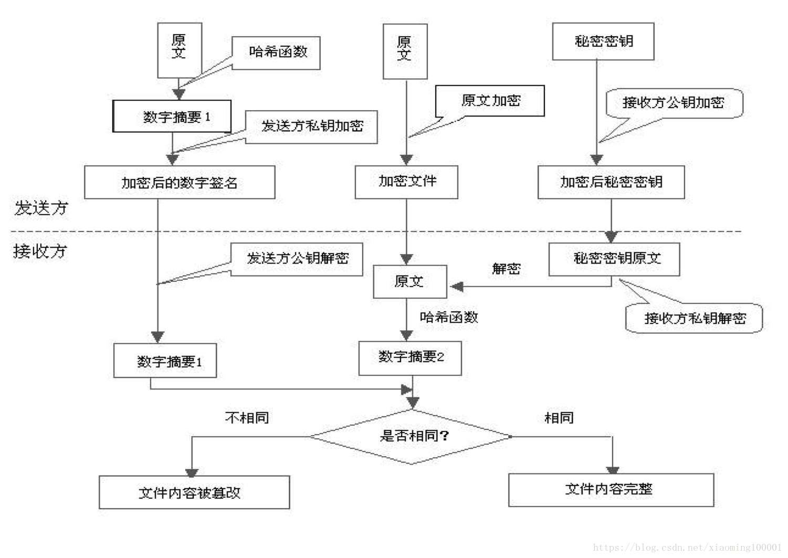
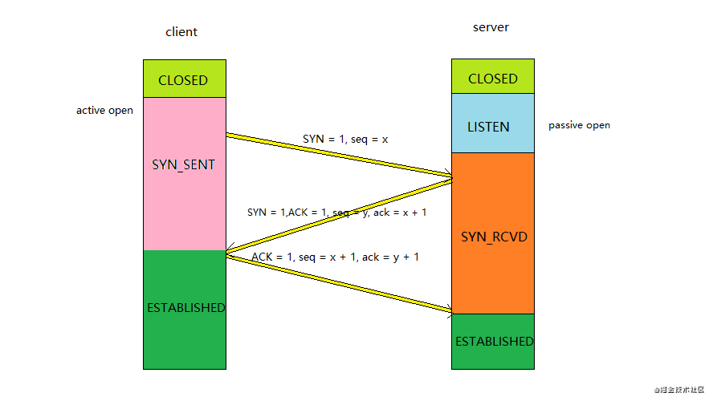
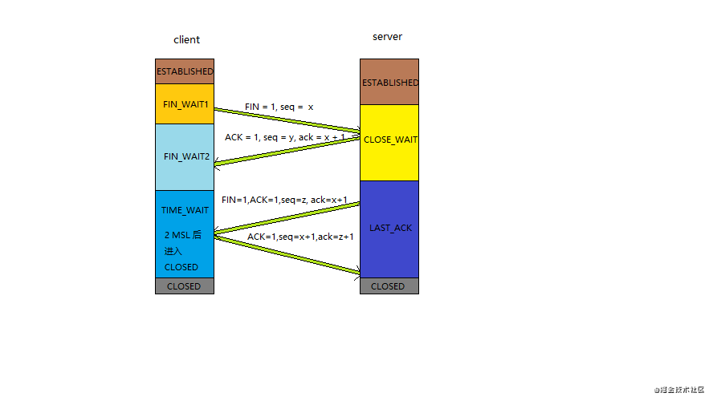
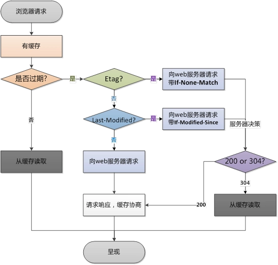
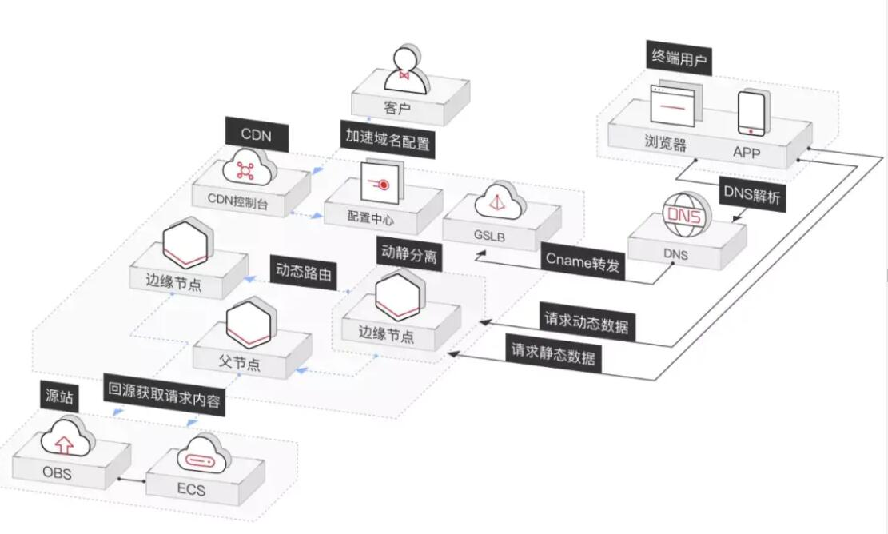
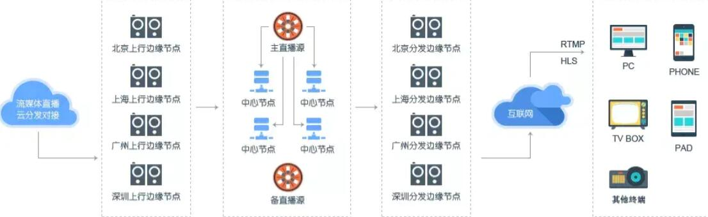

# HTTP
## 01. http 和 https
* http：超文本传输，传输的数据都是明文传输，并且是无状态的
* https：具有安全性的 SSL 加密传输协议，由 HTTP 和 SSL 协议构建的可进行加密传输和身份认证的网络协议，https 协议需要 CA 证书，费用较高。可防止数据在传输过程中不被窃取、改变，确保数据的完整性
* https 缺点:
    1. https 握手阶段比较费时，会使页面加载时间延长 50%，增加 10% ~ 20% 的耗电
    2. https 缓存不如 http 高效，会增加数据开销
    3. SSL 证书需要钱，功能越强大的证书费用越高
    4. SSL 证书需要绑定 IP，不能在同一个 ip 上绑定多个域名，ipv4 资源支持不了这种消耗
* SSL（Security Sockets Layer）安全套接层
    1. 为网络通信提供安全及数据完整性的一种安全协议
    2. 是操作系统对外的 API，SSL 3.0 后更名为 TSL
    3. 采用身份验证和数据加密保证网络通信的安全和数据的完整性
* 对称加密 和 非对称加密
    1. 对称加密：加密和解密用的是同一个密码或者同一套逻辑的加密方式
    2. 非对称加密：发布公私钥，私钥服务器保留。私钥解密只能公钥能解，公钥加密只有私钥能解
* 加密方式
    1. 对称加密：加密和解密都使用同一个秘钥
    2. 非对称加密：加密使用的秘钥和解密使用的秘钥是不相同的
    3. 哈希算法：将任意长度的信息转换为固定长度的值，算法不可逆
    4. 数字签名：证明某个消息或者文件是某人发出/认同的
* HTTPS 数据传输流程
    1. 浏览器将支持的加密算法信息发送给服务器
    2. 服务器选择一套浏览器支持的加密算法，以证书的形式回发浏览器
    3. 浏览器验证证书合法性，结合证书中公钥加密信息发送给服务器
    4. 服务器使用私钥解密信息，验证哈希，加密响应信息回发浏览器
    5. 浏览器解密响应信息，并对消息进行验真，之后进行加密交互数据
* 加密解密过程：


## 02. http1、http2、http3
### http1
* 优点：
    1. 增加了持久连接
    2. 浏览器为每个域名最多同时维护 6 个 TCP 持久连接
    3. 使用 CDN 的实现域名分片机制
* 缺点：
    1. 对带宽的利用率不高，TCP 的慢启动
    2. 慢启动是 TCP 是为了减少网络拥塞的一种策略
    3. 同时开启了多条 TCP 连接，那么这些连接会竞争固定的带宽
    4. http/1.1 队头阻塞的问题
    *  慢启动和 TCP 连接之间相互竞争带宽是由于 TCP 本身的机制导致的，而队头阻塞是由于 HTTP/1.1 的机制导致的
* 安全不足和性能不高
    1. 高延迟 --- 带来页面加载速度的降低
    2. 无状态特性 --- 带来的巨大 http 头部
    3. 明文传输 --- 带来的不安全性
    4. 不支持服务器推送消息

### http2
* 一个域名只使用一个 TCP 连接和消除队头阻塞问题
* 特性：
    1. 二进制传输：以二进制方式传输和 Header 压缩（http/2 将请求和响应数据分割为更小的帧，并且采用二进制编码）多个帧之间可以乱序发送，根据帧首部的流标识可以重新组装
    2. Header 压缩
    3. 多路复用
        1. 同域名下所有通信都在单个连接上完成
        2. 单个连接可以承载任意数量的双向数据流
        3. 数据流以消息的形式发送，而消息又是由一个或多个帧组成，多个帧之间可以乱序发送，因为根据帧首部的流标识可以重新组装
    4. Server Push
    5. 提高安全性
* 缺点：TCP 以及 TCP + TSL 建立连接的延时

### http3
* QUIC协议（全称Quick UDP Internet Connections，快速 UDP 互联网连接），QUIC 是基于 UDP
* 功能
    1. 实现了类似 TCP 的流量控制、传输可靠性的功能
        * 虽然 UDP 不提供可靠性的传输，但 QUIC 在 UDP 的基础之上增加了一层来保证数据可靠性传输。它提供了数据包重传、拥塞控制以及其他一些 TCP 中存在的特性。
    2. 实现了快速握手功能
        * 由于 QUIC 是基于 UDP 的，所以 QUIC 可以实现使用 0-RTT 或者 1-RTT 来建立连接，这意味着 QUIC 可以用最快的速度来发送和接收数据，这样可以大大提升首次打开页面的速度。0-RTT 建连可以说是 QUIC 相比 HTTP2 最大的性能优势。
    3. 集成了TLS加密功能
        * 目前 QUIC 使用的是 TLS1.3，相较于早期版本 TLS1.3 有更多的优点，其中最重要的一点是减少了握手所花费的 RTT 个数。
    4. 多路复用，彻底解决 TCP 中队头阻塞的问题
        * 和 TCP 不同，QUIC 实现了在同一物理连接上可以有多个独立的逻辑数据流。实现了数据流的单独传输，就解决了 TCP 中队头阻塞的问题。

### 总结：
1. HTTP/1.1 有两个主要的缺点：安全不足和性能不高
2. HTTP/2 完全兼容 HTTP/1，是"更安全的HTTP、更快的HTTPS"，头部压缩、多路复用等技术可以充分利用带宽，降低延迟，从而大幅度提高上网体验
3. QUIC 基于 UDP 实现，是 HTTP/3 中的底层支撑协议，该协议基于 UDP，又取了 TCP 中的精华，实现了即快又可靠的协议

## 03. TCP 三次握手 和 四次挥手
* 三次握手：客户端和服务端都需要知道各自可收发，因此需要三次握手

    * 握手过程
        1. 第一次握手：起初两端都处于 close 关闭状态。客户端将（同步序号标志）SYN 置为 1，随机产生一个值（序号）seq = x，并将该数据包发送给服务器，客户端进入 SYN-SENT，等待服务器确认
        2. 第二次握手：服务器收到的数据包后由标志位 SYN = 1 得知客户端请求建立连接，服务器将标志位 SYN 和 ACK（确认号）都置为 1，ack = x + 1（确认序号），随机产生一个值 seq = y，并将该数据包发送给客户端以确认连接请求，服务器进入 SYN-RCVD，此时操作系统为该 TCP 连接分配 TCP 缓存和变量
        3. 第三次握手：客户端收到确认后，检查 ack 是否为 x + 1，ACK 是否为 1，如果正确则将确认号 ACK 置为 1，ack = y + 1，并且此时操作系统为该 TCP 连接分配 TCP 缓存和变量，并将该数据包发送给服务器，服务器检查 ack 是否为 y + 1，ACK 是否为 1，如果正确则连接建立成功，服务器和客户端进入 established 状态，完成三次握手，随后服务器和客户端就可以开始传输数据了
    * 为什么是三次握手？
        客户端与服务端建立可靠的双工连接，开始传输数据。三次握手的主要目的是保证连接是双工的，可靠更多是通过重传机制来保证的。保证客户端和服务端都有收发数据的能力
    * 握手失败如何处理？
        当失败时，服务器不会重传 ack 报文，而是直接发送 RTS 报文段，进入 CLOSE 状态。这样做的目的是为了防止 SYN 洪泛攻击
* 四次挥手：双方都要释放自己的连接

    * 挥手过程
        1. 客户端 A 发送一个 FIN，用来关闭客户端 A 到服务器 B 的数据传送
        2. 服务器 B 收到这个 FIN，发回一个 ACK（确认号），确认序号为收到的序号加 1。和 SYN 一样，一个 FIN 将占用一个序号
        3. 服务器 B 关闭与客户端 A 的连接，发送一个 FIN 给客户端 A
        4. 客户端 A 发回 ACK 报文确认，并将确认序号设置为收到的序号加 1
    * 为什么是四次挥手？
        因为双方彼此都建立了连接，因此双方都需要释放自己的连接，A 向 B 发出一个释放连接请求，他要释放连接表明不在向 B 发送数据了，此时 B 收到了 A 发送的释放连接请求之后，给 A 发送一个确认，A 不能向 B 发送数据了，它处于 FIN-WAIT-2 的状态，但是此时 B 还可以向 A 进行数据的传送，此时 B 向 A 发送一个断开连接的请求，A 收到之后给 B 发送一个确认，此时 B 关闭连接，A 也关闭连接
    * 为什么有 TIME-WAIT 这个状态呢？
        因为有可能最后一次确认丢失，如果 B 此时继续向 A 发送一个断开连接的请求，等待 A 发送确认，但此时 A 已经关闭连接了，那么 B 永远也关不掉，所以才会有这个 TIME-WAIT 状态。（TCP 也不是 100% 可靠的）

## 04. TCP（传输控制协议） 和 UDP（用户数据报协议）
|  | UDP| TCP |
|----|----|----|
|是否连接|无连接|面向连接|
|是否可靠|不可靠传输，尽最大努力交付|可靠传输，使用流量控制和拥塞控制（数据无差错、不丢失、不重复且按序到达）|
|连接对象数量|支持一对一、一对多、多对一和多对多|只能一对一|
|传输方式|面向报文|面向字节流|
|首部开销|首部开销小，仅 8 字节|首部最小 20 字节，最大 60 字节|
|适用场景|适用于实时应用（IP 电话、视频会议、直播等）|适用于要求可靠的应用（文件传输等等）|
* TCP 拥塞控制机制四个阶段
    1. 慢启动
        * 对于刚刚加入网络的连接，要一点一点的提速
    2. 拥塞避免阶段
        * 缓慢增长，找到最优值
    3. 快速重传
        * 如果发送方有 Seq 发送失败（表现为“丢包”），就认为网络拥塞了
        * 拥塞发生时有两种情况
            1. 超时重传：重新进入慢启动阶段（网络情况糟糕）
            2. 快速重传
    4. 恢复阶段
    * 1 和 2 适用于拥塞发生前，3 适用于在拥塞发生时，4 适用于拥塞解决后（相当于拥塞发生前）

* 发生拥塞的主要原因：在于网络能够提供的资源不足以满足用户的需求。这些资源包括缓存空间、链路带宽容量和中间节点的处理能力

## 05. 网络模型

### 1. OSI七层 网络模型
| OSI |  功能 | 协议族|
|----|----|----|
|应用层|文件传输、电子邮件、文件服务、虚拟终端|TFTP、HTTP、SNMP、SMTP、DNS、Telnet|
|表示层|数据格式化、代码转换、数据加密|无|
|会话层|管理（建立、维护、重连）通信会话|无|
|传输层|提供端对端的接口|TCP、UDP|
|网络层|为数据包选择路由|IP、ICMP、RIP、OSPF、BGP、IGMP|
|数据链路层|传输有地址的帧以及错误检测功能|SLIP、CSLIP、PPP、ARP、RARP、MTU|
|物理层|以二进制数据形式在物理媒体上传输数据|ISO2110、IEEE802、IEEE802.2|

### 2. TCP/IP 模型
1. 应用层  HTTP/FTP
    1. 应用层的任务是通过应用进程间的交互来完成特定网络应用
    2. 应用层协议定义的是应用进程（进程：主机中正在运行的程序）间的通信和交互的规则
    3. 对于不同的网络应用需要不同的应用层协议
2. 运输层  TCP/UDP
    1. 运输层的主要任务就是负责向两台主机进程之间的通信提供通用的数据传输服务
    2. 传输控制协议（TCP）--- 提供面向连接的，可靠的数据传输服务
    3. 用户数据协议（UDP）--- 提供无连接的，尽最大努力的数据传输服务（不保证数据传输的可靠性） 
3. 网络层  IP/ICMP
    1. 网络层负责为分组交换网上的不同主机提供通信服务。
    2. 在发送数据时，网络层把运输层产生的报文段或用户数据封装成分组和包进行传送。
    3. 在TCP/IP体系结构中，由于网络层使用IP协议，因此分组也叫IP数据报，简称数据报
4. 数据链路层  PPP/Ethernet/HDLC
    1. 两台主机之间的数据传输，总是在一段一段的链路上传送的，这就需要使用专门的链路层的协议
    2. 在两个相邻节点之间传送数据时，数据链路层将网络层交下来的IP数据报组装成帧

## 06. get 和 post 的区别
|get|post|
|----|----|
| 用来获取数据 | 用于提交数据 |
| 参数有长度限制（受限于 url 的长度，具体长度的数值取决于浏览器和服务器的限制，最长 2048 字节）| 无限制 |
| 请求的数据会附加在 url 之后，以 “ ？ ” 分割 url 和传输数据，多个参数用 “ & ” 连接 | 请求会把请求的数据放在 http 请求体中|
| 明文传输| 放在请求体中，但是通过开发者可以通过抓包工具看到，也相当于是明文的 |

* get 请求会保存在浏览器历史记录中，还可能保存在 web 服务器的日志中
* get 和 post 方法没有实质的区别，只是报文格式不同
* get 和 post 是什么？
    * http 协议中的两种发送请求的方法
    * get --- 从指定的资源请求数据
    * post --- 向指定的资源提交要处理的数据
* 均是不安全的，要想安全传输，就只有加密，使用 https
* HTTP 协议中没有对 body 和 URL 的长度限制，对 URL 限制的大多是浏览器和服务器的原因
* HTTP 协议中没有明确说明 post 会产生 2 个 TCP 数据包，而且实际测试（Chrome）发现，header 和 body 不会分开发送

## 07. 状态码
* 状态码可以按照第一个数字分类：
    1. 1 表示信息
    2. 2 表示成功
    3. 3 表示重定向
    4. 4 表示客户端错误
    5. 5 表示服务器错误
* 常见的状态码：
    101 切换协议；200 成功；301 永久重定向；302 临时重定向；304 未修改
* 301 和 302 的区别：
    |  | 301 | 302 |
    |----|----|----|
    | 区别 | 永久移动，请求的网页已经永久的移动到新的位置上，服务器返回此响应，会自动将请求转到新的位置 | 历史移动，服务器从不同位置的网页中响应请求，但是请求者应继续使用原有位置来继续以后的请求 |
    | 用途 |永久重定向，默认情况是会缓存的| 临时重定向（用做临时跳转），默认情况下不会缓存 |
    | 应用场景 | 域名跳转（新旧域名） | 临时跳转，比如未登录的用户想要访问用户中心，这时就需要重定向到登录界面、功能的切换等等 |

* 200 和 304 ：
    | | 200 | 304 |
    |----|----|----|
    | 信息 | 表示成功 | 表示未修改 |
    | 意义| 服务器已经成功处理了请求，通常表示为服务器提供了请求的资源 | 自动上次请求后，请求的网页未修改过，服务返回此响应时，不会返回网页内容 |

* 400和401、403：
    * 400状态码：请求无效
        * 产生原因：
            1. 前端提交数据的字段名称和字段类型与后台的实体没有保持一致
            2. 前端提交到后台的数据应该是 json 字符串类型，但是前端没有将对象 JSON.stringify 转化成字符串。
        * 解决方法：
            1. 对照字段的名称，保持一致性
            2. 将obj对象通过 JSON.stringify 实现序列化
    * 401状态码：当前请求需要用户验证
    * 403状态码：服务器已经得到请求，但是拒绝执行
* 常见状态码表：
    | 状态码 | 意义 |
    |----|----|
    |  100  | continue 继续，客户端应继续请求 |
    |  101  | 切换协议，切换到http的新版本协议 |
    |  200  | 请求成功，一般用于get与post |
    |  204  | 请求执行成功，但是没有数据，浏览器不用刷新页面，也不用导向新的页面【用于一些提交到服务器处理的数据，只需要返回成功的情况下，可以考虑使用状态码 204 来作为返回信息，从而省掉多余的数据传输】 |
    |  301  | 永久移动，请求的网页已经永久的移动到新的位置上，服务器返回此响应，会自动将请求转到新的位置，永久重定向，默认情况是会缓存的 |
    |  302  | 历史移动，服务器从不同位置的网页中响应请求，但是请求者应继续使用原有位置来继续以后的请求，临时重定向（用做临时跳转），默认情况下不会缓存 |
    |  304  | Not Modified    未修改。所请求的资源未修改，服务器返回此状态码时，不会返回任何资源。客户端通常会缓存访问过的资源，通过提供一个头信息指出客户端希望只返回在指定日期之后修改的资源【304：如果客户端发送了一个带条件的GET 请求且该请求已被允许，而文档的内容（自上次访问以来或者根据请求的条件）并没有改变，则服务器应当返回这个304状态码】 |
    |  400  |  客户端请求的语法错误，服务器无法理解 |
    |  401  |  请求要求用户的身份认证 |
    |  403  |  服务器理解客户端请求，但是拒绝执行此请求 |
    |  404  |  无法找到资源 |
    |  408  |  请求超时 |
    |  500  |  服务器内部错误，无法完成请求 |
    |  501  |  服务器不支持请求功能，无法完成请求 |
    |  502  |  收到一个无效的响应 |
    |  503  |  超载货系统维护，服务器无法处理客户端请求 |
    |  504  |  充当网管或代理的服务器，未及时从远端服务器获取请求 |
    |  505  |  服务器不支持请求的http协议，无法完成处理 |

## 08. fetch 发送 2 次请求的原因
* fetch 发送 post 请求的时候，总是发送 2 次，第一次状态码是 204，第二次才成功？
    * 204 状态码：请求执行成功，但是没有数据，浏览器不用刷新页面，也不用导向新的页面
    * 204 状态码的应用：用于一些提交到服务器处理的数据，只需要返回成功的情况下，可以考虑使用状态码 204 来作为返回信息，从而省掉多余的数据传输
    * 原因：用 fetch 的 post 请求的时候，导致 fetch 第一次发送了一个 Options 请求，询问服务器是否支持修改的请求头，如果服务器支持，则在第二次中发送真正的请求

## 09.常见的HTTP的头部 
* 可以将 http 首部分为通用首部，请求首部，响应首部，实体首部
    1. 通用首部表示一些通用信息，比如 date 表示报文创建时间，
    2. 请求首部就是请求报文中独有的，如 cookie ，和缓存相关的如if-Modified-Since
    3. 响应首部就是响应报文中独有的，如 set-cookie ，和重定向相关的 location，
    4. 实体首部用来描述实体部分，如 allow 用来描述可执行的请求方法，content-type描述主题类 content-Encoding 描述主体的编码方式 

## 10. HTTP 工作过程
* 一次HTTP操作称为一个事务，整个工作流程如下：
### 地址解析
1. 客户端浏览器请求页面 http://localhost.com:8080/index.html
2. 从中解析出协议名、主机名、端口、对象路径等部分，解析结果：
```
    协议名：http
    主机名：localhost.com
    端口：8080
    对象路径：/index.html
```
* 需要域名系统 DNS 解析域名 localhost.com，得主机的 IP 地址

### 封装 HTTP 请求数据包
* 把以上信息以及本机自己的信息，封装成一个 HTTP 请求数据包

### 封装成 TCP 包，建立 TCP 连接（TCP三次握手）
在 HTTP 工作开始之前，客户端首先要通过网络与服务器建立连接，该连接是通过 TCP 来完成的，该协议与 IP 协议工作构建 Internet，即 TCP/IP 协议，因此 Internet 又被称作 TCP/IP 网络。HTTP 是比 TCP 更高层次的应用层协议，根据规则，只有底层协议建立之后才能进行更高层协议的链接。因此，首先要建立 TCP 连接

### 客户机发送请求命令
建立连接后，客户机发送一个请求给服务器，请求方式的格式为：统一资源标识符（URL）、协议版本号，后面是 MIME 信息包括请求修饰符、客户机信息和内容

### 服务器响应
* 服务器接到请求后，给予响应的响应信息，其格式为一个状态行，包括信息的协议版本号、一个成功或错误的代码，后面是 MIME 信息包括服务器信息、实体信息和可能的功能
* 实体信息是服务器向浏览器发送头信息后，它会发送一个空白行来表示头信息的发送到此为结束，接着它就以 Content-Type 应答头信息所描述的格式发送用户所请求的实际数据

### 服务器关闭 TCP 连接
* 一般情况下，一旦 Web 服务器向浏览器发送了请求数据，它就要关闭 TCP 连接，然后如果浏览器或者服务器在其头信息加入了这行代码
    Connection: keep-alive
* TCP 连接在发送后将仍然保持打开状态，浴室，浏览器可以继续通过相同的连接发送请求。保持连接节省了为每个请求建立新连接所需的时间，还节约了网络带宽

## 11. HTTP 工作过程用到的概念
* HTTP 的报文有两中类型：请求和响应。其报文格式分别为：
    1. 请求报文格式：
        ```
            请求方法 URL HTTP/版本号
            请求首部字段（可选）
            空行
            body（只对 Post 请求有效）
        ```
    2. 响应报文格式：
        ```
            HTTP/版本号 返回码 返回码描述
            应答首部字段（可选）
            空行
            body
        ```
### HTTP 的请求方法
* GET：获取 URL 指定的资源
* POST：传输实体信息
* PUT：上传文件
* DELETE：删除文件
* HEAD：获取报文首部，与 GET 相比，不返回报文主体部分
* OPTIONS：询问支持的方法
* TRACE：追踪请求的路径
* CONNECT：要求在与代理服务通信时建立隧道，使用隧道进行 TCP 通信。主要使用 SSL 和 TSL 将数据加密后通过网络隧道进行传输

### 报文字段
* HTTP 首部字段由字段名和字段组成，中间以 “ ：” 分割，如 Content-Type: text/html。其中，同一个字段名可对应多个字段值
* HTTP 的报文字段分为5种
    * 请求报文字段
    * 应答报文字段
    * 实体首部字段
    * 通用报文字段
    * 其他报文字段

# WebSocket 的实现和应用
1. 什么是 WebSocket
    * WebSocket 是一种在单个 TCP 连接上进行全双工通信的协议。WebSocket 使得客户端和服务器端之间的数据交换变得更加简单，允许服务端主动向客户端推送数据。在 WebSocket API 中，浏览器和服务器只需要完成一次 HTTP 握手，两者之间就可以创建持久性的连接，并进行双向数据传输
    * WebSocket 是HTML5 中的协议，支持持久连接，http 协议不支持持久性连接。
    * http1.0 和 http1.1 都不支持持久性的连接，http1.1 中的 keep-alive，将多个 http 请求合并为 1 个
2. 为什么有了 HTTP 还需要 WebSocket？
    * 一般情况下使用 HTTP 的缺陷，就是 HTTP 只能由客户端主动发起，如果有需要服务端通知的业务，就需要轮询。轮询的效率低，非常浪费资源。为了解决 Web 端即时通信的需求就出现了 WebSocket
2. WebSocket 是什么样的协议，有什么优点？
    * http 的声明周期通过 Request 来界定，也就是一个 Request 一个 Response，那么在 http1.0 协议中，这次 http 请求就结束了
    * 在 http1.1 中有一个 connection: keep-alive。即在一个 http 连接中，可以发送多个 Response，接受多个 Response
    * 在 http 中一个 Request 只能对应有一个 Response，并且这个 Response 是被动的，不能主动发起
    * WebSocket 是基于 http 协议，借用了 http 协议来完成一部分握手，在握手阶段与 http 是相同的
        * WebSocket 握手协议的实现，基本是 2 个属性
            1. Upgrade: webSocket
            2. Connection: Upgrade
3. 为什么不使用 HTTP 长连接来实现即时通信？事实上，在 WebSocket 之前就是使用 HTTP 长连接这种方式，如 Connet，但是有弊端：
    1. HTTP1.1 规范中规定，客户端不应该与服务器端建立超过两个的 HTTP 连接，新的连接会被阻塞
    2. 对于服务器端来说，每个长连接都占有一个用户线程，在 NIO 或者 异步编程之前，服务端的开销太大
4. 为什么不直接使用 Socket 编程，基于 TCP 直接保持长连接，实现即时通信？
    * Socket 编程针对 C/S 模式的，而浏览器是 B/S 模式，浏览器没法发起 Socket 请求，正因如此，W3C 最后还是给出了浏览器的 Socket————WebSocket
5. Socket 是什么？
    1. Unix 中的 Socket
        * 操作系统中也有使用到的 Socket 这个概念用来进行进程间通信，它和通常说的基于 TCP/IP 的 Socket 概念十分相似，代表了在操作系统中传输数据的两方，只是它不再基于网络协议，而是操作系统本身的文件系统
    2. 网络中的 Socket
        * 网络中的 Socket 并不是什么协议，而是为了使用 TCP，UDP 而抽象出来的一层 API，它是位于应用层和传输层之间的一个抽象层。Socket 是对 TCP/IP 的封装；HTTP 是轿车，提供了封装或者显示数据的具体形式；Socket 是发动机，提供了网络通信的能力。在 Unix 一切皆文件的思想下，Socket 是一种“打开————读/写————关闭”模式的实现，服务器和客户端各自维护一个“文件”，在建立连接打开后，可以向自己写入文件内容供对方读取或者读取对方内容，通信结束时关闭文件。
        * 若想基于 TCP/IP 来构建服务，那么可能会使用到 Socket API
5. WebSocket 与 Socket 的区别
    1. Socket 是传输控制层的接口，用户可以通过 Socket 来操作底层 TCP/IP 协议族通信
    2. WebSocket 是一个完整应用层协议
    3. Socket 更灵活，WebSocket 更易用
    4. 两者都能做即时通信

# 短轮询、长轮询、WebSocket、SSE
|          | 轮询（Polling）                | 长轮询（Long-Polling） | WebSocket                             | SSE |
| 通讯协议 | http                           | http                  | tcp                                   | http | 
| 触发方式 | client（客户端）                | client（客户端）       | client、server（客户端、服务端）        |client、server（客户端、服务端） | 
| 优点    | 兼容性好容错性强，实现简单        | 比短轮询节约资源        | 全双工通讯协议，性能开销小、安全性高，可扩展性强 | 实现简便，开发成本低 | 
| 缺点    | 安全性差，占较多的内存资源与请求数 | 安全性差，占较多的内存资源与请求数 | 传输数据需要进行二次解析，增加开发成本及难度 | 只适用高级浏览器 | 
| 延迟    | 非实时，延迟取决于请求间隔        | 同短轮询               | 实时          | 非实时，默认3秒延迟，延迟可自定义 | 
 
1. 轮询（Polling）
    * 短轮询（Polling）的实现思路就是浏览器端每个几秒钟向服务器发送 http 请求，服务端在收到请求后，不论是否有数据更新，都直接进行响应。在服务端响应完成，就会关闭这个 TCP 连接
    ```javascript
        function Polling() {
            fetch(url).then(data => {
                // something
            }).catch(err => {
                console.log(err)
            })
        }
        setInterval(polling, 5000)
    ```
    * 优点：简单，兼容性好，只要支持 http 协议就能实现
    * 缺点：非常的消耗资源，因为建立 TCP 连接是非常消耗资源的，服务端响应完成就会关闭这个 TCP 连接，下一次请求再次建立 TCP 连接

2. 长轮询（Long-Polling）
    * 客户端发送请求后服务器端不会立即返回数据，服务器端会阻塞请求连接不会立即断开，知道服务器端有数据更新或者是连接超时才返回，客户端才再次发出请求新建连接、如此反复从而获取最新数据
    ```javascript
        function LongPolling () {
            fetch(url).then(data => {
                LongPolling()
            }).catch(err => {
                LongPolling()
                console.log(err)
            })
        }
        LongPolling()
    ```
    * 优点：长轮询和短轮询比起来，明显减少了很多不必要的 http 请求次数，相比之下解决了资源
    * 缺点：连接挂起也会导致资源的浪费

3. WebSocket
    * WebSocket 是 HTML5 的一个持久化的协议，它实现了浏览器与服务器的全双工通信，同时也是跨域的一种解决方案。
    * WebSocket 和 HTTP 都是应用层协议，都基于 TCP 协议，但是 WebSocket 是一种双向通信协议，在建立连接之后，WebSocket 和 server 与 client 都能主动向对方发送或接受数据。同时 WebSocket 在建立连接时需要借助 HTTP 协议，连接建立好了之后 client 与 server 之间的双向通信就与 HTTP 无关了
    * 原生的 WebSocket API 使用起来不太方便，所以使用 Socket.io ，这个很好的封装了 WebSocket 接口，提供了更简单、灵活的接口，也对不支持 WebSocket 的浏览器提供了向下兼容
    ```javascript
        // 服务端
        const express = require('express')
        const app = express()
        const server = require('http').Server(app)
        const WebSocket = require('ws')
        const wss = new WebSocket.Server({port: 8000})
        wss.on('connnction', function connection(ws) {
            console.log('server receive connection')
            ws.on('message', function incoming(message) {
                console.log('server: recevied: %s', message)
            })
            ws.send('world')
        })
        app.get('/', function (req, res) {
            res.sendfile(__dirname + '/index.html');
        });
        app.listen(3000);

        // 客户端
        const ws = new WebSocket('ws://localhost:8080');
        ws.onopen = function () {
            console.log('ws onopen');
            ws.send('from client:hello');
        };
        ws.onmessage = function (e) {
            console.log('ws onmessage');
            console.log('from server:' + e.data);
        }
    ```

4. SSE（Server-Sent Events）
    * Server-Sent是HTML5提出一个标准。由客户端发起与服务器之间创建TCP连接，然后并维持这个连接，直到客户端或服务器中的任何一方断开，ServerSent使用的是"问"+"答"的机制，连接创建后浏览器会周期性地发送消息至服务器询问，是否有自己的消息。其实现原理类似于我们在上一节中提到的基于iframe的长连接模式。HTTP响应内容有一种特殊的content-type —— text/event-stream，该响应头标识了响应内容为事件流，客户端不会关闭连接，而是等待服务端不断得发送响应结果。SSE规范比较简单，主要分为两个部分：浏览器中的EventSource对象，以及服务器端与浏览器端之间的通讯协议。
    * 基础用法
        * 在浏览器中通过 EventSource 构造函数来创建该对象
            var source = new EventSource('/sse')
        * 而SSE的响应内容可以看成是一个事件流，由不同的事件所组成。这些事件会触发前端EventSource对象上的方法。
            ```javascript
                  // 默认的事件
                source.addEventListener('message', function (e) {
                    console.log(e.data);
                }, false);

                // 用户自定义的事件名
                source.addEventListener('my_msg', function (e) {
                    process(e.data);
                }, false);

                // 监听连接打开
                source.addEventListener('open', function (e) {
                    console.log('open sse');
                }, false);

                // 监听错误
                source.addEventListener('error', function (e) {
                    console.log('error');
                });
            ```
            * EventSource通过事件监听的方式来工作。注意上面的代码监听了y_msg事件，SSE支持自定义事件，默认事件通过监听message来获取数据。实现代码如下:
        * 客户端
            ```javascript
                // 显示聊天信息
                let chat = new EventSource("/chat-room");
                chat.onmessage = function (event) {
                    let msg = event.data;
                    $(".list-group").append("<li class='list-group-item'>" + msg + "</li>");
                    // chat.close(); 关闭server-sent event
                };

                // 自定义事件
                chat.addEventListener("myChatEvent", function (event) {
                    let msg = event.data;
                    $(".list-group").append("<li class='list-group-item'>" + msg + "</li>");
                });
            ```
        * 服务端
            ```javascript
                var express = require('express');
                var router = express.Router();
                router.get('/chat-room', function (req, res, next) {
                    // 当res.white的数据data 以\n\n结束时 就默认该次消息发送完成，触发onmessage方法，以\r\n不会触发onmessage方法
                    res.header({
                        "Content-Type": "text/event-stream",
                        "Cache-Control": "no-cache",
                        "Connection": "keep-alive"
                    });
                    // res.white("event: myChatEvent\r\n"); 自定义事件
                    res.write("retry: 10000\r\n"); // 指定通信的最大间隔时间
                    res.write("data: start~~\n\n");
                    res.end(); // 不加end不会认为本次数据传输结束 会导致不会有下一次请求
                });
            ```
    * 优点： 客户端只需连接一次，Server就定时推送，除非其中一端断开连接。并且SSE会在连接意外断开时自动重连。
    * 缺点： 要学习新的语法

5. 总结：基本上可以分为两大类基于http和tcp两种通信中的一种。
    * 兼容性考虑：短轮询>长轮询>长连接SSE>WebSocket
    * 从性能方面考虑：WebSocket>长连接SSE>长轮询>短轮询
    * 服务端推送：WebSocket>长连接SSE>长轮询

# Cookie、Session、Token
## Cookie
1. cookie 是浏览器实现的一种数据存储功能
2. cookie 是一般由服务器生成发送给浏览器，浏览器 ———— kv （键值对）形式存储在本地文件夹，下一次请求带上 cookie 发送给服务器
    * HTML5 提供了两种本地存储的方式：sessionStorage 和 localStorage
3. 作用：cookie的最大的作用就是存储session用来唯一标识用户
## Session
1. 会话，服务器对每个客户端身份进行区分，所以对其发放“身份标识”，每次客户端向服务端请求都会带上这个“身份标识”。对于浏览器客户端，一般都采用 cookie
2. 拓展性不好：单机服务器是没问题的，要是遇到服务器集群，或者跨域服务器导向机构。这种情况需要每台服务器都能读取到 session
    * eg：有 A、B 两个网站，想要在 A 网站登录过之后访问 B 网站的时候不需要再次登录，这就涉及单点登录
3. 解决方案：
    1. session 复制：任何一个服务端发生改变，改节点会把这个 session 的所有内容序列化，广播给其他节点
    2. session 共享：将 session 统一储存到一个地方，所有机器都能访问这个地方的数据
    3. Nginx ip_hash 策略：通过 Nginx 代理，每次请求按照 ip 的hash 分配
    4. token 这种方式在服务端直接不存 session 了，所有数据保存在客户端

## token
1. 过程：将登陆凭证做数字签名，加密之后得到字符串作为 token，拿到 token 后，将 token 保存在本地
    * 请求 API 时携带 Token：拿到 token 串，做解密和签名认证，判断其有效性
2. 使用 token 可以解决那些问题？
    1. Token 完全是由应用管理，所以能够避开同源策略
    2. Token 完全避免 CSRF 攻击
    3. Token 可以是无状态的，可以在多个服务间共享

## 总结
*   Token 和 Session 的区别
    * Session 是一种 HTTP 储存机制，为无状态的 HTTP 提供持久机制；
    * Token 就是令牌
        * eg：授权（登录）一个程序时，它就是一个依据，判断是否已经授权

# Cookie、SessionStorage、localStorage
* session -> 服务器端的机制，在服务器上保存的信息 -> 解析客户端请求并操作session id，按需保存状态信息
    * session 的实现方式：
        1. 使用Cookie来实现
        2. 使用URL回写来实现
* Cookie数据存放在客户的浏览器上，Session数据放在服务器上，Session相对于Cookie更安全，若考虑减轻服务器负担，应当使用Cookie
* 共同点：都是保存在浏览器端，并且是同源的
* Cookie：cookie数据始终在同源的http请求中携带（即使不需要），即cookie在浏览器和服务器间来回传递。
    * cookie数据还有路径（path），可以限制cookie只属于某个路径下，存储的大小只要4k左右（key：可以在浏览器和服务器端来回传递，存储容量小，只有大约4K左右）
* sessionStorage和localStorage不会自动把数据发给服务器，仅在本地保存。
    * sessionStorage：仅在当前浏览器窗口关闭前有效，自然也就不可能持久保持；
* localStorage：始终有效，窗口或浏览器关闭也一直保存，因此用做持久数据；
* cookie只在设置的cookie过期时间之前一直有效，即便窗口或浏览器关闭（key：本身就是一个会话过程,关闭浏览器后消失，session作为一个会话，当页面不同即使在同一个页面打开，也被视为同一次会话）
* localStorage：localStorage在所有同源窗口中都是共享的；cookie也是在所有同源窗口中都是共享的
    * （key：同源窗口都会共享，并且不会失效，不管窗口或者浏览器关闭与否都会始终生效）
* cookie的作用：
    1. 保存用户登录状态，cookie还可以设置过期时间，当超过时间期限后，cookie就会自动消失
    2. 跟踪用户行为，记录用户的选项

# 强、协商缓存

*   缓存分为两种：强缓存和协商缓存，根据响应的header内容来决定

|      | 获取资源形式 |状态码 |发送请求到服务器|应用场景|
| ---- | ---- | ----| ----| ---- |
|强缓存   |从缓存取 |200（from cache）  |否，直接从缓存取| 离线状态 |
|协商缓存  |从缓存取 |304（not modified）|是，通过服务器来告知缓存是否可用 | 音乐播放器的歌单 |

* 强缓存相关字段有expires，cache-control。如果cache-control与expires同时存在的话，cache-control的优先级高于expires
* 协商缓存相关字段有Last-Modified/If-Modified-Since，Etag/If-None-Match
* 强缓存命中，不会请求服务器，直接请求缓存；协商缓存命中，会请求服务器，不会返回内容，然后读取缓存

# CDN 原理
* CDN的全称是Content Delivery Network，即内容分发网络。
* 内容分发网络解决了因分布、带宽、服务器性能带来的访问延迟问题，适用于站点加速、点播、直播等场景。使用户可就近取得所需内容，解决 Internet 网络拥挤的状况，提高用户访问网站的响应速度和成功率
* CDN的基本原理是广泛采用各种缓存服务器，将这些缓存服务器分布到用户访问相对集中的地区或网络中。在用户访问网站时，利用全局负载技术将用户的访问指向距离最近的工作正常的缓存服务器上，由缓存服务器直接响应
* 广泛分布的 CDN 节点加上节点之间的智能冗余机制，可以有效地预防黑客入侵以及降低各种 DDos 攻击对网站的影响，同时保证较好的服务质量
## 传统网站的请求和响应的基本工作流程
1. 用户在浏览器输入访问的网址域名
2. 浏览器向本地 DNS 服务器请求对该域名的解析
3. 本地 DNS 服务器中如果缓存有这个域名的解析结果，则直接响应用户的解析请求
4. 本地 DNS 服务器中如果没有关于这个域名的解析结果的缓存，则以迭代方式向整个 DNS 系统请求解析，获得应答后将结果反馈给浏览器
5. 浏览器得到域名解析结果，就是该域名相应的服务设备的 IP 地址
6. 浏览器获取 IP 地址之后，经过 TCP 三次握手，建立 TCP 连接
7. 浏览器向服务器发送 HTTP 请求
8. 服务器将用户请求内容传送给浏览器
9. 最后 TCP 四次挥手，断开 TCP 连接

## 引入 CDN 的网站，基本工作流程
1. 当用户点击网站页面上的内容 URL，先经过本地 DNS 系统解析，如果本地 DNS 服务器没有相应域名的缓存，则本地 DNS 系统会将域名的解析权交给 CNAME 指向的 CDN 专用的 DNS 服务器
2. CDN 的 DNS 服务器将 CDN 的全局负载均衡设备 IP 地址返回给用户
3. 用户向 CDN 的全局负载均衡设备发起 URL 访问请求
4. CDN 全局负载均衡设备根据用户 IP 地址，以及用户请求的 URL，选择一台用户所属区域的区域负载均衡设备，并将请求转发到此设备上
* 基于以下这些条件综合分析之后，区域负载均衡设备会选择一个最优的缓存服务器节点，并从缓存服务器节点处得到缓存服务器的 IP 地址，最终将得到的 IP 地址返回给全局负载均衡设备
    1. 根据用户 IP 地址，判断哪一个边缘节点距用户最近
    2. 根据用户所请求的 URL 中携带的内容名称，判断哪一个边缘节点有用户所需内容
    3. 查询各个边缘节点当前的负载情况，判断哪一个边缘节点尚有服务能力
    4. 全局负载均衡设备把服务器的 IP 地址返回给用户
    5. 用户向缓存服务器发起请求，缓存服务器响应用户请求，将用户所需内容传送到用户终端。如果这台缓存服务器上并没有用户想要的内容，而区域均衡设备依然将它分配给了用户，那么这台服务器就要向它的上一次缓存服务器请求内容，直至追溯到网站的源服务器将内容拉到本地


## CDN 的组成
* 内容分发网络（CDN）是由多个节点组成。CDN 网络主要由中心节点、边缘节点两部分组成

### 中心节点
* 中心节点包括 CDN 网管中心和全局负载均衡 DNS 重定向解析系统，负责整个 CDN 网络的分发和管理
### 边缘节点
* CDN 边缘节点主要指异地分发节点，由负载均衡设备、高速缓存服务器两部分组成
* 负载均衡设备负责每个节点中各个 Cache 的负载均衡，保证节点的工作效率；同时还负责收集节点与周围环境的信息，保持全局负载均衡 DNS 的通信，实现整个系统的负载均衡
* 高速缓存服务器（Cache）负责存储客户网站中的大量信息，就像一个靠近用户的网站服务器一样响应本地用户的访问请求。通过全局负载均衡 DNS 的控制，用户的请求被透明地指向最近的节点，节点中 Cache 服务器就像网站的原始服务器一样，响应终端用户的请求。
* 因其距离用户更近，故其响应时间才更快

## 搭建 CDN
* 最重要的四大技术 内容发布、内容存储、内容路由以及内容管理
### 内容发布
* 借助于建立索引、缓存、流分裂、组播（Multicast）等技术，将内容发布或投递到距离用户最近的远程服务点（POP）处
### 内容存储
* 对于 CDN 系统而言，需要考虑两个方面的内容存储问题。一个是内容源的存储，一个是内容在 Cache 节点中存储
### 内容路由
* 它是整体性的网络负载均衡技术，通过内容路由器中的重定向（DNS）机制，在多个远程 POP 上均衡用户的请求，以使用户请求得到最近内容源的响应
### 内容管理
* 它通过内部和外部监控系统，获取网络部件的状况信息，测量内容发布的端到端性能（如：包丢失、延时、平均带宽、启动时间、帧速率等），保证网络处于最佳的运行状态

# 跨域
1. 用原生 AJAX 进行跨域请求，会发现报错了，
2. 得到结论：Ajax本身是可以跨域的，但是浏览器的同源策略机制，限制XMLHttpRequest请求，导致无法跨域，所以Ajax在浏览器中跨域是一个伪命题，而Ajax不是无法跨域的主谋
3. 同源规则：同域名、端口、协议（只针对XMLHttpRequest）

## 01. 原因：处于浏览器的同源策略限制，浏览器会拒绝所有跨域请求
* 同源规则：同域名、端口、协议（只针对XMLHttpRequest）
* 注：严格的说，浏览器并不是拒绝所有的跨域请求，实际上拒绝的是跨域的读操作。浏览器的同源限制策略是这样执行的
    1. 通常浏览器允许进行跨域写操作（Cross-origin writes），如链接，重定向
    2. 通常浏览器允许跨域资源嵌入（Cross-origin embedding），如 img、script 标签
    3. 通常浏览器不允许跨域读操作（Cross-origin reads）

## 02. 实现跨域 常用的四种方式（JSONP、CORS、postMessage、代理）
* jsonp: 带有src属性的标签都可以用来， 但是只能处理GET请求
* document.domain + iframe跨域
* location.hash + iframe
* window.name + iframe
* postMessage跨域
* Nginx配置反向代理
* CORS（跨域资源共享）：支持所有类型的HTTP请求

### 1. JSONP 
1.  实现原理：虽然因为同源策略的影响，不能通过XMLHttpRequest请求不同域上的数据（Cross-origin reads）。但是，在页面上引入不同域上的js脚本文件却是可以的（Cross-origin embedding）。因此在js文件载入完毕之后，触发回调，可以将需要的data作为参数传入。
2.  JSONP的优缺点
优点：兼容性好（兼容低版本IE）
缺点：1.JSONP只支持GET请求； 2.XMLHttpRequest相对于JSONP有着更好的错误处理机制
```javascript
    input.onblur = function () {  
            let name = this.value
            // 创建script标签
            const script = document.createElement('script');
            // 设置标签的src属性
            script.src = 'http://127.0.0.1:8000/jsonp-name';
            // 将script插入到文档中
            document.body.appendChild(script)
        }
```

### 2. postMessage
*   window.postMessage(message,targetOrigin) 方法是html5新引进的特性，可以使用它来向其它的window对象发送消息，无论这个window对象是属于同源或不同源，目前IE8+、FireFox、Chrome、Opera等浏览器都已经支持window.postMessage方法。
```javascript
    otherWindow.postMessage(message, targetOrigin, [transfer]);
```

### 3. 代理
    向服务器发送对应的url，服务器在后台做了一个代理，前端只需要访问A的服务器也就相当于访问了B的服务器
    eg：在A（www.a.com/serve.php）和B（www.b.com/serve.php）各有一个服务器，A的后端（www.a.com/serve.php）直接访问B的服务，然后把获取的响应值返回给前端，这种代理属于后台的技术

### 4. CORS
```javascript
    response.setHeader("Access-Control-Allow-Origin","*");
    response.setHeader("Access-Control-Allow-Headers","*");
    response.setHeader("Access-Control-Allow-Method","*");
```
1. CORS 是W3C 推荐的一种新的官方方案，能使服务器支持 XMLHttpRequest 的跨域请求。CORS 实现起来非常方便，只需要增加一些 HTTP 头，让服务器能声明允许的访问来源。
2.  通常使用CORS时，异步请求会被分为简单请求和非简单请求，非简单请求的区别是会先发一次预检请求。
    1. 简单请求
        使用下列方法之一且没有人为设置对 CORS 安全的首部字段集合之外的其他首部字段：
            GET
            HEAD
            POST
       - 仅当POST方法的Content-Type值等于下列之一才算作简单请求
            - text/plain
            - multipart/form-data
            - application/x-www-form-urlencoded
    2. 非简单请求
        *   使用了下面任一 HTTP 方法：
            PUT
            DELETE
            CONNECT
            OPTIONS
            TRACE
            PATCH
        *   人为设置了对 CORS 安全的首部字段集合之外的其他首部字段。该集合为：
            Accept
            Accept-Language
            Content-Language
            Content-Type (but note the additional requirements below)
            DPR
            Downlink
            Save-Data
            Viewport-Width
            Width

## 5. iframe通信，同源和不同源两种情况，多少种方法。同源，根据父页面以及cookie，不同源设置子域的方法
*   ifame通信，同源和不同源两种情况
    * 同域：即父子页面互相调用
        1. 父页面调用子页面
            1. 先得到子页面的document
            document.getElementById（'FrameId'）.contentWindow.document
            2. 得到子页面的window
            document.getElementById('FrameId').contentWindow.window
            重载子页面：document.getElementById('FrameId').contentWindow.window.location.reload(true);
            或者 $('#FrameId').attr('src','../list');
            3. 得到子页面的的变量
            doucment. iframe的name属性值 . 子页面变量名称 （document.frameName.temp）
        2. 子页面调用父页面
            1. 父页面document ： window.parent.document
            2. 获得父页面变量 ： parent.变量名称
            3. 调用事件 ： window.parent.XXX();
    * 跨域：
        * 主域：由两个或两个以上的字母构成，中间由点号隔开，整个域名只有1个点号 csdn.net
        * 子域：是在主域名之下的域名，域名内容会有多个点号
        * 未跨主域，跨子域
            * 两个域的js文件中设置document.domain=主域名 即可
        * 跨主域location.hash( B 操作 A )
            1. 动态改变 location.hash，iframe 不会重载
            2. 无论跨域与否，iframe 内可以获取自己的 location.hash
            3. 只要域名相同就能通信，即使ABC三层嵌套 

# 安全
## CSRF
### CSRF攻击原理
*   CSRF(Cross site request forgery)，即跨站请求伪造
*   而CSRF却是借用用户的身份，向web server发送请求，因为该请求不是用户本意，所以称为“跨站请求伪造”。
*   CSRF一般的攻击过程是，攻击者向目标网站注入一个恶意的CSRF攻击URL地址(跨站url)，当(登录)用户访问某特定网页时，如果用户点击了该URL，那么攻击就触发了，我们可以在该恶意的url对应的网页中，利用来向目标网站发生一个get请求，该请求会携带cookie信息，所以也就借用了用户的身份，也就是伪造了一个请求，该请求可以是目标网站中的用户有权限访问的任意请求。也可以使用javascript构造一个提交表单的post请求。比如构造一个转账的post请求。
*   所以CSRF的攻击分为了两步，首先要注入恶意URL地址，然后在该地址中写入攻击代码，利用等标签或者使用Javascript脚本

### CSRF防御
*   Referer Check
    因为伪造的请求一般是从第三方网站发起的，所以第一个防御方法就是判断referer 头，如果不是来自本网站的请求，就判定为CSRF攻击。但是该方法只能防御跨站的CSRF攻击，不能防御同站的CSRF攻击(虽然同站的CSRF更难)
*   使用验证码
    每一个重要的post提交页面，使用一个验证码，因为第三方网站是无法获得验证码的。还有使用手机验证码，比如转账是使用的手机验证码。
*   使用 token
    每一个网页包含一个web server产生的token,提交时，也将该token提交到服务器，服务器进行判断，如果token不对，就判定位CSRF攻击。
    将敏感操作get改为post,然后在表单中使用token. 尽量使用post也有利于防御CSRF攻击

## XSS
### XSS攻击原理
*   XSS是跨站脚本攻击，就是在用户的浏览器中执行攻击者的脚本，来获得其cookie等信息。

## XSS攻击可以分为3类：反射型（非持久型）、存储型（持久型）、基于DOM。
1. 反射性
    反射型 XSS 只是简单地把用户输入的数据 “反射” 给浏览器，这种攻击方式往往需要攻击者诱使用户点击一个恶意链接，或者提交一个表单，或者进入一个恶意网站时，注入脚本进入被攻击者的网站。
2. 存储型
    存储型 XSS 会把用户输入的数据 "存储" 在服务器端，当浏览器请求数据时，脚本从服务器上传回并执行。这种 XSS 攻击具有很强的稳定性。
3. 基于DOM
    基于 DOM 的 XSS 攻击是指通过恶意脚本修改页面的 DOM 结构，是纯粹发生在客户端的攻击。
4. XSS防御
*   现在主流的浏览器内置了防范 XSS 的措施，例如 CSP。
    内容安全策略（CSP）：是一个额外的安全层，用于检测并削弱特定类型的攻击，包括跨站脚本攻击（XSS）和数据注入攻击等。无论是数据盗取、网站内容污染还是散发恶意软件，这些攻击都是主要手段
*   HttpOnly 防止劫取 Cookie， 浏览器将禁止页面的Javascript 访问带有 HttpOnly 属性的Cookie。
    严格来说，HttpOnly 并非阻止 XSS 攻击，而是能阻止 XSS 攻击后的 Cookie 劫持攻击。
*   用户输入检查
*   服务器输出检查