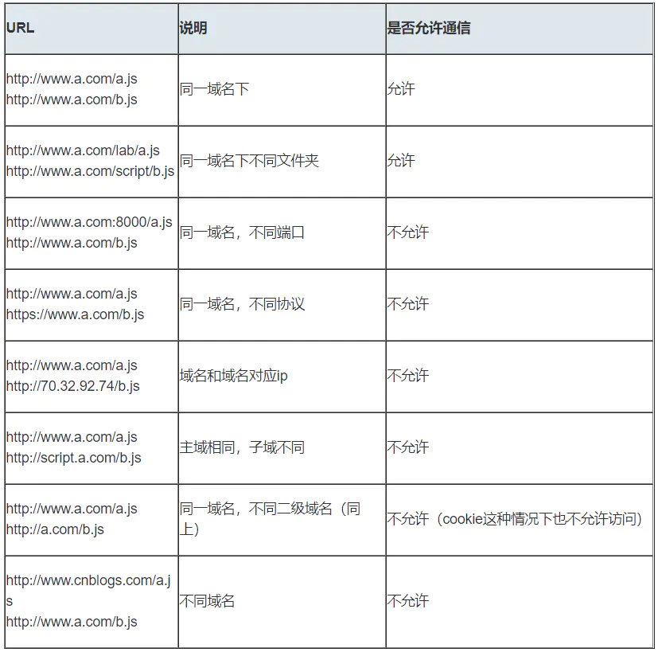
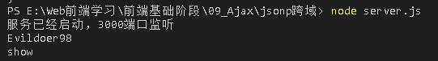

# 一、什么是跨域？
## 什么是同源策略及其限制内容
* 同源策略是一种约定，它是浏览器最核心也是最基本的安全功能
* 如果缺少了同源策略，浏览器很容易受到 XSS、CSRF 等攻击
* 所谓同源是指“协议+域名+端口”三者相同，即使两个不同的域名指向同一个 ip 地址，也非同源
* 同源策略限制内容：
    * Cookie、LocalStorage、indexedDB 等存储内容
    * DOM 节点
    * AJAX 请求发送后，结果被浏览器拦截了
* 但是有三个标签是被允许跨域加载资源的：
    ```html
        
        <link href = xxx>
        <script src = xxx>
    ```

# 二. 常见跨域场景
* 当协议、域名、端口号中任意一个不相同时，都算不同域。不同域之间相互请求资源，就算作“跨域”

* 注意：
    1. 如果是协议和端口造成的跨域问题，“前台”是无能为力的
    2. 在跨域问题上，仅仅是通过“ URL 的首部”来识别而不会根据域名对应的 IP 地址是否相同来判断
        * “URL 首部”可以理解为“协议、域名以及端口必须匹配”
* 跨域并不是请求发不出去，请求能发出去，服务器能收到请求并正常返回结果，只是结果被浏览器拦截了
    * 通过表单的方式可以发起跨域请求，为什么 Ajax 就不会？
        * 因为：跨域是为了阻止用户读取到另一个域名下的内容，Ajax 可以获取响应，浏览器认为这不安全，所以拦截了响应。但是表单并不会获取内容，所以可以发起跨域请求，同时也说明了跨域并不能完全阻止 CSRF，因为请求毕竟是发出去了的

# 三. 跨域解决方案
## 1. jsonp
1. JSONP 原理
    * 利用 script 标签没有跨域限制的漏洞，网页可以得到从其他源动态产生的 JSON 数据。JSONP 请求一定需要对方的服务器做支持才可以
2. JSONP 和 AJAX 对比
    * JSONP 和 AJAX 相同，都是客户端向服务器端发送请求，从服务器端获取数据的方式，但 AJAX 属于同源策略，JSONP 属于非同源策略（跨域请求）
3. JSONP 优缺点
    * 优点：简单兼容性好，可以用于解决主流浏览器的跨域数据访问的问题
    * 缺点：仅支持 get 方法，具有局限性，不安全可能会遭受 XSS 攻击
4. JSONP 的实现流程
    1. 声明一个回调函数，其函数名（如 show）当作参数值，要传递给跨域请求数据的服务器，函数形参为要获取目标数据（服务器返回的 data）
    2. 创建一个 script 标签，把那个跨域的 API 数据接口地址赋值给 script 的 src，还要在这个地址中向服务器传递该函数名（可以通过问好传参：?callback = show）
    3. 服务器接收到请求后，需要进行特殊的处理：把传递进来的函数名和它需要给你的数据拼接成一个字符串。
        * eg：传递进入的函数名是 show，它准备好的数据是 show('Evildoer98')
    4. 最后服务器把准备的数据通过 HTTP 协议返回给客户端，客户端再调用执行之前声明的回调函数（show），对返回的数据进行操作
* eg：
    ```javascript
    // index.html
        function jsonp ({url, params, callback}) {
            return new Promise((resolve, reject) => {
                let script = document.createElement('script')
                window[callback] = function (data) {
                    resolve(data)
                    document.body.removeChild(script)
                }
                params = {...params, callback} // wd = b & callback = show
                let arrs = []
                for(let key in params) {
                    arrs.push(`${key}=${params[key]}`)
                }
                script.src = `${url}?${arrs.join('&')}`
                document.body.appendChild(script)
            })
        }
        jsonp({
            url: 'http://localhost:3000/test',
            params: {wd: 'Evildoer98'},
            callback: 'show'
        }).then(data => {
            console.log(data)
        })

        // ajax
        $.ajax({
            url:'http://localhost:3000/test',
            params: {wd: 'Evildoer98'},
            dataType: "jsonp",
            type: 'get',
            jsonpCallback: "show", // 自定义传递给服务器的函数名，而不是使用 jQuery 自动生成，可省略
            jsonp: 'callback', // 把传递函数名的那个形参 callback，可省略
            success: function (data) {
                console.log(data)
            }
        })

    // server.js
        const express = require('express')
        const app = express()
        app.get('/test', function (request, response) {
            let {wd, callback} = request.query
            console.log(wd);
            console.log(callback);
            response.end(`${callback}('world')`)
        })
        app.listen(3000, () => {
            console.log('服务已经启动，3000端口监听');
        })
    ```
    
    * 以上代码相当于向 http://localhost:3000/test/wd=Evildoer98&callback=show 这个地址请求数据，然后后台返回 show('world')，最后运行这个 show()，打印出 world


    
